# LLM 技术全景笔记

> 基于尚硅谷大模型技术教程整理，覆盖 LLM 从原理到工程落地的完整知识体系。

---

# 一、LLM 概述

LLM（Large Language Model，大语言模型）是指在海量无标注文本数据上进行预训练得到的大型语言模型。典型代表：GPT 系列、DeepSeek 系列、Qwen 系列等。

**"大"的三个维度：**
- **参数量大**：数十亿到上万亿参数
- **数据量大**：多语言、多领域庞大语料
- **能力强**：跨任务泛化与生成能力

---

# 二、LLM 发展历程

## 2.1 GPT 系列演进总览

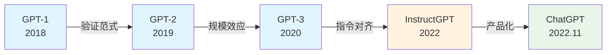

| 模型 | 核心突破 | 关键词 |
|------|---------|--------|
| GPT-1 | 预训练+微调范式 | Decoder-only |
| GPT-2 | Zero-shot + 规模效应 | 15亿参数 |
| GPT-3 | In-Context Learning | 1750亿参数 |
| InstructGPT | RLHF 指令对齐 | SFT→RM→PPO |
| ChatGPT | 多轮对话产品化 | 对话数据集 |

## 2.2 GPT-1（2018）

**核心贡献**：首次验证 **Decoder-only + 预训练-微调** 范式

| 维度 | 内容 |
|------|------|
| 架构 | Transformer Decoder-only |
| 预训练 | BooksCorpus（~7000 本小说，~8 亿词），Next-Token Prediction |
| 微调 | 加 Task Classifier 层，少量标注数据有监督训练 |
| 创新点 | 可学习位置编码、输入嵌入与输出词表权重共享 |

## 2.3 GPT-2（2019）

**核心贡献**：首次证明 **Zero-shot** 泛化能力 + **规模效应**

| 维度 | 内容 |
|------|------|
| 参数 | 15 亿（GPT-1 的 10 倍）|
| 数据 | WebText ~40GB，800 万网页 |
| 关键发现 | 模型参数↑ + 数据↑ → 性能持续↑（Scaling Effect）|
| 架构创新 | Pre-LayerNorm（缓解梯度不稳定）|

## 2.4 GPT-3（2020）

**核心贡献**：首次提出 **In-Context Learning**（上下文学习）

| 维度 | 内容 |
|------|------|
| 参数 | 1750 亿（GPT-2 的 100 倍）|
| 数据 | ~570GB，~3000 亿 token |
| 关键创新 | 无需微调，仅通过 Prompt 中的少量示例即可完成任务 |
| 架构创新 | 稠密注意力 + 局部带状稀疏注意力交替使用 |

## 2.5 InstructGPT（2022）

**核心贡献**：引入 **RLHF** 指令对齐训练范式

> GPT-3 的问题：训练目标是预测下一个词，而非理解和执行人类指令 → 模型未与人类意图对齐（Alignment）

**三阶段训练：**

```
┌──────────────────────────────────────────────────────────────┐
│  阶段 1: SFT（监督微调）                                       │
│  人工标注 "指令-回答" 对 → 有监督训练                           │
└──────────────────────┬───────────────────────────────────────┘
                       ▼
┌──────────────────────────────────────────────────────────────┐
│  阶段 2: RM（奖励模型）                                        │
│  SFT模型生成多个回答 → 人工排序 → 训练奖励模型                   │
└──────────────────────┬───────────────────────────────────────┘
                       ▼
┌──────────────────────────────────────────────────────────────┐
│  阶段 3: RLHF（强化学习）                                      │
│  奖励模型打分 → PPO 算法优化 → 生成更符合人类偏好的回答           │
└──────────────────────────────────────────────────────────────┘
```

## 2.6 ChatGPT（2022.11）

与 InstructGPT 同技术路线，核心区别：使用**多轮对话格式数据集**训练。

## 2.7 GPT 系列总结：三阶段训练范式

```
预训练（Pre-training）→ 监督微调（SFT）→ 对齐（Alignment）
    ↓                      ↓                  ↓
  通用语言能力           指令遵循能力        人类偏好对齐
  世界知识               规范输出格式        安全可靠
  基础推理               任务适配            RLHF/DPO/ORPO
```

---

# 三、LLM 基础架构

## 3.1 整体结构

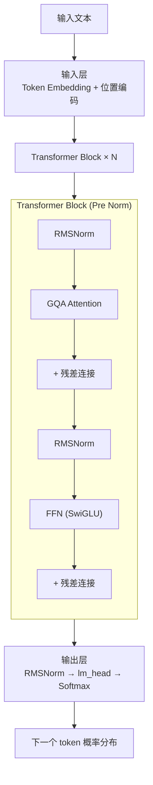

## 3.2 🔥 面试高频问题

| 问题 | 要点 |
|------|------|
| LLM 的三大组成部分是什么？ | 输入层、Transformer Block 堆叠层、输出层 |
| 为什么用 Decoder-only 而不用 Encoder-Decoder？ | 自回归生成任务天然适配，GPT 系列验证了其有效性 |
| 输出层 lm_head 和输入层 tok_emb 有什么关系？ | 小模型中常共享权重以减少参数量 |
| Pre Norm 和 Post Norm 的区别？ | Pre Norm 在子层前归一化，保留恒等梯度路径，训练更稳定 |

---

# 四、位置编码

## 4.1 正余弦位置编码（Sinusoidal）

原始 Transformer 方案，通过正弦/余弦函数生成位置向量。

**特点**：无需训练、隐含相对位置信息
**缺陷**：在实际注意力计算中，由于 Wq/Wk 是可学习参数，会破坏正余弦编码的几何结构，导致理论优势无法在实践中体现。

## 4.2 可学习位置编码（Learned）

GPT-1/2/BERT 采用，每个位置一个可训练向量。

**缺陷**：无长度外推能力、参数量随序列长度线性增长

## 4.3 旋转位置编码 RoPE ⭐⭐⭐

> 由苏剑林提出，当前 LLM 普遍采用的方案。

**核心思想**：不将位置编码加到词向量上，而是**直接作用于 q 和 k 向量**，通过旋转使注意力得分自然体现相对位置关系。

```
设计目标：f(q, m, k, n) = g(q, k, n-m)
                          ↑
                    注意力评分仅依赖相对位置差
```

**实现方式**：将 q/k 按维度两两分组，每对施加旋转矩阵：

```
位置 m 的第 i 对子向量旋转 m·θᵢ 角度
位置 n 的第 i 对子向量旋转 n·θᵢ 角度

其中 θᵢ = 1 / (10000^(2i/d))

注意力评分 = q·k 的内积
         = Σ (旋转后子向量内积)
         = Σ (仅依赖 q, k, n-m)
```

**特点**：

| 特性 | 说明 |
|------|------|
| 显式编码相对位置 | 旋转后注意力得分天然依赖 n-m |
| 零参数且训练稳定 | 无需学习位置向量，结构固定 |
| 更容易外推 | 数学结构不依赖训练长度 |

**代码实现**（Qwen3 风格）：

```python
def compute_rope_params(head_dim, theta_base=10_000, context_length=4096):
    inv_freq = 1.0 / (theta_base ** (torch.arange(0, head_dim, 2).float() / head_dim))
    positions = torch.arange(context_length)
    angles = positions.unsqueeze(1) * inv_freq.unsqueeze(0)  # (ctx, head_dim//2)
    angles = torch.cat([angles, angles], dim=1)               # (ctx, head_dim)
    return torch.cos(angles), torch.sin(angles)

def apply_rope(x, cos, sin, offset=0):
    # x: (batch, heads, seq_len, head_dim)
    head_dim = x.shape[-1]
    x1, x2 = x[..., :head_dim//2], x[..., head_dim//2:]
    cos = cos[offset:offset+x.shape[2], :].unsqueeze(0).unsqueeze(0)
    sin = sin[offset:offset+x.shape[2], :].unsqueeze(0).unsqueeze(0)
    rotated = torch.cat((-x2, x1), dim=-1)
    return x * cos + rotated * sin
```

## 4.4 🔥 位置编码面试问题

| 问题 | 要点 |
|------|------|
| RoPE 的设计目标是什么？ | 让注意力得分仅依赖相对位置差 n-m |
| RoPE 为什么比可学习位置编码好？ | 零参数、显式编码相对位置、更容易外推 |
| RoPE 作用在 Q 还是 K 上？ | 同时作用于 Q 和 K，在计算注意力之前旋转 |
| 正余弦位置编码有什么问题？ | Wq/Wk 是可学习参数，会破坏正余弦的几何结构 |

---

# 五、注意力机制

## 5.1 MHA（Multi-Head Attention）

标准多头注意力：每个头独立的 Q/K/V 投影。

**问题**：KV Cache 随层数×头数×序列长度不断累积，内存占用巨大。

```
KV Cache 内存 = 2 × n_layers × n_heads × seq_len × head_dim × dtype_bytes
```

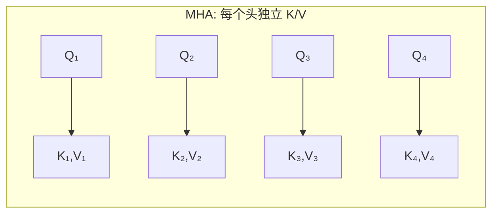

## 5.2 MQA（Multi-Query Attention）

**核心思想**：多个注意力头**共享同一套 K 和 V**

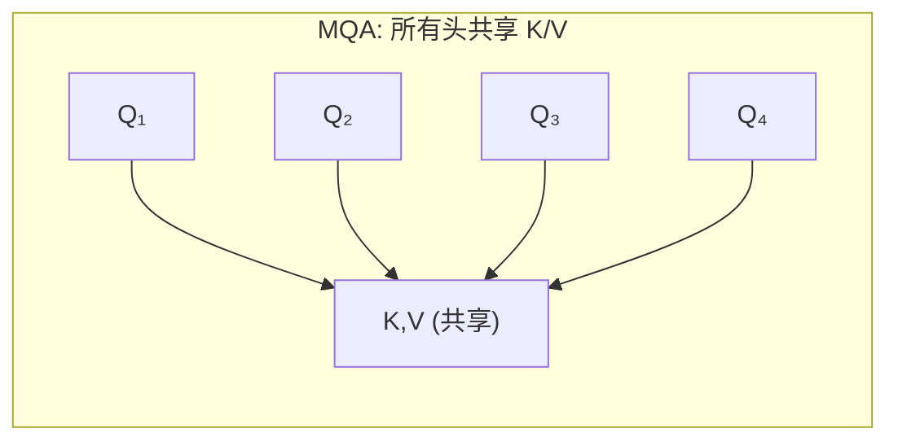

**效果**：KV Cache 大幅减少，推理速度显著提升，精度损失很小。

## 5.3 GQA（Group-Query Attention）⭐⭐⭐

> 当前主流 LLM（Qwen、DeepSeek 等）采用的方案

**核心思想**：将注意力头分为 G 组，每组共享 K/V

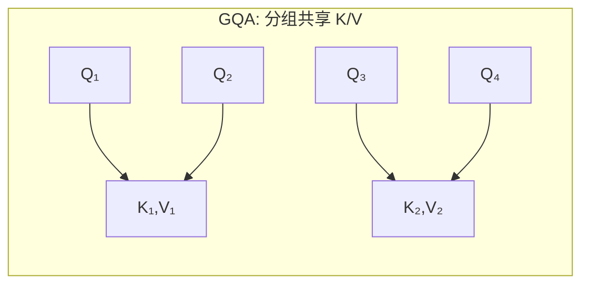

```
MHA:  每个头独立 K/V    →  KV Cache = H 组     →  表达能力最强，内存最大
GQA:  G 组共享 K/V      →  KV Cache = G 组     →  平衡效率与能力  ✅ 当前主流
MQA:  所有头共享 K/V     →  KV Cache = 1 组     →  效率最高，能力略降
```

**Qwen3 中的参数**：`n_heads=16, n_kv_groups=4` → 每 4 个 Query 头共享 1 组 K/V

## 5.4 🔥 面试高频问题

| 问题 | 要点 |
|------|------|
| MHA/MQA/GQA 的区别？ | MHA 每头独立 K/V，MQA 全共享，GQA 分组共享，GQA 是当前主流 |
| 什么是 KV Cache？为什么需要？ | 缓存历史 token 的 K/V 避免重复计算，是推理加速的关键 |
| GQA 的 group_size 怎么算？ | group_size = num_heads / num_kv_groups |
| FlashAttention 解决什么问题？ | 减少 attention 中间结果的显存读写，加速计算 |

**代码实现**（GQA 核心逻辑）：

```python
class GroupedQueryAttention(nn.Module):
    def __init__(self, d_in, num_heads, num_kv_groups, head_dim):
        self.num_heads = num_heads          # Query 头数
        self.num_kv_groups = num_kv_groups  # KV 组数
        self.group_size = num_heads // num_kv_groups
        self.head_dim = head_dim

        self.W_query = nn.Linear(d_in, num_heads * head_dim, bias=False)
        self.W_key   = nn.Linear(d_in, num_kv_groups * head_dim, bias=False)
        self.W_value = nn.Linear(d_in, num_kv_groups * head_dim, bias=False)

    def forward(self, x, mask, cos, sin, cache=None):
        b, num_tokens, _ = x.shape

        # Q/K/V 投影
        queries = self.W_query(x).view(b, num_tokens, self.num_heads, self.head_dim).transpose(1, 2)
        keys    = self.W_key(x).view(b, num_tokens, self.num_kv_groups, self.head_dim).transpose(1, 2)
        values  = self.W_value(x).view(b, num_tokens, self.num_kv_groups, self.head_dim).transpose(1, 2)

        # 应用 RoPE
        queries = apply_rope(queries, cos, sin)
        keys    = apply_rope(keys, cos, sin)

        # KV Cache 拼接
        if cache is not None:
            keys   = torch.cat([cache[0], keys], dim=2)
            values = torch.cat([cache[1], values], dim=2)

        # 关键：复制 K/V 使组内所有 Q 共享相同的 K/V
        keys   = keys.repeat_interleave(self.group_size, dim=1)
        values = values.repeat_interleave(self.group_size, dim=1)

        # 注意力计算
        attn_scores = queries @ keys.transpose(2, 3)
        attn_scores = attn_scores.masked_fill(mask, -torch.inf)
        attn_weights = torch.softmax(attn_scores / self.head_dim**0.5, dim=-1)
        context = (attn_weights @ values).transpose(1, 2).reshape(b, num_tokens, -1)
        return self.out_proj(context), (keys_original, values_original)
```

---

# 六、前馈网络（FFN）

## 6.1 激活函数演进

```
ReLU → GELU → SiLU/Swish → GLU 变体（SwiGLU）⭐ 当前主流
```

| 函数 | 特点 | 应用模型 |
|------|------|---------|
| ReLU | 正区间恒定梯度，负区间硬截断 → 死亡神经元 | 早期模型 |
| GELU | 平滑非线性，全域连续可导 | BERT, GPT-2/3 |
| SiLU | Sigmoid 加权，平滑过渡 | 现代模型 |
| **SwiGLU** | 门控结构：主分支 × SiLU(门控分支) | **Qwen, DeepSeek, LLaMA** |

## 6.2 GLU 门控结构

```
FFN_SwiGLU(x) = (SiLU(x·W₁) ⊙ x·W₂) · W₃
                 ↑ 门控分支     ↑ 主分支     ↑ 降维
```

**代码实现**：

```python
class FeedForward(nn.Module):
    def __init__(self, cfg):
        self.fc1 = nn.Linear(cfg["emb_dim"], cfg["hidden_dim"], bias=False)  # 升维 (门控)
        self.fc2 = nn.Linear(cfg["emb_dim"], cfg["hidden_dim"], bias=False)  # 升维 (主分支)
        self.fc3 = nn.Linear(cfg["hidden_dim"], cfg["emb_dim"], bias=False)  # 降维

    def forward(self, x):
        return self.fc3(F.silu(self.fc1(x)) * self.fc2(x))
```

## 6.3 MoE（Mixture of Experts）⭐

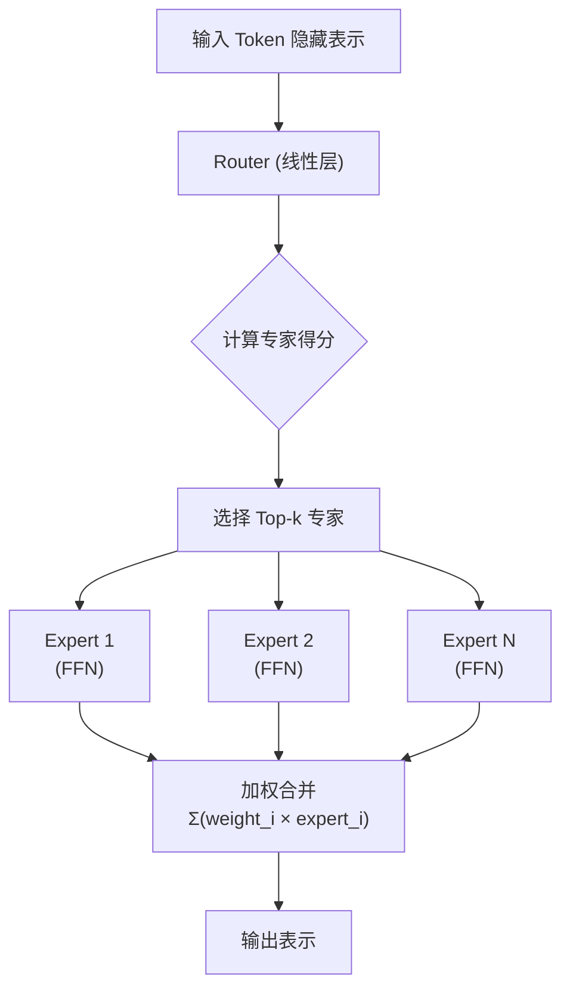

**三大优势**：
1. **高容量低计算**：稀疏激活，总参数大但每次计算量小
2. **专家分工**：不同输入由不同专家处理，增强表达能力
3. **天然分布式**：专家独立，易于分布到多设备

### MoE Router 代码实现

```python
class MoELayer(nn.Module):
    def __init__(self, num_experts, top_k, hidden_dim, expert_dim):
        super().__init__()
        self.top_k = top_k
        # 路由器：将 token 映射到专家得分
        self.router = nn.Linear(hidden_dim, num_experts, bias=False)
        # 专家池：每个专家是一个独立的 FFN
        self.experts = nn.ModuleList([
            FeedForward(hidden_dim, expert_dim) for _ in range(num_experts)
        ])

    def forward(self, x):
        # x: (batch, seq_len, hidden_dim)
        batch, seq_len, hidden = x.shape

        # 1. 路由得分计算
        router_logits = self.router(x)                          # (batch, seq, num_experts)

        # 2. 选择 Top-k 专家
        topk_values, topk_indices = torch.topk(router_logits, self.top_k, dim=-1)

        # 3. 计算路由权重 (softmax 仅在被选中的专家上)
        router_weights = F.softmax(topk_values, dim=-1)         # (batch, seq, top_k)

        # 4. 专家执行 + 加权合并
        output = torch.zeros_like(x)
        for i in range(self.top_k):
            expert_idx = topk_indices[:, :, i]                  # (batch, seq)
            weight = router_weights[:, :, i].unsqueeze(-1)      # (batch, seq, 1)

            # 每个 token 路由到对应专家
            for e in range(len(self.experts)):
                mask = (expert_idx == e)
                if mask.any():
                    expert_input = x[mask]
                    expert_output = self.experts[e](expert_input)
                    output[mask] += weight[mask] * expert_output

        return output
```

### 负载均衡问题

MoE 训练中常见问题：**部分专家被过度使用，其他专家闲置**。

**解决方案**：
- **辅助损失（Auxiliary Loss）**：加一个额外的损失项，鼓励 token 均匀分配到各专家
- **Expert Choice 路由**：让专家选择 token，而非 token 选择专家

### 🔥 面试高频问题

| 问题 | 要点 |
|------|------|
| MoE 的核心思想？ | 多个并行专家 + Router 动态选择 Top-k，稀疏激活 |
| MoE 如何实现高容量低计算？ | 总参数量大但每次只激活少数专家，计算量小 |
| MoE 的负载均衡问题？ | 部分专家过度使用，用辅助损失或 Expert Choice 解决 |
| DeepSeek 的 MoE 有什么特点？ | 采用共享专家 + 路由专家的混合设计 |

### 🔥 FFN 面试高频问题

| 问题 | 要点 |
|------|------|
| FFN 的作用是什么？ | 对 token 表示做非线性变换，是表达能力的重要来源 |
| SwiGLU 为什么比 ReLU/GELU 好？ | 门控机制让模型能选择性地保留/抑制信息 |
| MoE 和普通 FFN 的区别？ | MoE 用多个并行专家替代单个 FFN，Router 动态选择 |
| FFN 的升维比例一般是多少？ | 通常 4×（如 1024→4096→1024），MoE 中可能更小 |

---

# 七、残差连接与归一化

## 7.1 RMSNorm ⭐

比 LayerNorm 更简洁，去掉均值标准化，仅用均方根缩放：

```
RMSNorm(x) = x / √(mean(x²) + ε) × γ
```

**代码实现**：

```python
class RMSNorm(nn.Module):
    def __init__(self, emb_dim, eps=1e-6):
        self.eps = eps
        self.scale = nn.Parameter(torch.ones(emb_dim))

    def forward(self, x):
        variance = x.pow(2).mean(dim=-1, keepdim=True)
        norm_x = x * torch.rsqrt(variance + self.eps)
        return norm_x * self.scale
```

## 7.2 Pre Norm vs Post Norm

```
Post Norm:  x → SubLayer → Add(x, output) → LayerNorm   ❌ 现代模型不用
Pre Norm:   x → LayerNorm → SubLayer → Add(x, output)   ✅ 当前主流
```

**Pre Norm 优势**：保留残差连接的恒等梯度路径，训练更稳定。

---

# 八、Qwen3 架构解析

```
Qwen3-0.6B 配置:
  vocab_size = 151936
  emb_dim = 1024
  n_heads = 16
  n_kv_groups = 4        ← GQA: 4 组 K/V
  head_dim = 128
  n_layers = 28
  hidden_dim = 3072       ← FFN 升维维度
  context_length = 4096
  rope_base = 1000000
```

**整体结构代码**：

```python
class Qwen3Model(nn.Module):
    def __init__(self, cfg):
        self.tok_emb = nn.Embedding(cfg["vocab_size"], cfg["emb_dim"])
        self.trf_blocks = nn.ModuleList([TransformerBlock(cfg) for _ in range(cfg["n_layers"])])
        self.final_norm = RMSNorm(cfg["emb_dim"])
        self.out_head = nn.Linear(cfg["emb_dim"], cfg["vocab_size"], bias=False)
        cos, sin = compute_rope_params(cfg["head_dim"], cfg["rope_base"], cfg["context_length"])
        self.register_buffer("cos", cos)
        self.register_buffer("sin", sin)

    def forward(self, in_idx, cache=None):
        x = self.tok_emb(in_idx)
        mask = torch.triu(torch.ones(...), diagonal=1)  # 因果掩码
        for i, block in enumerate(self.trf_blocks):
            x, blk_cache = block(x, mask, self.cos, self.sin, cache=cache.get(i))
        x = self.final_norm(x)
        return self.out_head(x)
```

**TransformerBlock 代码**：

```python
class TransformerBlock(nn.Module):
    def __init__(self, cfg):
        self.att = GroupedQueryAttention(...)   # GQA
        self.ff = FeedForward(...)               # SwiGLU FFN
        self.norm1 = RMSNorm(cfg["emb_dim"])    # Pre Norm
        self.norm2 = RMSNorm(cfg["emb_dim"])

    def forward(self, x, mask, cos, sin, cache=None):
        # Attention + 残差
        shortcut = x
        x = self.norm1(x)
        x, next_cache = self.att(x, mask, cos, sin, cache=cache)
        x = x + shortcut
        # FFN + 残差
        shortcut = x
        x = self.norm2(x)
        x = self.ff(x)
        x = x + shortcut
        return x, next_cache
```

---

# 九、LLM 微调

## 9.1 微调概述

> 微调 = 在预训练模型基础上，用特定数据继续训练，适配特定任务。

**何时需要微调**：Prompt Engineering / RAG 无法满足需求时才考虑微调。

**微调价值**：
- 增强特定任务能力
- 定制输出风格/格式
- 注入领域知识

## 9.2 整体流程

```
模型选择 → 数据准备 → 微调训练 → 模型验证
```

### 模型选择建议

| 任务类型 | 模型类型 | 推荐规模 |
|---------|---------|---------|
| 意图识别/文本分类 | Instruct Model | 1B-7B |
| 智能客服/FAQ | Instruct Model | 7B-14B |
| 企业知识库问答/RAG | Instruct Model | 7B-32B |
| NL2SQL | Instruct Model | 7B-32B |
| 边缘设备部署 | Instruct Model | 0.5B-4B |

## 9.3 SFT（监督微调）

### 核心思想

使用 "指令-回答" 数据训练，**仅对 assistant 回答部分计算损失**（与预训练的本质区别）。

### 数据格式（Chat Template）

```python
# 将对话转为模型输入格式
tokenizer.apply_chat_template([
    {"role": "system", "content": "You are a helpful assistant."},
    {"role": "user", "content": "什么是习惯？"},
    {"role": "assistant", "content": "习惯是..."}
])
```

### 损失函数

```
Loss = -1/N × Σ log P(answer_token | context)

仅对 assistant 回答部分的 token 计算负对数似然损失
```

**代码实现**：

```python
def compute_loss(output_logits, target_labels, assistant_answer_mask):
    log_probs = torch.log_softmax(output_logits, dim=-1)
    gathered = torch.gather(log_probs, -1, target_labels.unsqueeze(-1))
    token_losses = gathered.squeeze(-1) * (-1)
    masked_losses = token_losses * assistant_answer_mask
    return masked_losses.sum() / assistant_answer_mask.sum()
```

### SFT 的问题：灾难性遗忘

过度拟合微调数据 → 通用能力下降

**解决方案**：
1. 控制训练轮次（小数据 1-2 epoch）+ 早停
2. 混入通用能力数据
3. 设置任务能力 + 通用能力两类评测集

## 9.4 SFT vs RLHF vs DPO 对比

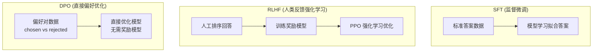

| 维度 | SFT | RLHF | DPO |
|------|-----|------|-----|
| **数据格式** | 指令-标准回答 | 人工排序的多个回答 | chosen-rejected 偏好对 |
| **学习目标** | 拟合标准答案 | 最大化奖励模型评分 | 偏好 chosen 胜过 rejected |
| **是否需要奖励模型** | ❌ | ✅ | ❌ |
| **是否需要强化学习** | ❌ | ✅ (PPO) | ❌ |
| **训练复杂度** | 低 | 高 | 中 |
| **适用场景** | 格式化输出、领域适配 | 对齐人类偏好 | 对齐人类偏好（简化版）|

## 9.5 DPO（直接偏好优化）详解

> 论文：*Direct Preference Optimization: Your Language Model is Secretly a Reward Model*

### 一句话理解

DPO 的核心：**让模型学会"两个回答中哪个更好"，而不是"背诵标准答案"。**

### 数据格式

每条样本包含三部分：
- `prompt`：用户问题
- `chosen`：更优的回答
- `rejected`：较差的回答

### 损失函数直觉

```
DPO 损失 = 让模型对 chosen 的概率 > 对 rejected 的概率
         + 参考模型作为基线，防止模型偏离太远
```

**数学表达**：

```
L_DPO = -log(σ(β × [log_ratio_current - log_ratio_reference]))

其中：
log_ratio_current  = log π(chosen) - log π(rejected)     ← 当前模型的偏好倾向
log_ratio_reference = log π_ref(chosen) - log π_ref(rejected)  ← 参考模型的偏好倾向

β: 温度参数，越大区分越严格
```

**直觉解释**：
- 如果当前模型 already 更喜欢 chosen → loss 小（已经学对了）
- 如果当前模型更喜欢 rejected → loss 大（需要纠正）
- 参考模型的作用：如果参考模型 already 更喜欢 chosen，说明"这个区分很容易"，不需要大力优化；如果参考模型分不清，说明"这个区分很难"，需要重点学习

### 代码实现

```python
def compute_loss(preferred_logits, rejected_logits,
                 ref_preferred_logits, ref_rejected_logits,
                 preferred_labels, rejected_labels,
                 preferred_mask, rejected_mask, beta):
    # 计算平均 log 概率
    pref_log_prob = avg_log_prob(preferred_logits, preferred_labels, preferred_mask)
    rej_log_prob  = avg_log_prob(rejected_logits, rejected_labels, rejected_mask)
    ref_pref_log_prob = avg_log_prob(ref_preferred_logits, preferred_labels, preferred_mask)
    ref_rej_log_prob  = avg_log_prob(ref_rejected_logits, rejected_labels, rejected_mask)

    # DPO 损失：当前模型的偏好差 - 参考模型的偏好差
    final = (pref_log_prob - rej_log_prob) - (ref_pref_log_prob - ref_rej_log_prob)
    loss = -F.logsigmoid(final * beta)
    return loss.mean()
```

### 训练流程

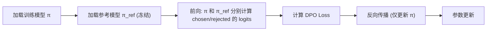

### 🔥 面试高频问题

| 问题 | 要点 |
|------|------|
| SFT 和 DPO 的本质区别？ | SFT 学习拟合标准答案，DPO 学习答案间的相对偏好 |
| DPO 为什么需要参考模型？ | 提供稳定基线，防止模型偏离太远，保持语言能力 |
| DPO 的 β 参数有什么用？ | 控制区分强度，越大越严格，越小越宽松 |
| DPO 相比 RLHF 的优势？ | 无需训练奖励模型，无需强化学习，训练更简单稳定 |
| DPO 的 chosen 和 rejected 怎么来？ | 人工标注、GPT-4 打分筛选、模型生成后排序 |

## 9.6 RLHF 详解

> 论文：*Training language models to follow instructions with human feedback*

### 一句话理解

RLHF 的核心：**用人类的"品味"训练一个裁判（奖励模型），然后用这个裁判教模型写出更好的回答。**

### 三阶段流程

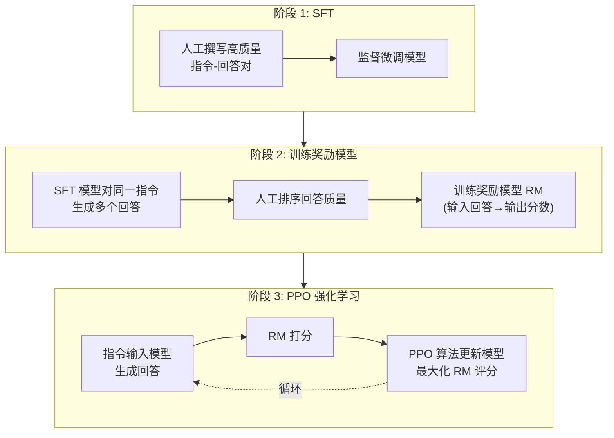

### PPO 算法核心思想

```
PPO (Proximal Policy Optimization):
1. 模型生成回答 → RM 打分 → 作为奖励信号
2. 用策略梯度更新模型参数
3. 加入 KL 散度惩罚 → 防止模型偏离 SFT 模型太远
   → 避免"奖励黑客"（模型找到 RM 的漏洞而非真正提升质量）

目标函数 = E[RM 评分] - β × KL(π || π_SFT)
```

### 🔥 RLHF 面试问题

| 问题 | 要点 |
|------|------|
| RLHF 和 DPO 的区别？ | RLHF 需要 RM + PPO，DPO 直接用偏好数据优化 |
| 为什么 RLHF 需要 KL 惩罚？ | 防止奖励黑客，模型钻 RM 漏洞 |
| 奖励模型怎么训练？ | 人工排序数据训练，输入回答输出偏好分数 |

---

# 十、微调工程优化

## 10.1 显存消耗构成

```
总显存 = 模型参数 + 梯度 + 优化器状态 + 激活值 + 运行时开销
         ↓           ↓        ↓            ↓
       P×dtype    P×dtype   12×P(fp32)   b×s×h×L×2×k
```

**AdamW 优化器状态**（FP32 存储）：
- 一阶矩 m：与参数同大小
- 二阶矩 v：与参数同大小
- 主权重副本（FP32）
→ 每个参数约 12 字节

## 10.2 单 GPU 优化

| 技术 | 原理 | 效果 |
|------|------|------|
| **梯度累积** | 多个 mini-batch 梯度累积后更新 | 等效大 batch |
| **CPU 卸载** | 非计算时将数据转移到 CPU | 降显存，增延迟 |
| **梯度检查点** | 前向不保存中间结果，反向时重算 | 时间换空间 |
| **混合精度** | FP16/BF16 计算 + FP32 主权重 | 降显存，加速 |

### 混合精度训练

```
主权重 (FP32) ──→ 前向传播 (FP16/BF16) ──→ 损失计算
                                              ↓
参数更新 (FP32) ←── 梯度缩放 ←── 反向传播 (FP16/BF16)
```

## 10.3 多 GPU 并行策略

### 数据并行（DP）

```
GPU 0: 完整模型 + 数据子集 A → 梯度 ─┐
GPU 1: 完整模型 + 数据子集 B → 梯度 ─┼→ AllReduce → 全局梯度 → 各自更新
GPU 2: 完整模型 + 数据子集 C → 梯度 ─┘
```

### 流水线并行（PP）

```
GPU 0: Layer 0-7  → 中间激活 → GPU 1: Layer 8-15 → ... → GPU 3: Layer 24-31
                      ↑ 气泡问题：用微批次缓解
```

### 张量并行（TP）

单层内矩阵乘法切分到多 GPU：
```
权重矩阵 W 切分为 [W₁, W₂]
GPU 1: x·W₁ = y₁ ─┐
GPU 2: x·W₂ = y₂ ─┼→ AllReduce → y = y₁+y₂
```

### ZeRO（Zero Redundancy Optimizer）

| 阶段 | 分片内容 | 显存节省 | 通信开销 |
|------|---------|---------|---------|
| ZeRO-1 | 优化器状态 | ~4× | 低 |
| ZeRO-2 | 优化器状态 + 梯度 | ~8× | 中 |
| ZeRO-3 | 优化器状态 + 梯度 + 参数 | ~N×（N=GPU数）| 高 |

---

# 十一、参数高效微调（PEFT）

## 11.1 LoRA ⭐⭐⭐

> 核心观察：微调时的权重增量 ΔW 具有**低秩结构**

```
全参数微调: W' = W + ΔW          （ΔW ∈ ℝ^(d×d)，参数量巨大）
LoRA:       W' = W + B × A        （B ∈ ℝ^(d×r), A ∈ ℝ^(r×d), r << d）

训练时：冻结 W，仅训练 A 和 B
推理时：W' = W + B×A，无额外开销！
```

**参数量对比**：
- 全参更新 4096×4096 = 16M 参数
- LoRA (r=8)：4096×8 + 8×4096 = 65K 参数（仅 0.4%）

**插入位置**：通常对 `q_proj` 和 `v_proj` 插入（对任务语义最敏感）

**工程实现**：

```python
# 缩放系数 α：控制增量影响力
output = W·x + (α/r) · B·A·x

# LoRA Dropout：防过拟合
```

## 11.2 QLoRA

在 LoRA 基础上引入 **4-bit 量化**，三大技术：

| 技术 | 说明 |
|------|------|
| **NF4 量化** | 专为正态分布设计的 4-bit 量化，0 附近格点更密 |
| **双重量化** | 对量化缩放因子再次量化，减少辅助存储 |
| **分页优化器** | 优化器状态按需加载/卸载到 CPU |

→ 单张消费级 GPU（RTX 3090/4090）即可微调数十亿参数模型

## 11.3 🔥 PEFT 面试高频问题

| 问题 | 要点 |
|------|------|
| LoRA 的核心思想？ | 利用微调增量 ΔW 的低秩结构，分解为 B×A |
| LoRA 的 r 越大越好吗？ | 不一定，r 越大参数越多，过拟合风险增加，通常 4-64 |
| LoRA 插入哪些层？ | 通常 q_proj 和 v_proj，可扩展到 k_proj/o_proj/FFN |
| LoRA 推理有额外开销吗？ | 没有，合并后 W' = W + BA，与原模型推理完全一样 |
| QLoRA 和 LoRA 的区别？ | QLoRA 先将模型量化为 4-bit 再加 LoRA，显存更低 |
| LoRA 的 α 参数有什么用？ | 缩放系数 α/r 控制增量影响力，α=r 时无缩放 |

---

# 十二、微调框架实战

## 12.1 TRL 库

```python
from trl import SFTTrainer, SFTConfig

training_args = SFTConfig(
    output_dir="./output",
    per_device_train_batch_size=4,
    gradient_accumulation_steps=3,
    learning_rate=2e-5,
    num_train_epochs=1,
    bf16=True,
    warmup_ratio=0.1,
)

trainer = SFTTrainer(
    model=model,
    args=training_args,
    train_dataset=train_dataset,
    processing_class=tokenizer,
)
trainer.train()
```

## 12.2 PEFT + TRL（LoRA 微调）

```python
from peft import LoraConfig, get_peft_model

peft_config = LoraConfig(
    r=4, lora_alpha=8, lora_dropout=0.05,
    target_modules="all-linear",
    task_type="CAUSAL_LM"
)
lora_model = get_peft_model(model, peft_config)

# 后续与 SFTTrainer 相同，只需传入 lora_model
```

## 12.3 QLoRA（BitsAndBytes）

```python
from transformers import BitsAndBytesConfig
from peft import prepare_model_for_kbit_training

bnb_config = BitsAndBytesConfig(
    load_in_4bit=True,
    bnb_4bit_quant_type="nf4",
    bnb_4bit_use_double_quant=True,
    bnb_4bit_compute_dtype=torch.bfloat16,
)
model = AutoModelForCausalLM.from_pretrained(model_name, quantization_config=bnb_config)
model = prepare_model_for_kbit_training(model)
```

## 12.4 Unsloth

主打**更快训练、更低显存**，通过 Triton 内核优化。

```python
from unsloth import FastLanguageModel

model, tokenizer = FastLanguageModel.from_pretrained(
    model_name="Qwen/Qwen3-8B",
    max_seq_length=2048,
    load_in_4bit=True
)
model = FastLanguageModel.get_peft_model(model, r=8, lora_alpha=8,
    target_modules=["q_proj","k_proj","v_proj","o_proj","gate_proj","up_proj","down_proj"])
```

## 12.5 LLaMA-Factory

无代码 WebUI 微调平台，支持 100+ 预训练模型。

```bash
# 安装
git clone https://github.com/hiyouga/LLaMA-Factory.git
cd LLaMA-Factory && uv pip install -e .

# 启动 WebUI
llamafactory-cli webui
```

---

# 十三、推理部署

## 13.1 vLLM ⭐

高性能推理框架，吞吐量比传统方案高一个数量级。

**核心特性**：PagedAttention、连续批处理、张量并行、前缀缓存

```bash
# 单卡部署
vllm serve Qwen3-8B --served-model-name Qwen3-8B --max-model-len 32K

# 多卡张量并行
vllm serve Qwen3-14B --tensor-parallel-size 2
```

**调用方式**（OpenAI 兼容）：

```python
from openai import OpenAI
client = OpenAI(base_url="http://localhost:8000/v1/", api_key="none")
response = client.chat.completions.create(
    model="Qwen3-8B",
    messages=[{"role": "user", "content": "你好"}]
)
```

## 13.2 PagedAttention 详解

类比操作系统的**虚拟内存分页**：

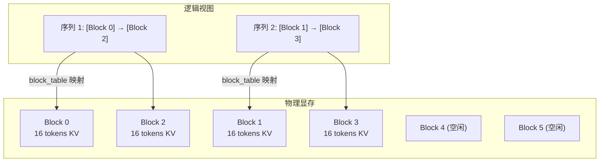

### 核心数据结构

```python
class BlockManager:
    def __init__(self, num_blocks, block_size):
        self.block_size = block_size          # 每个 block 保存的 token 数
        self.free_blocks = list(range(num_blocks))  # 空闲 block 池
        self.block_table = {}  # {seq_id: [物理 block 索引列表]}

    def allocate(self, seq_id, num_tokens):
        """为序列分配 block"""
        num_blocks_needed = (num_tokens + self.block_size - 1) // self.block_size
        allocated = []
        for _ in range(num_blocks_needed):
            block_idx = self.free_blocks.pop(0)
            allocated.append(block_idx)
        self.block_table[seq_id] = allocated
        return allocated

    def free(self, seq_id):
        """释放序列占用的 block"""
        blocks = self.block_table.pop(seq_id)
        self.free_blocks.extend(blocks)
```

### 前缀缓存

```
请求 A: "你是一个专业的技术助手。请解释..."  ─┐
请求 B: "你是一个专业的技术助手。请翻译..."  ─┤→ 共享前缀的 KV Cache Block
请求 C: "你是一个专业的技术助手。请总结..."  ─┘

共享 block 维护引用计数，所有引用释放后才回收
```

## 13.3 连续批处理

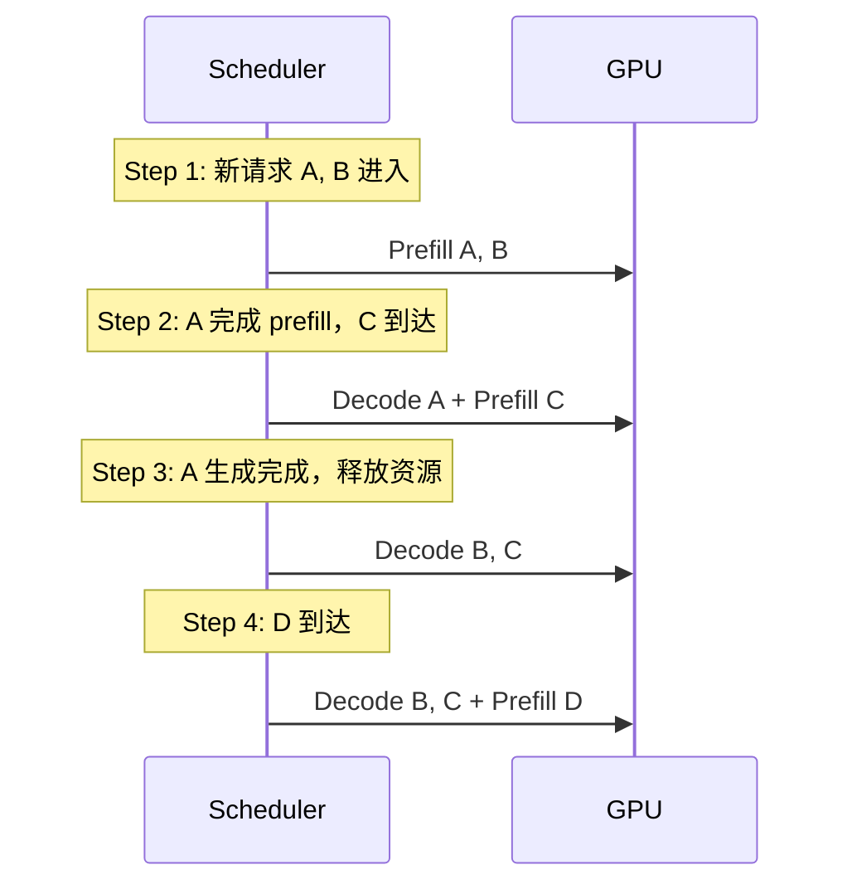

**与传统 Batch 对比**：

| 维度 | 静态 Batch | 连续 Batch |
|------|-----------|-----------|
| 请求加入 | 必须等整个 batch 完成 | 随时加入 |
| 请求退出 | batch 内全部完成才释放 | 完成即释放 |
| Prefill/Decode | 同一 batch 内统一 | 可交替/混合执行 |
| GPU 利用率 | 低（短请求等长请求）| 高（无空闲等待）|

## 13.4 其他优化

| 技术 | 作用 |
|------|------|
| **FlashAttention** | 减少中间结果保存，降低显存读写 |
| **Tensor Parallel** | 单层计算切分到多 GPU |
| **CUDA Graph** | 捕获计算图重放，减少 CPU 调度开销 |

## 13.5 🔥 推理部署面试高频问题

| 问题 | 要点 |
|------|------|
| PagedAttention 解决什么问题？ | KV Cache 显存碎片化，类比 OS 虚拟内存分页 |
| 连续批处理和静态批处理的区别？ | 连续批处理允许请求动态进出，GPU 利用率更高 |
| vLLM 为什么比 HuggingFace 快？ | PagedAttention + 连续批处理 + FlashAttention |
| KV Cache 的显存怎么算？ | 2 × n_layers × n_heads × seq_len × head_dim × dtype |
| Prefill 和 Decode 阶段的区别？ | Prefill 并行处理所有 prompt token，Decode 逐 token 生成 |
| Tensor Parallel 和 Pipeline Parallel 的区别？ | TP 切分单层权重，PP 切分不同层 |

---

# 十四、模型评估

## 14.1 EvalScope

魔搭社区的模型评测框架，支持压测和能力评估。

```bash
# 压测
evalscope perf --url http://localhost:8000/v1/chat/completions \
    --parallel 5 --model Qwen3-8B --number 20 --stream

# 能力评估
evalscope eval --model Qwen3-8B \
    --api-url http://localhost:8000/v1/chat/completions \
    --datasets aime24
```

---

# 十五、关键公式速查

| 公式 | 含义 |
|------|------|
| `Attention = softmax(QK^T/√d)V` | 注意力计算 |
| `RoPE: θᵢ = 1/10000^(2i/d)` | 旋转位置编码频率 |
| `RMSNorm(x) = x/√(mean(x²)+ε) × γ` | 均方根归一化 |
| `SwiGLU = SiLU(xW₁) ⊙ xW₂` | 门控前馈网络 |
| `LoRA: W' = W + BA` | 低秩适配 |
| `DPO: -log σ(β[(log π_c-log π_r)-(log π_ref_c-log π_ref_r)])` | 偏好优化损失 |
| `显存 ≈ 参数量 × 字节数 × (1+梯度+优化器)` | 显存估算 |

---

# 附录：数学推导

## A. RoPE 旋转矩阵推导

### 二维旋转矩阵

二维向量 (x₁, x₂) 绕原点逆时针旋转 θ 角：

```
旋转前: (x₁, x₂) = r·(cos α, sin α)
旋转后: (x₁', x₂') = r·(cos(α+θ), sin(α+θ))

利用三角恒等式:
cos(α+θ) = cos α·cos θ - sin α·sin θ
sin(α+θ) = sin α·cos θ + cos α·sin θ

矩阵形式:
┌ x₁' ┐   ┌ cos θ  -sin θ ┐ ┌ x₁ ┐
│     │ = │               │ │    │
└ x₂' ┘   └ sin θ   cos θ ┘ └ x₂ ┘

即: x' = R(θ) · x
```

### 旋转矩阵的叠加性

```
R(θ₁) · R(θ₂) = R(θ₁ + θ₂)

连续两次旋转 = 一次旋转（角度相加）
```

### RoPE 的关键性质

位置 m 的 q 旋转 mθ，位置 n 的 k 旋转 nθ：

```
q_m = R(mθ) · q
k_n = R(nθ) · k

注意力评分 = q_m^T · k_n
           = q^T · R(mθ)^T · R(nθ) · k
           = q^T · R(-mθ) · R(nθ) · k      (旋转矩阵转置 = 角度取反)
           = q^T · R(n-m) · k               (旋转叠加性)

结果仅依赖相对位置 (n-m) ✅
```

## B. LoRA 低秩分解

### 矩阵的秩

秩 = 列向量（或行向量）线性独立的最大个数

```
A = [1 2]    第二列 = 2 × 第一列 → 秩 = 1 (线性相关)
    [2 4]

B = [1 2]    两列线性无关 → 秩 = 2 (满秩)
    [3 4]
```

### 低秩分解

如果矩阵 W ∈ ℝ^(d×d) 的秩为 r << d，则存在：

```
W = B × A    其中 B ∈ ℝ^(d×r), A ∈ ℝ^(r×d)

例如: 4096×4096 矩阵 (秩=8) 可分解为:
  4096×8  ×  8×4096
  (B 矩阵)   (A 矩阵)

参数量: 16M → 65K (减少 99.6%)
```

### LoRA 应用

```
全参数微调: W' = W + ΔW           ΔW ∈ ℝ^(d×d), 参数量巨大
LoRA:       W' = W + B·A          B ∈ ℝ^(d×r), A ∈ ℝ^(r×d), r << d

训练时: 冻结 W，仅训练 A 和 B
推理时: W' = W + (α/r)·B·A，合并后无额外开销
```

---

# 相关笔记

- [[AI缩写术语表]] — 缩写速查
- [[RAG技术全解]] — 检索增强生成
- [[Agent与工具调用]] — AI Agent 架构
- [[Transformer（Attention Is All You Need）面试讲解稿]] — 原始论文
- [[预训练]] — 预训练细节
