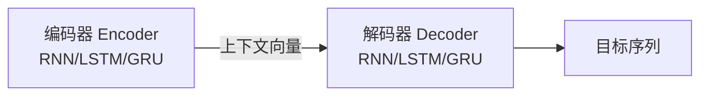

---
aliases:
  - NLP基础
  - 自然语言处理基础
  - NLP Basics
tags:
  - NLP
  - 深度学习
  - RNN
  - LSTM
  - GRU
  - Attention
  - Word2Vec
  - 分词
  - 序列模型
created: 2026-06-13
---

**标签：** #NLP #深度学习 #RNN #LSTM #GRU #Attention #Word2Vec #分词 #序列模型 #面试八股
**关联：** [[大模型应用/Transformer|Transformer]] [[大模型应用/预训练|预训练]] [[00. 大模型知识体系导航]]

---

# 一、NLP 概述

## 1. 定义

自然语言处理（Natural Language Processing, NLP）是人工智能的重要分支，目标是让计算机"理解"和"使用"人类日常语言（中文、英文等）。

## 2. 常见任务

| 任务 | 描述 | 典型应用 |
|------|------|----------|
| **文本分类** | 对整段文本判断或归类 | 情感分析、垃圾邮件识别、新闻主题分类 |
| **序列标注** | 对每个词/字打标签 | 命名实体识别（人名、地名、手机号） |
| **文本生成** | 根据已有内容生成新文本 | 自动写作、摘要生成、对话系统 |
| **信息抽取** | 从文本中提取结构化信息 | 阅读理解、答案抽取 |
| **文本转换** | 将一种文本转为另一种形式 | 机器翻译、摘要生成 |

## 3. 技术演进


### 规则系统阶段（1950s-1980s）
- 人工编写语言规则，代表系统：Georgetown-IBM 实验（1954，俄译英）、ELIZA 聊天机器人（1966）
- 优点：特定领域表现好；缺点：缺乏通用性，扩展性差

### 统计方法阶段（1990s）
- 从"专家经验"转向"数据驱动"，通过概率建模学习语言模式
- 代表方法：**N-gram 模型**、隐马尔可夫模型（HMM）、最大熵模型
- N-gram 核心思想：一个词出现的概率只取决于前 N-1 个词（Bigram 看前 1 个，Trigram 看前 2 个）

### 机器学习阶段（2000s）
- 引入逻辑回归、SVM、决策树、CRF 等方法
- **特征工程**成为关键环节，需要设计大量手工特征
- 词袋模型的局限：完全忽略词序（"服务很好但味道差劲" vs "味道很好但服务差劲" 在词袋模型中特征向量完全相同）

### 深度学习阶段（2010s+）
- RNN/LSTM/GRU 取代手工特征工程，自动提取语义表示
- Transformer 架构提升并行能力和长距离依赖建模
- 推动预训练模型（GPT、BERT）和迁移学习发展

---

# 二、文本表示

## 1. 概述

文本表示是将自然语言转化为计算机可处理的数值形式，是 NLP 任务的基础步骤。

**流程**：原始文本 → **分词**（Tokenization）→ **词表映射**（Vocabulary）→ **嵌入层**（Embedding）→ 词向量

- 分词：将文本切分为最小语义单元（token）
- 词表：包含模型可识别 token 的集合，每个 token 有唯一 ID
- 嵌入层：将 token ID 转换为低维稠密向量

## 2. 分词

### 英文分词

| 粒度 | 描述 | 优点 | 缺点 |
|------|------|------|------|
| **词级**（Word-Level） | 按空格/标点切分 | 直观易懂 | OOV 问题严重（未登录词被替换为 `<UNK>`） |
| **字符级**（Character-Level） | 以单个字符为单位 | 词表极小，几乎无 OOV | 单字符语义弱，序列变长，建模难度大 |
| **子词级**（Subword-Level） | 切分为词根、前后缀等子词 | 缓解 OOV，保留语义结构 | 需要训练分词算法 |

**BPE（Byte Pair Encoding）** 是最主流的子词分词算法：
1. 训练阶段：将词汇拆为字符，迭代合并频率最高的相邻字符对，直到词表达到上限
2. 分词阶段：按合并规则逐步合并新文本
3. BERT、GPT 等模型均采用子词分词

### 中文分词

| 粒度 | 描述 | 特点 |
|------|------|------|
| **字符级** | 按单个汉字切分 | 汉字本身有独立语义，天然可行 |
| **词级** | 按完整词语切分 | 贴近人类阅读习惯，但中文无天然词边界，依赖词典/模型 |
| **子词级** | 以汉字为单位应用 BPE | 无需人工词典，主流中文大模型（通义千问、DeepSeek）采用 |

### jieba 分词器

```python
import jieba

text = "小明毕业于北京大学计算机系"

# 精确模式（默认）：最精确地切开
jieba.lcut(text)  # ['小明', '毕业', '于', '北京大学', '计算机系']

# 全模式：扫描所有可能成词的词语
jieba.lcut(text, cut_all=True)  # ['小', '明', '毕业', '于', '北京', '北京大学', '大学', '计算', '计算机', '计算机系', '算机', '系']

# 搜索引擎模式：精确模式基础上对长词进一步切分
jieba.lcut_for_search(text)  # ['小明', '毕业', '于', '北京', '大学', '北京大学', '计算', '算机', '计算机', '计算机系']
```

自定义词典：`jieba.load_userdict('dict.txt')`，格式为每行 `词语 词频 词性标签`。

## 3. 词表示

### One-hot 编码
- 每个词映射为一个稀疏向量（词表长度），该词位置为 1，其余为 0
- **局限**：无法体现词间语义关系；维度随词表膨胀

### 语义化词向量（Word2Vec）

**设计理念**：基于"分布假设"——一个词的含义由它周围的词决定。

**两种模型结构**：

| 模型 | 输入 | 目标 | 直觉类比 |
|------|------|------|----------|
| **CBOW** | 上下文词（前后若干个词） | 预测中间的目标词 | "完形填空"——给上下文猜中间词 |
| **Skip-Gram** | 中心词 | 预测上下文中的所有词 | "举一反三"——给一个词猜周围词 |

**Skip-Gram 前向传播**：
1. 输入中心词 one-hot → 与参数矩阵 W 相乘，查出词向量
2. 词向量与参数矩阵 W' 相乘 → 得到对整个词表的预测得分
3. Softmax → 概率分布
4. 与真实上下文词计算交叉熵损失
5. 反向传播更新 W 中对应词向量

**CBOW 前向传播**：
1. 输入上下文词 one-hot → 查出各自词向量
2. 多个上下文词向量**取平均** → 整体上下文表示
3. 平均向量与 W' 相乘 → Softmax → 概率分布
4. 与真实中心词计算交叉熵损失

**训练与使用（Gensim）**：

```python
from gensim.models import Word2Vec, KeyedVectors

# 训练
model = Word2Vec(
    sentences,        # 已分词的句子序列 [['我','每天','乘坐','地铁','上班'], ...]
    vector_size=100,  # 词向量维度
    window=5,         # 上下文窗口大小
    min_count=2,      # 最小词频
    sg=1,             # 1=Skip-Gram, 0=CBOW
    workers=4
)

# 保存/加载
model.wv.save_word2vec_format('my_vectors.kv')
wv = KeyedVectors.load_word2vec_format('my_vectors.kv')

# 查询
wv.similarity('地铁', '公交')          # 余弦相似度
wv.most_similar(positive=["上班"], topn=5)  # 最相似词
wv.most_similar(positive=["爸爸", "女性"], negative=["男性"])  # 类比推理
```

**应用**：使用预训练词向量初始化 Embedding 层

```python
embedding_layer = nn.Embedding.from_pretrained(
    embedding_matrix,  # (词表大小, 词向量维度)
    freeze=False       # 是否冻结词向量
)
```

### 上下文相关词表示

Word2Vec 的问题：每个词只有一个**固定**向量（静态词向量），无法区分不同语境。

> "我吃了一个**苹果**" vs "**苹果**发布了新手机" → 同一个"苹果"向量

**ELMo**（Embeddings from Language Models, 2018）：基于 LSTM 语言模型，每个词的向量由前文和后文**动态**生成，是第一个广泛使用的上下文词向量模型。

> 从静态词向量到上下文词表示，是从"查字典"到"读上下文"的质变。

---

# 三、传统序列模型

## 1. RNN（循环神经网络）

### 核心思想
逐个读取句子中的词语，每一步结合当前词和前面的上下文信息，不断更新隐藏状态，从而建模序列依赖关系。

### 基础结构

```text
x_t (当前词向量) + h_{t-1} (上一步隐藏状态)
        ↓
    h_t = tanh(W_hh · h_{t-1} + W_xh · x_t + b)
        ↓
    传递到下一时间步
```

### 多层结构
多个 RNN 层堆叠：底层捕捉局部模式（词组、短语），高层学习抽象语义（句子主题）。每层输出序列作为下层输入。

### 双向结构
- 正向 RNN：从前到后处理
- 反向 RNN：从后到前处理
- 每步输出 = 拼接（或求和）正向和反向隐藏状态
- 适合序列标注等需要同时参考上下文的任务

### 存在问题：梯度消失/爆炸

**根本原因**：BPTT（时间反向传播）中，梯度需要在时间步上链式传递，涉及大量连乘。

```text
∂L/∂W ∝ ∏ tanh'(...) · W_hh
```

- 若 tanh'(...) < 1 且 W_hh < 1：多次连乘 → 梯度指数级衰减 → **梯度消失** → 只能学短期依赖
- 若 W_hh > 1：多次连乘 → 梯度指数级增长 → **梯度爆炸** → 参数更新不稳定

### PyTorch API

```python
rnn = torch.nn.RNN(
    input_size,      # 输入特征维度
    hidden_size,     # 隐藏状态维度
    num_layers=1,    # 层数
    batch_first=False,
    bidirectional=False
)
output, h_n = rnn(input, h_0)
# output: (seq_len, batch, hidden_size*num_directions)
# h_n: (num_layers*num_directions, batch, hidden_size)
```

## 2. LSTM（长短期记忆网络）

### 核心思想
通过引入**记忆单元**（Memory Cell）和三个**门控机制**，缓解梯度消失问题，提升长序列依赖建模能力。

> 直觉类比：记忆单元像一条"信息高速公路"，梯度可以沿着它稳定传播；三个门像"红绿灯"，控制信息的遗忘、存入和读取。

### 三个门

**遗忘门（Forget Gate）**：决定忘记多少过去的记忆
```text
f_t = σ(W_f · [h_{t-1}, x_t] + b_f)
```
> 例："小帅是程序员，他每天加班；**小美**..." → 主语变了，需要忘记"小帅"

**输入门（Input Gate）**：决定存入多少新信息
```text
i_t = σ(W_i · [h_{t-1}, x_t] + b_i)       # 输入门
c̃_t = tanh(W_c · [h_{t-1}, x_t] + b_c)    # 候选新信息
```

**记忆单元更新**：
```text
c_t = f_t ⊙ c_{t-1} + i_t ⊙ c̃_t
#     遗忘旧信息     + 存入新信息
```
> ⊙ 为 Hadamard 积（逐元素相乘）

**输出门（Output Gate）**：决定从记忆单元读取多少信息作为隐藏状态
```text
o_t = σ(W_o · [h_{t-1}, x_t] + b_o)
h_t = o_t ⊙ tanh(c_t)
```

### 为何能缓解梯度消失？

记忆单元更新公式 `c_t = f_t ⊙ c_{t-1} + i_t ⊙ c̃_t` 中，反向传播时梯度沿记忆单元路径是多个 f_t 的连乘。遗忘门 f_t 通常接近 1（"记得多、忘得少"），所以连乘衰减远小于传统 RNN 的指数衰减。

### PyTorch API

```python
lstm = torch.nn.LSTM(input_size, hidden_size, num_layers=1, batch_first=False, bidirectional=False)
output, (h_n, c_n) = lstm(input, (h_0, c_0))
# output: (seq_len, batch, hidden_size*num_directions)
# h_n, c_n: (num_layers*num_directions, batch, hidden_size)
```

### LSTM 的局限
- **难以并行**：时间步强依赖，必须顺序执行
- **参数量大**：每个单元有 4 个线性变换（3 个门 + 候选信息）
- **长依赖仍有限**：序列极长时仍难捕捉超远距离依赖

## 3. GRU（门控循环单元）

### 核心思想
LSTM 的简化版本：取消独立记忆单元，只保留隐藏状态；用两个门替代三个门。

### 两个门

**重置门（Reset Gate）**：控制计算候选隐藏状态时遗忘多少旧信息
```text
r_t = σ(W_r · [h_{t-1}, x_t])
h̃_t = tanh(W · [r_t ⊙ h_{t-1}, x_t])  # 候选隐藏状态
```

**更新门（Update Gate）**：控制保留多少旧信息、引入多少新信息
```text
z_t = σ(W_z · [h_{t-1}, x_t])
h_t = (1 - z_t) ⊙ h_{t-1} + z_t ⊙ h̃_t
```

> 直觉类比：更新门像"调酒师"，用一个比例混合旧记忆和新信息。

### RNN vs LSTM vs GRU 对比

| 特性 | RNN | LSTM | GRU |
|------|-----|------|-----|
| 门控机制 | 无 | 3 个门（遗忘/输入/输出） | 2 个门（重置/更新） |
| 记忆单元 | 无 | 有（Cell State） | 无（合并到隐藏状态） |
| 参数量 | 最小 | 最大（约 RNN 的 4 倍） | 中等（约 RNN 的 3 倍） |
| 长依赖建模 | 差（梯度消失） | 好 | 较好 |
| 训练速度 | 最快 | 最慢 | 较快 |
| 适用场景 | 简单序列 | 长序列、复杂依赖 | 资源受限、中等序列 |

**PyTorch API**（与 RNN 几乎相同）：

```python
gru = torch.nn.GRU(input_size, hidden_size, num_layers=1, batch_first=False, bidirectional=False)
output, h_n = gru(input, h_0)
# output: (seq_len, batch, hidden_size*num_directions)
# h_n: (num_layers*num_directions, batch, hidden_size)
```

## 4. Seq2Seq 模型

### 概述
解决输入输出均为序列、长度动态可变的任务（机器翻译、摘要、问答、对话）。

### 模型结构



- **编码器**：依次处理输入序列，最终隐藏状态作为上下文向量（Context Vector）
- **解码器**：以上下文向量为初始状态，逐步生成目标序列（自回归生成）
- 特殊标记：`<sos>`（开始）、`<eos>`（结束）

### 训练与推理

**训练 — Teacher Forcing**：
- 解码器每步输入不是模型自己的预测，而是目标序列中**真实的前一个 token**
- 优点：训练更快，误差不累积，梯度更稳定

**推理 — 自回归生成**：
- 每步输入自己上一步的预测结果，直到生成 `<eos`

**解码策略**：

| 策略 | 描述 | 优点 | 缺点 |
|------|------|------|------|
| 贪心解码 | 每步选概率最高的词 | 简单高效 | 容易陷入局部最优 |
| 束搜索（Beam Search） | 每步保留 top-k 候选序列 | 全局考虑，质量高 | 计算开销大 |

### 存在问题
1. **信息压缩困难**：一个固定长度向量难以完整表达长句语义（信息瓶颈）
2. **缺乏动态感知**：解码器始终依赖同一个上下文向量，无法"有选择地关注"源句不同部分

## 5. Attention 机制

### 核心思想
解码器在生成每一步时，**动态地**从编码器各时间步的隐藏状态中选取最相关的信息，而非只依赖一个静态上下文向量。

> 直觉类比：翻译"我喜欢你"时，生成"I"关注"我"，生成"like"关注"喜欢"，生成"you"关注"你"——像聚光灯一样移动。

### 计算步骤

**Step 1：相关性计算（评分函数）**

| 评分函数 | 公式 | 特点 |
|----------|------|------|
| **点积（Dot）** | $score(s_t, h_j) = s_t^T h_j$ | 最简单，要求维度一致 |
| **通用点积（General）** | $score(s_t, h_j) = s_t^T W h_j$ | 引入可学习矩阵 W，解决维度不一致 |
| **拼接（Concat）** | $score(s_t, h_j) = v^T \tanh(W[s_t; h_j])$ | 表达能力最强，引入非线性 |

> $s_t$ 为解码器当前隐藏状态，$h_j$ 为编码器第 j 步隐藏状态

**Step 2：注意力权重**：Softmax 归一化 → 概率分布

**Step 3：上下文向量**：编码器输出按注意力权重加权求和

**Step 4：解码信息融合**：上下文向量与解码器隐藏状态拼接 → 线性变换 + Softmax → 预测词

### Attention 机制的优势
- 解决了信息瓶颈：不再压缩为固定向量
- 提供"对齐"能力：自动判断源句中哪些位置对当前目标词更重要
- 可解释性：注意力权重可视化，能看到模型"在看哪里"

### 存在问题
尽管 Attention 增强了 Seq2Seq，但核心仍依赖 RNN：
- **计算无法并行**：RNN 时间步强依赖
- **长依赖未根除**：超长序列仍有梯度消失

---

# 四、Transformer（精简）

> 详细架构解析见 [[大模型应用/Transformer|Transformer]]

## 核心突破

Transformer（2017, Google）完全摒弃 RNN，仅靠注意力机制建模序列依赖：
- **Self-Attention** 替代 RNN 的循环传递 → 可并行计算
- **Multi-Head Attention** 同时捕捉多种语义关系
- **位置编码**（正余弦函数）注入顺序信息

## PyTorch 实现要点

```python
from torch import nn

# 完整 Encoder-Decoder 结构
transformer = nn.Transformer(
    d_model=512,              # 隐藏维度
    nhead=8,                  # 注意力头数
    num_encoder_layers=6,     # 编码器层数
    num_decoder_layers=6,     # 解码器层数
    dim_feedforward=2048,     # FFN 中间层维度
    batch_first=True
)

# 前向传播
output = transformer(
    src=src_emb,              # 源序列嵌入 + 位置编码
    tgt=tgt_emb,              # 目标序列嵌入 + 位置编码
    src_key_padding_mask=src_pad_mask,
    tgt_key_padding_mask=tgt_pad_mask,
    tgt_mask=tgt_mask          # 下三角遮盖矩阵（因果 Mask）
)
```

**关键组件**：
- 位置编码（Positional Encoding）：需手动实现，使用 `register_buffer` 注册
- 因果 Mask：`transformer.generate_square_subsequent_mask(seq_len)` 生成下三角矩阵
- Padding Mask：标记填充位置，避免注意力关注 padding token

---

# 五、预训练模型（精简）

> 详细解析见 [[大模型应用/预训练|预训练]]

## 预训练 + 微调范式

- **预训练**：大规模无标注语料上学习通用语言规律
- **微调**：少量标注数据适配具体下游任务

## 三大架构对比

| 特性 | GPT | BERT | T5 |
|------|-----|------|-----|
| **架构** | Decoder-only | Encoder-only | Encoder-Decoder |
| **预训练目标** | 自回归语言建模（预测下一个词） | MLM（掩码语言模型）+ NSP | Corrupted span prediction |
| **注意力方向** | 单向（只看左文） | 双向（同时看左右文） | 编码器双向 + 解码器单向 |
| **微调方式** | 添加任务头，取最后位置输出 | 添加任务头，取 `[CLS]` 输出 | 统一 Text-to-Text 格式 |
| **擅长任务** | 文本生成、对话 | 文本分类、NER、问答 | 翻译、摘要等生成任务 |
| **提出时间** | 2018.06 (OpenAI) | 2018.10 (Google) | 2019.10 (Google) |

**微调方式对比**：
- **GPT**：添加 `[Start]` 和 `[Extract]` 标记，取 `[Extract]` 位置输出接线性层分类
- **BERT**：输入加 `[CLS]` 和 `[SEP]`，取 `[CLS]` 输出接分类头；序列标注取每个 token 输出
- **T5**：所有任务统一为"输入文本 → 输出文本"格式（如 `"sentiment: 这个电影很好" → "positive"`）

---

# 六、面试高频问题

## Q1：RNN vs LSTM vs GRU 的区别？

**RNN**：基础循环结构，无门控，梯度消失严重，只能学短期依赖。

**LSTM**：引入记忆单元（Cell State）和 3 个门（遗忘/输入/输出），记忆单元提供稳定的梯度传播路径，缓解梯度消失。参数量约 RNN 的 4 倍。

**GRU**：LSTM 的简化版，取消独立记忆单元，用 2 个门（重置/更新）控制信息流。参数量约 RNN 的 3 倍，训练更快，性能与 LSTM 相当。

**选择建议**：数据充足、序列长 → LSTM；资源受限、需快速迭代 → GRU；简单任务 → RNN。

## Q2：Attention 机制为什么有效？

1. **解决信息瓶颈**：不再将整个源句压缩为一个固定向量，而是动态提取相关信息
2. **对齐能力**：自动学习源句与目标句之间的对应关系（如翻译中的词对齐）
3. **梯度直通**：注意力权重直接连接源和目标，梯度传播路径短，训练更稳定
4. **可解释性**：注意力权重可可视化，便于调试和理解模型行为

## Q3：Transformer 为什么取代了 RNN？

1. **并行计算**：Self-Attention 对所有位置同时计算，充分利用 GPU；RNN 必须顺序执行
2. **长距离依赖**：任意两个位置直接连接（O(1) 路径长度）；RNN 需要 O(n) 步传递
3. **表达能力**：Multi-Head Attention 同时捕捉多种语义关系（指代、语法、语义等）
4. **可扩展性**：结构规则，易于堆叠层数和扩大参数量，支撑了后续大模型的发展

## Q4：BERT vs GPT 的核心区别？

| 维度 | GPT | BERT |
|------|-----|------|
| 架构 | Decoder-only（Masked Self-Attention） | Encoder-only（双向 Self-Attention） |
| 预训练 | 自回归（左→右预测下一个词） | 掩码语言模型（随机遮盖，双向预测） |
| 上下文 | 单向：每个词只能看到左侧上下文 | 双向：每个词同时看到左右上下文 |
| 适用场景 | 文本生成（对话、续写、摘要） | 文本理解（分类、NER、问答） |
| 微调 | 取序列末尾输出 | 取 `[CLS]` 位置输出 |

## Q5：Word2Vec 的 CBOW 和 Skip-Gram 有什么区别？

**CBOW**（Continuous Bag-of-Words）：输入上下文词，预测中间词。类似"完形填空"。训练速度快，适合高频词，对语料利用效率高。

**Skip-Gram**：输入中心词，预测上下文词。类似"举一反三"。训练速度慢，但对低频词和小语料效果更好。

**共同点**：都是浅层神经网络（只有一层隐藏层），训练目标不是最终任务，而是为了得到隐藏层的权重矩阵作为词向量。

## Q6：BPE 分词算法的工作原理？

**训练阶段**：
1. 将语料中所有词拆为单个字符，构建初始词表
2. 统计所有相邻字符对的出现频率
3. 将频率最高的字符对合并为新子词，加入词表
4. 重复步骤 2-3，直到词表达到预设大小

**分词阶段**：将新文本拆为字符，按训练时学到的合并规则逐步合并。

**优势**：高频词保持完整，低频词拆为有意义的子词片段，兼顾覆盖率和语义。

## Q7：LSTM 为什么能缓解梯度消失？

记忆单元 c_t 的更新公式为 `c_t = f_t * c_{t-1} + i_t * c̃_t`，反向传播时梯度沿记忆单元路径是 `∂c_t/∂c_{t-1} = f_t` 的连乘。

遗忘门 f_t 通常接近 1（倾向于"记得多"），所以 `∏f_t` 衰减远小于传统 RNN 中 `∏tanh'(·)*W` 的指数衰减。记忆单元提供了一条"梯度高速公路"。

---

# 七、背诵版总结

NLP 从规则系统、统计方法、机器学习演进到深度学习。文本表示经历 One-hot → Word2Vec（CBOW/Skip-Gram 静态词向量）→ ELMo（上下文相关）的发展。传统序列模型中，RNN 因梯度消失难以建模长依赖；LSTM 通过记忆单元和三个门缓解该问题；GRU 是其简化版。Seq2Seq + Attention 解决了信息瓶颈，但仍依赖 RNN 无法并行。Transformer 完全摒弃 RNN，用 Self-Attention 实现并行计算和全局依赖建模，成为预训练模型（GPT/BERT/T5）的基础架构，推动 NLP 进入"预训练 + 微调"时代。

---

**相关笔记**：
- [[大模型应用/Transformer|Transformer]] — Transformer 架构详解
- [[大模型应用/预训练|预训练]] — GPT/BERT/T5 预训练与微调详解
- [[00. 大模型知识体系导航]] — 大模型学习路线总览
- [[强化学习与多模态/01. LLM基础与GPT-2|01. LLM基础与GPT-2]] — LLM 基础概念
- [[强化学习与多模态/02. 强化学习基础|02. 强化学习基础]] — RL 基础（MDP、策略梯度）
- [[强化学习与多模态/03. PPO与RLHF对齐|03. PPO与RLHF对齐]] — PPO 与 RLHF
- [[强化学习与多模态/04. GRPO与DeepSeek-R1|04. GRPO与DeepSeek-R1]] — DPO/GRPO/DAPO
- [[强化学习与多模态/05. 多模态模型|05. 多模态模型]] — ViT、CLIP、Qwen2.5-VL
- [[强化学习与多模态/06. 扩散模型与文生图|06. 扩散模型与文生图]] — DDPM、DALL-E2
