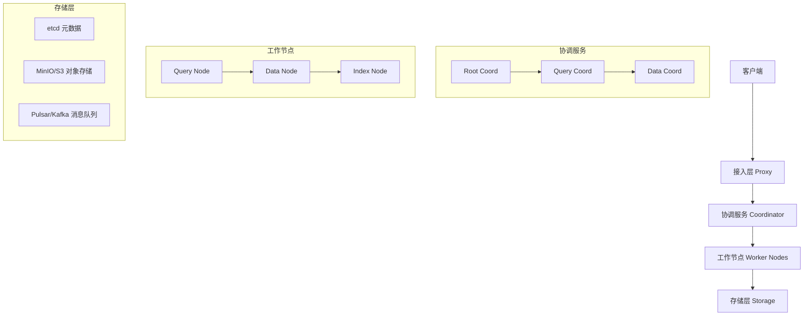
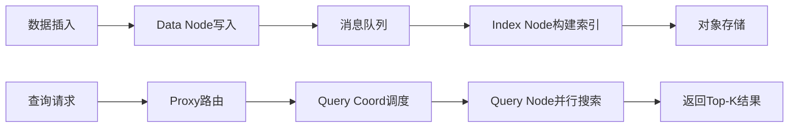

# Milvus向量数据库

## 1. 技术背景

### 1.1 什么是Milvus？

Milvus是一个开源的**向量数据库（Vector Database）**，专为AI/ML应用中的**大规模向量相似性搜索**而设计，能处理万亿级向量的存储和检索，被称为"向量数据库天花板"。

### 1.2 为什么需要它？

在大模型应用（如RAG、推荐系统、图像检索）中，需要将文本、图像等非结构化数据转换为向量 embeddings，然后进行高效的相似性搜索。传统数据库（如MySQL）无法高效处理高维向量的相似性计算，而Milvus专门针对这一场景优化，支持万亿级向量的存储和毫秒级检索。

### 1.3 在大模型体系中的位置

Milvus属于**数据层/工程基础设施层**，是大模型应用的核心组件：

- **模型层**：Embedding模型将文本转换为向量
- **数据层**：**Milvus存储和检索向量** ← 当前位置
- **应用层**：RAG、推荐系统、图像检索等应用
- **工程基础设施层**：Kubernetes、Docker等

与RAG的关系：Milvus是RAG知识库的向量存储引擎，负责存储文档的向量表示，并在查询时快速检索相关文档。

---

# 2. 核心概念

## 2.1 向量检索

- **定义**：将高维向量（如768维的文本embedding）存储在数据库中，通过计算向量间的距离（如余弦相似度、欧氏距离）快速找到最相似的向量。
- **原理**：使用近似最近邻搜索（ANN）算法，牺牲少量精度换取数量级的速度提升。
- **作用**：实现毫秒级的语义相似性搜索，支撑实时的RAG检索。
- **应用场景**：语义搜索、推荐系统、图像检索、去重检测等。

## 2.2 存算分离架构

- **定义**：计算节点和存储节点独立部署、独立扩展的架构设计。
- **原理**：计算层（Worker Nodes）负责数据处理，存储层（etcd/MinIO/S3）负责数据持久化，两者通过网络通信。
- **作用**：计算和存储可以按需独立扩展，提高资源利用率和系统灵活性。
- **应用场景**：大规模分布式系统，需要弹性扩展的生产环境。

## 2.3 分片（Shard）

- **定义**：将一个Collection的数据水平分割成多个片段（Segment），分布在不同的节点上。
- **原理**：数据按时间或大小自动分片，查询时并行搜索所有分片后合并结果。
- **作用**：支持数据的水平扩展和并行处理，突破单机存储和计算限制。
- **应用场景**：海量数据存储、高并发查询场景。

---

# 3. 整体架构

## 3.1 架构概览

Milvus采用**存算分离的微服务架构**，核心分为四层：

## 3.2 核心模块说明

| 模块 | 作用 | 关键技术 |
| ---- | ---- | -------- |
| **Access Layer（接入层）** | 客户端连接、请求路由、负载均衡 | Proxy服务、gRPC |
| **Coordinator Service（协调服务）** | 管理元数据、分片、副本调度 | Root Coord、Query Coord、Data Coord |
| **Worker Nodes（工作节点）** | 执行实际的数据操作（插入、查询、索引构建） | Query Node、Data Node、Index Node |
| **Storage（存储层）** | 数据持久化 | etcd（元数据）、MinIO/S3（对象存储）、Pulsar/Kafka（消息队列） |

---

# 4. 工作流程

## Step 1：数据导入

用户通过客户端将向量数据（如文档embedding）插入Milvus，Data Node接收数据并写入消息队列，同时持久化到对象存储。

## Step 2：索引构建

Index Node从消息队列消费数据，构建向量索引（如IVF_FLAT、HNSW），加速后续的相似性搜索。

## Step 3：查询检索

用户发起查询请求，Proxy将请求路由到Query Coord，Query Coord协调多个Query Node并行搜索各分片，返回Top-K最相似的结果。

整体流程：

---

# 5. 核心技术细节

## 5.1 向量索引算法

### 原理

Milvus支持多种向量索引，核心思想是通过数据结构优化减少搜索时的计算量：

- **IVF_FLAT**：倒排索引 + 精确搜索，将向量聚类后只搜索最近的聚类中心
- **IVF_PQ**：乘积量化压缩，将高维向量压缩为低维编码，节省内存
- **HNSW**：基于图的索引，构建层次化导航小世界图，高召回率
- **DiskANN**：磁盘索引，支持超大规模数据，牺牲部分速度换取更大容量

### 优点

- 支持多种索引算法，可根据场景选择最优方案
- GPU索引加速，大幅提升索引构建和搜索性能
- 支持动态索引切换，无需重新导入数据

### 缺点

- 不同索引在精度、速度、内存之间存在权衡
- 索引构建需要一定时间，实时性要求极高的场景需特殊处理

### 适用场景

- **IVF_FLAT**：对精度要求高，数据量中等
- **HNSW**：高召回率场景，如语义搜索
- **DiskANN**：超大规模数据，内存有限

## 5.2 分布式架构

### 原理

各组件独立部署为独立的服务/容器，支持水平扩展和高可用：

- **Proxy**：可水平扩展，处理更多并发请求
- **Query Node**：可水平扩展，提升查询吞吐
- **Data Node**：可水平扩展，提升写入吞吐
- **Index Node**：可水平扩展，加速索引构建

### 优点

- 弹性扩展：按需增加Worker节点
- 高可用：组件多副本，自动故障恢复
- 读写分离：Query Node专门处理查询，Data Node专门处理写入

### 缺点

- 部署复杂，需要Kubernetes等编排工具
- 组件间网络通信开销
- 运维成本高

### 适用场景

- 千万到万亿级向量的大规模生产环境
- 需要高可用和弹性扩展的业务

---

# 6. 工程实践

## 6.1 实际项目应用

### RAG知识库

Milvus是RAG知识库的核心向量存储引擎：

1. **文档处理**：将文档分块，通过Embedding模型转换为向量
2. **向量存储**：将向量插入Milvus，建立索引
3. **查询检索**：用户提问时，将问题转换为向量，在Milvus中检索最相关的文档片段
4. **生成回答**：将检索到的文档作为上下文，输入LLM生成回答

### 推荐系统

- 存储用户和物品的向量表示
- 通过向量相似性计算实现个性化推荐
- 支持实时更新和在线服务

### 图像检索

- 存储图像的embedding向量
- 以图搜图、相似图像检索
- 支持跨模态检索（文本搜图、图搜文本）

## 6.2 技术选型分析

### 为什么选择Milvus？

- **性能**：万亿级向量支持，毫秒级检索
- **生态**：开源社区活跃，与主流AI框架集成良好
- **灵活性**：支持多种索引算法，可根据场景优化
- **可扩展**：从单机到分布式，覆盖全场景

### 与其他方案对比

| 方案 | 优点 | 缺点 | 适用场景 |
| ---- | ---- | ---- | -------- |
| **Milvus** | 性能强、功能全、生态好 | 部署复杂、运维成本高 | 大规模生产环境 |
| **Pinecone** | 全托管、易用 | 闭源、成本高 | 快速原型、中小规模 |
| **Weaviate** | GraphQL接口、模块化 | 社区相对较小 | 需要复杂查询的场景 |
| **Chroma** | 轻量、易集成 | 性能有限 | 开发测试、小规模应用 |

---

# 7. 技术对比

| 技术方案 | 优点 | 缺点 | 使用场景 |
| -------- | ---- | ---- | -------- |
| **Milvus** | 万亿级支持、高可用、多种索引 | 部署复杂、资源消耗大 | 大规模生产、企业级应用 |
| **Pinecone** | 全托管、零运维、快速上手 | 闭源、成本高、数据安全 | 中小规模、快速原型 |
| **Weaviate** | GraphQL接口、模块化、跨模态 | 社区较小、文档较少 | 复杂查询、多模态应用 |
| **Chroma** | 轻量、Python友好、易集成 | 性能有限、功能较少 | 开发测试、个人项目 |
| **FAISS** | Facebook出品、高性能 | 仅库、非数据库、需自行管理 | 研究实验、嵌入应用 |

---

# 8. 面试重点

## Q1：Milvus的架构是怎样的？

**问题**：请介绍Milvus的整体架构设计。

**回答**：Milvus采用存算分离的微服务架构，分为四层：
1. **接入层（Proxy）**：负责客户端连接、请求路由、负载均衡
2. **协调服务（Coordinator）**：包括Root Coord、Query Coord、Data Coord，管理元数据、分片、副本调度
3. **工作节点（Worker Nodes）**：包括Query Node、Data Node、Index Node，执行实际的数据操作
4. **存储层**：依赖etcd存元数据、MinIO/S3存对象数据、Pulsar/Kafka做消息队列

这种架构支持水平扩展和高可用，适合大规模生产环境。

## Q2：Milvus支持哪些向量索引？如何选择？

**问题**：Milvus有哪些向量索引算法？不同场景如何选择？

**回答**：Milvus支持多种向量索引：
- **IVF_FLAT**：倒排索引+精确搜索，平衡速度和精度，适合中等数据量
- **IVF_PQ**：乘积量化压缩，节省内存，适合内存受限场景
- **HNSW**：基于图的索引，高召回率，适合语义搜索
- **DiskANN**：磁盘索引，支持超大规模数据
- **GPU索引**：利用GPU加速，适合高性能需求

选择时需权衡精度、速度、内存：高精度选HNSW，大内存选IVF_FLAT，内存受限选IVF_PQ，超大规模选DiskANN。

## Q3：Milvus在RAG中如何使用？

**问题**：如何在RAG知识库中使用Milvus？

**回答**：Milvus在RAG中的使用流程：
1. **文档处理**：将文档分块，通过Embedding模型（如BGE、GTE）转换为向量
2. **向量存储**：将向量插入Milvus，建立索引（如HNSW）
3. **查询检索**：用户提问时，将问题转换为向量，在Milvus中进行相似性搜索，返回Top-K相关文档
4. **生成回答**：将检索到的文档作为上下文，输入LLM生成回答

关键优化点：合理的文档分块策略、合适的embedding模型、高效的索引选择、适当的Top-K值。

---

# 9. 我的理解总结

> Milvus是一个专为AI应用设计的开源向量数据库，采用存算分离的微服务架构，支持万亿级向量的存储和检索。它之所以被称为"天花板"，是因为其架构设计足够灵活，从单机开发到分布式生产都能覆盖，而且性能和扩展性都很强。

重点回答：

1. **它是什么？**
   Milvus是一个开源的向量数据库，专门用于存储和检索高维向量，支持万亿级规模，是RAG、推荐系统等AI应用的核心基础设施。

2. **为什么需要它？**
   传统数据库无法高效处理高维向量的相似性搜索，而Milvus通过专门的索引算法和分布式架构，实现毫秒级的向量检索，支撑实时的AI应用。

3. **它如何工作？**
   采用存算分离架构，数据写入Data Node后持久化到对象存储，Index Node构建向量索引，查询时Query Node并行搜索各分片，返回最相似的结果。

4. **在实际项目中如何使用？**
   在RAG知识库中，将文档embedding后存入Milvus，查询时检索最相关的文档片段作为LLM的上下文。选择合适的索引算法（如HNSW）和分布式部署方案，可支撑大规模生产环境。

---

# 10. 延伸学习

相关技术：

- **Embedding模型**：BGE、GTE、OpenAI Embedding等，将文本转换为向量
- **RAG框架**：LangChain、LlamaIndex等，整合向量检索与LLM生成
- **其他向量数据库**：Pinecone、Weaviate、Chroma、FAISS

推荐资料：

- Milvus官方文档：https://milvus.io/docs
- Milvus GitHub：https://github.com/milvus-io/milvus
- Zilliz博客：https://zilliz.com/blog
- 论文：*"Milvus: A Purpose-Built Vector Data Management System"*（SIGMOD 2021）
- 本笔记参考：抖音视频《AI向量数据库天花板 | Milvus是什么？架构是怎么样的》
