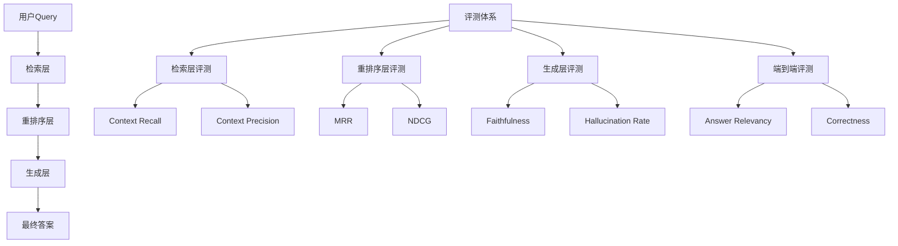
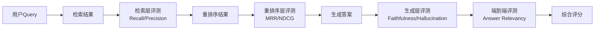

# RAG评测与诊断

## 1. 技术背景

### 1.1 什么是RAG评测？

RAG评测是对检索增强生成（Retrieval Augmented Generation）系统进行**系统性质量评估和问题诊断**的方法论，涵盖检索质量、生成质量、用户体验等多个维度，通过自动化指标和工具持续监控优化RAG系统效果。

### 1.2 为什么需要它？

很多团队搭建了RAG系统，但面临两大痛点：
- **不知道效果好不好**：缺乏量化评估手段，无法衡量系统质量
- **出了问题不知道怎么诊断**：无法定位是检索问题还是生成问题，优化无从下手

RAG评测解决了"如何衡量RAG系统效果"和"如何快速定位问题"两个核心问题，是RAG系统从原型到生产的关键环节。

### 1.3 在大模型体系中的位置

RAG评测属于**应用层+工程基础设施层**，贯穿RAG系统全生命周期：

- **模型层**：Embedding模型、Reranker模型、生成模型
- **数据层**：向量数据库（Milvus等）、文档处理
- **应用层**：**RAG评测与诊断** ← 当前位置
- **工程基础设施层**：CI/CD、可观测性平台

与RAG系统的关系：评测是RAG系统的"体检工具"，通过量化指标发现问题，指导优化方向。

---

# 2. 核心概念

## 2.1 分层评估

- **定义**：将RAG系统按处理流程分为多个层次，逐层评估各环节的质量。
- **原理**：RAG流程包含检索→重排序→生成三个核心环节，每个环节都可能引入问题，需要独立评估以便精准定位。
- **作用**：避免"只看最终结果"的粗放评估，快速定位问题发生在哪个环节。
- **应用场景**：RAG系统开发、调优、生产监控全流程。

## 2.2 忠实度（Faithfulness）

- **定义**：生成内容是否忠实于检索到的上下文，即答案中的信息是否都能在检索结果中找到依据。
- **原理**：通过LLM判断生成内容中的每个事实陈述是否有检索内容支撑。
- **作用**：检测模型是否"编造"了上下文没有的信息，是衡量幻觉的核心指标。
- **应用场景**：知识问答、文档摘要、企业知识库等对准确性要求高的场景。

## 2.3 LLM-as-Judge

- **定义**：使用大语言模型作为评判者，自动评估RAG系统输出质量。
- **原理**：设计评估Prompt，让LLM根据预定义的评分标准对输出进行打分或判断。
- **作用**：实现低成本、可扩展的自动化评估，无需大量人工标注。
- **应用场景**：大规模评测、CI/CD自动化评估、初筛过滤。

---

# 3. 整体架构

## 3.1 评测体系架构

RAG评测体系分为四个层次，对应RAG系统的不同阶段：

## 3.2 核心模块说明

| 评测层次 | 核心指标 | 作用 | 关键技术 |
| -------- | -------- | ---- | -------- |
| **检索层** | Context Recall, Context Precision | 评估检索质量 | 向量相似度、关键词匹配 |
| **重排序层** | MRR, NDCG | 评估排序质量 | Reranker模型 |
| **生成层** | Faithfulness, Hallucination Rate | 评估生成质量 | LLM-as-Judge |
| **端到端** | Answer Relevancy, Correctness | 评估整体效果 | 综合评分 |

---

# 4. 工作流程

## Step 1：检索层评测

评估向量检索的质量，核心看两个指标：
- **Context Recall（上下文召回率）**：是否检索到了回答所需的所有相关信息
- **Context Precision（上下文精确率）**：检索到的上下文中相关信息的占比

如果检索效果不好，后面的生成再好也没用——"垃圾进，垃圾出"。

## Step 2：重排序层评测

评估Reranker模型是否把最相关的内容排到了前面：
- **MRR（Mean Reciprocal Rank）**：第一个正确结果的排名倒数
- **NDCG（Normalized Discounted Cumulative Gain）**：考虑排序位置的评分

## Step 3：生成层评测

评估LLM生成内容的质量：
- **Faithfulness（忠实度）**：生成内容是否有检索内容支撑
- **Hallucination Rate（幻觉率）**：模型编造上下文没有信息的比例

## Step 4：端到端评测

评估最终答案的整体质量：
- **Answer Relevancy（答案相关性）**：回答是否真正回答了用户的问题
- **Correctness（正确性）**：答案是否正确

整体流程：

---

# 5. 核心技术细节

## 5.1 RAGAS评测框架

### 原理

RAGAS（Retrieval Augmented Generation Assessment）是基于LLM的自动化评估框架，无需人工标注参考答案，通过LLM-as-Judge实现端到端评估。

核心指标：
- **Faithfulness**：生成内容是否忠实于检索上下文
- **Answer Relevancy**：回答与问题的相关性
- **Context Precision**：检索上下文中相关信息的占比
- **Context Recall**：是否检索到了所有相关信息

### 优点

- 开源免费，社区活跃
- 无需人工标注，自动化程度高
- 支持端到端评估，覆盖RAG全流程

### 缺点

- 依赖LLM评判，存在评判偏差
- 评估成本较高（需要调用LLM）
- 对中文支持有待优化

### 适用场景

- RAG系统开发阶段的效果评估
- 不同配置方案的对比测试
- CI/CD自动化评估

## 5.2 TruLens可观测性平台

### 原理

TruLens提供端到端的RAG链路追踪和评估，核心组件包括：
- **Groundedness（有据性）**：答案是否有检索内容支撑
- **Answer Relevance（答案相关性）**：答案对问题的回答程度
- **Context Relevance（上下文相关性）**：检索内容与问题的相关程度

通过Dashboard实现持续监控和可视化。

### 优点

- 提供完整的可观测性（Observability）
- 内置Dashboard，可视化效果好
- 支持持续监控，适合生产环境

### 缺点

- 相对RAGAS，社区较小
- 部署配置相对复杂
- 部分高级功能需要付费

### 适用场景

- 生产环境的持续监控
- 需要可视化仪表板的场景
- 团队协作的RAG项目

## 5.3 LangSmith追踪平台

### 原理

LangSmith是LangChain官方的追踪和评估平台，提供：
- 端到端的RAG链路追踪
- 自定义评估指标
- 与LangChain/LangGraph深度集成

### 优点

- 与LangChain生态无缝集成
- 追踪功能强大，可查看完整调用链
- 支持自定义评估逻辑

### 缺点

- 闭源商业产品，有使用成本
- 绑定LangChain生态，独立使用受限
- 国内访问可能有网络问题

### 适用场景

- 已使用LangChain/LangGraph的技术栈
- 需要完整链路追踪的场景
- 有预算的商业项目

---

# 6. 工程实践

## 6.1 实际项目应用

### 企业知识库

- **场景**：企业内部文档问答系统
- **评测重点**：Faithfulness（避免编造）、Context Precision（检索精准）
- **诊断方向**：检索噪音过多→优化embedding模型或chunk策略；幻觉严重→优化Prompt或降低temperature

### 客服机器人

- **场景**：基于知识库的智能客服
- **评测重点**：Answer Relevancy（回答用户问题）、Correctness（答案正确）
- **诊断方向**：答非所问→检查检索相关性；答案不准确→检查知识库质量

### 内容生成

- **场景**：基于参考资料的内容创作
- **评测重点**：Faithfulness（忠实于素材）、Answer Relevancy（符合需求）
- **诊断方向**：偏离主题→优化检索策略；内容不准确→检查源文档质量

## 6.2 技术选型分析

### 为什么需要评测体系？

- **量化效果**：用数据说话，告别"感觉还行"
- **定位问题**：快速找到瓶颈，精准优化
- **持续改进**：建立基线，跟踪优化效果
- **质量保障**：CI/CD集成，防止质量回退

### 与其他方案对比

| 方案 | 优点 | 缺点 | 适用场景 |
| ---- | ---- | ---- | -------- |
| **RAGAS** | 开源、自动化、覆盖全 | 依赖LLM、成本较高 | 开发评测、方案对比 |
| **TruLens** | 可观测性强、有Dashboard | 社区较小、部署复杂 | 生产监控、团队协作 |
| **LangSmith** | 追踪强大、与LangChain集成 | 闭源、有成本 | LangChain技术栈 |
| **人工评估** | 准确度高、可处理复杂case | 成本高、速度慢 | 精标、疑难case |

---

# 7. 技术对比

| 技术方案 | 优点 | 缺点 | 使用场景 |
| -------- | ---- | ---- | -------- |
| **RAGAS** | 开源免费、自动化评估、无需标注 | 依赖LLM、评估有偏差 | 开发阶段评测 |
| **TruLens** | 可观测性好、Dashboard可视化 | 社区小、部署复杂 | 生产环境监控 |
| **LangSmith** | 链路追踪强、LangChain集成 | 闭源付费、生态绑定 | LangChain项目 |
| **DeepEval** | 易集成CI/CD、幻觉检测 | 功能相对较少 | CI/CD自动化 |
| **人工评估** | 准确度高、处理复杂case | 成本高、速度慢 | 精标、疑难case |

---

# 8. 面试重点

## Q1：如何评测一个RAG系统的效果？

**问题**：请介绍如何系统性地评测RAG系统的效果。

**回答**：RAG评测要分层进行，覆盖四个层次：

1. **检索层**：看Context Recall（召回率）和Context Precision（精确率），评估检索质量
2. **重排序层**：看MRR和NDCG，评估排序质量
3. **生成层**：看Faithfulness（忠实度）和Hallucination Rate（幻觉率），评估生成质量
4. **端到端**：看Answer Relevancy（答案相关性），评估整体效果

工具选择：开发阶段用RAGAS做自动化评测，生产环境用TruLens或LangSmith做持续监控。

最佳实践：分层评估+自动化Pipeline+人工精标+A/B测试+持续监控。

## Q2：RAG系统出现幻觉怎么诊断和解决？

**问题**：RAG系统生成的内容与检索到的文档不一致，如何定位和解决？

**回答**：幻觉问题出现在生成层，诊断和解决步骤：

1. **定位问题**：用Faithfulness指标确认是否真的存在幻觉
2. **检查检索质量**：如果Context Precision低，可能是检索到了不相关的内容，导致模型被误导
3. **检查Prompt设计**：是否明确要求模型只基于提供的上下文回答
4. **检查模型参数**：temperature过高会导致模型更"创造性"，容易编造
5. **优化方案**：
   - 优化检索策略，提高上下文相关性
   - 调整Prompt，强化"只基于上下文回答"的约束
   - 降低temperature，减少随机性
   - 考虑使用更小的、更专业的模型

## Q3：RAGAS和TruLens有什么区别？如何选择？

**问题**：RAGAS和TruLens都是RAG评测工具，它们有什么区别？如何选择？

**回答**：

| 维度 | RAGAS | TruLens |
|------|-------|---------|
| **定位** | 评测框架 | 可观测性平台 |
| **核心功能** | 自动化评估指标计算 | 链路追踪+评估+监控 |
| **部署** | Python库，简单集成 | 需要部署Dashboard |
| **适用阶段** | 开发评测 | 生产监控 |
| **成本** | 开源免费 | 基础功能免费，高级功能付费 |

选择建议：
- **开发阶段**：用RAGAS做方案对比和效果评估
- **生产环境**：用TruLens做持续监控和问题诊断
- **LangChain项目**：优先考虑LangSmith，集成更紧密
- **最佳实践**：RAGAS做开发评测 + TruLens/LangSmith做生产监控

---

# 9. 我的理解总结

> RAG评测是RAG系统的"体检工具"，通过分层评估（检索层→重排序层→生成层→端到端）量化系统质量，用RAGAS、TruLens等工具实现自动化评估和持续监控，是RAG从原型到生产的关键环节。

重点回答：

1. **它是什么？**
   RAG评测是对检索增强生成系统进行系统性质量评估和问题诊断的方法论，涵盖检索质量、生成质量、用户体验等多个维度，通过自动化指标和工具持续优化RAG系统效果。

2. **为什么需要它？**
   解决"不知道效果好不好"和"出了问题不知道怎么诊断"两个核心痛点，让RAG优化从"凭感觉"变成"看数据"，是RAG系统从原型到生产的关键环节。

3. **它如何工作？**
   分层评估：检索层看召回率和精确率，重排序层看MRR和NDCG，生成层看忠实度和幻觉率，端到端看答案相关性。通过RAGAS等工具实现自动化评估，用TruLens等平台做持续监控。

4. **在实际项目中如何使用？**
   开发阶段用RAGAS做方案对比和效果评估，集成到CI/CD做自动化检测；生产环境用TruLens或LangSmith做持续监控，及时发现问题。最佳实践是分层评估+自动化Pipeline+人工精标+A/B测试+持续监控。

---

# 10. 延伸学习

相关技术：

- **RAG系统**：LangChain、LlamaIndex等RAG框架
- **向量数据库**：Milvus、Pinecone等向量存储检索
- **评测框架**：RAGAS、TruLens、DeepEval

推荐资料：

- RAGAS GitHub：https://github.com/explodinggradients/ragas
- TruLens GitHub：https://github.com/truera/trulens
- LangSmith官方文档：https://docs.smith.langchain.com/
- DeepEval GitHub：https://github.com/confident-ai/deepeval
- 本笔记参考：抖音视频《企业级RAG评测与诊断指南，13分钟带你搞明白！》
