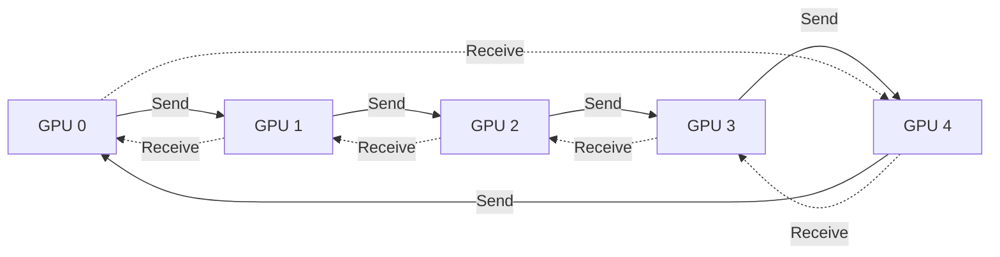

---
aliases:
  - 微调面试题
  - 机器学习面试
  - 深度学习面试
tags:
  - AI
  - 面试
  - 机器学习
  - 深度学习
  - NLP
  - 大模型
  - 微调
  - 强化学习
  - 多模态
created: 2026-08-17
---

# 微调核心技术

---

## 1. 机器学习

### 1.1 机器学习基础概念

#### 1.1.1 机器学习的主要分类有哪些？

**核心知识**

按监督方式：

- 有监督学习：使用带标签数据训练（如分类、回归）。
- 无监督学习：使用无标签数据，挖掘数据内在结构（如聚类、降维）。
- 半监督学习：结合少量标签数据和大量无标签数据训练。
- 强化学习：通过与环境交互，以 “奖励” 机制优化策略。

**面试表达**

机器学习从数据标注角度可以分为四类，有监督学习、无监督学习、半监督学习和强化学习。有监督学习就是使用带标签数据训练，通过使用人工标注的数据进行模型学习的方式。无监督学习则是用没有标签的数据，让模型按照一定规则去发现数据中的规律，例如根据特征数值的密度进行聚类。而半监督学习是介于两者之间，用少量带标签的数据和大量无标签数据一起训练，一定程度上兼顾两者的特点，主要是为了节约数据标注成本。而强化学习比较特殊，是通过和环境互动，用奖励机制来优化策略，进行学习的方式。

#### 1.1.2 简述验证集和测试集的区别。

**核心知识**

验证集用于调整模型的超参数，并在训练过程中评估其性能；而在训练过程完成并选择了超参数之后，使用测试集来评估模型的最终性能。

**面试表达**

整个模型训练使用的数据集会分为训练集、验证集、测试集三部分。训练集拥有最大的数据量，主要用于模型学习。而测试集是在整个训练过程结束后，进行评测，计算一些指标来评估模型好坏的数据集。验证集则是在训练过程中，在一定步数后便进行模型评测的数据集，主要是为了方便在训练过程中评估模型性能，并适当调整学习策略。这几个数据集只是作用不一样，数据格式一致。

### 1.2 数据处理与特征工程

#### 1.2.1 什么是特征工程？包含哪些内容？

**核心知识**

特征工程指的是通过对原始数据的处理、转换和构造，生成新的特征或选择有效的特征，从而提高模型的性能。内容包括：

- 特征选择：从原始特征中挑选出与目标变量关系最密切的特征，剔除冗余、无关或噪声特征。包括过滤法、包裹法、嵌入法等。
- 特征转换： 对数据进行数学或统计处理，使其变得更加适合模型的输入要求。包括归一化、标准化、类别编码（独热编码、标签编码）等。
- 特征构造：特征构造是基于现有的特征创造出新的、更有代表性的特征。包括创建交互特征（如特征乘积）、统计特征（如均值、标准差）、日期时间特征等。
- 特征降维：在保持数据本质的情况下，减少特征维度，缓解维度灾难、避免过拟合。包括 PCA、LDA、t-SNE、自编码器等方法。

**面试表达**

特征工程就是将数据构建成模型更容易理解形式的过程。可以分为特征选择、特征转换、特征构造、特征降维。特征选择就是从一堆特征指标中挑出最重要的，去掉那些没用的或重复的指标数据。特征转换是对数据进行处理，例如将类别的文字转换成类别数值进行表达，以及将数值范围压缩到0到1范围内。特征构造则是基于现有特征指标构造新的特征指标，以达到更好的学习效果。特征降维则是对于当特征指标过多，导致学习过程过于复杂，通过保留数据主要信息的矩阵运算，减少输入数据的维度数量，让模型更容易处理。在机器学习中特征工程的好坏直接影响模型效果，是一个需要做好的工作。

#### 1.2.2 如何处理高维特征？

**核心知识**

当特征维度增加时，会导致模型复杂度剧增、计算的复杂度呈指数级增长、过拟合风险升高，这种现象被称为”维度灾难”。

处理高维特征，可以通过特征选择剔除无关特征；采用PCA、LDA或t-SNE等方法对特征进行降维处理；采用正则化技术（L1、L2、弹性网络）约束模型复杂度；还可以选择更适合高维数据的模型，例如 SVM，或者支持特征重要性评估的抗噪声模型（比如随机森林、XGBoost）。

**面试表达**

高维特征会导致计算量爆炸，还容易导致模型学习过拟合。解决的话有几个思路：进行特征选择，去掉无关紧要的特征；用降维方法，比如PCA、LDA这些，把高维数据投影到低维空间，保留最重要的信息。这是从维度下手，也可以从防止过拟合、选择合适学习方法下手。使用L1、L2正则化，来防止模型过拟合学习。并且，SVM、随机森林、XGBoost这些学习方法天生就适合处理高维数据，更换这些方法也是可以的。

#### 1.2.3 数据中有噪声如何处理？

**核心知识**

首先进行噪声检查，比较常见的方法：

- 距离检测：通过寻找数据集中与其他观测值及均值差距最大的点作为异常点。
- 聚类方法检测：将类似的取值组织成”群”或”簇”，落在”簇”集合之外的值被视为离群点。

在进行噪声检查后，通常采用分箱、聚类、回归、计算机检查和人工检查结合等方法”光滑”数据，去掉数据中的噪声。

**面试表达**

数据噪声就是数据中的杂质，会影响模型的学习效果。对于噪声采用的操作就只有去除、削弱。首先得先检测噪声，常用的方法有距离检测、聚类方法，把相似的数据分到一组，特殊且独立的就是噪声点。检测到噪声后，去除或减弱的方法也有很多种。使用聚类方法直接进行剔除是一种选择，但是这种绝对性的剔除方式，会丢弃掉噪声中包含的有用信息，所以对噪声进行削弱也是常用方法，例如分箱方法，它把连续数据分成区间，进行平滑去除掉极端值；或者使用回归方法预测并修正异常值。当然，最稳妥的方式肯定还是进行人工检查，但这通常适用于数据量不大的时候。

#### 1.2.4 如何解决数据不平衡问题？

**核心知识**

- 采样：对小样本加噪声采样，对大样本进行下采样
- 调整数据权重：对某类数据进行特殊的加权，比如Adaboost
- 采用对不平衡数据集不敏感的算法
- 改变评价标准：用AUC-PR来进行评价
- 采用集成学习：如Bagging、Boosting等方法
- 考虑数据的先验分布

**面试表达**

数据不平衡是个常见问题，通常是可获取到的某一类数据较少，相比于其他类型的数据具有明显的数量不足。那么，改善的方法可以从增加数据入手，对少数类数据做过采样，对多数类数据做下采样，从而减弱数量上的差异。或者是，给少数类数据加点噪声，将构造出的数据加入数据集中进行扩充。当然，更换决策树、随机森林这些对不平衡数据不敏感的学习方法也是可行的。最重要的是评估，使用准确率、召回率很难评估好这种不平衡的数据集学习效果，要使用AUC-PR曲线或者F1分数来评估。同样的，也可以从学习方法入手，使用Adaboost、调整数据权重，从而让模型对于样本较少的类别数据进行更深度的学习，提升少数类数据的识别能力。

### 1.3 模型评估与模型选择

#### 1.3.1 什么是过拟合和欠拟合？产生的原因是什么？如何解决？

**核心知识**

**过拟合**

> [!important] 过拟合
> 模型在训练集表现好，但测试集表现差（高方差）。

产生原因：模型复杂度过高，训练数据不足，特征过多，训练过长。

解决方法：简化模型或者降维降低模型复杂度，增加训练数据，使用正则化，交叉验证，早停。

**欠拟合**

> [!important] 欠拟合
> 模型在训练集和测试集表现都很差（高偏差）。

产生原因：模型复杂度不足 ，特征不足，训练不充分，过强的正则化。

解决方法：增加模型复杂度，增加特征或者改进特征工程，增加训练时间，减少正则化强度。

**面试表达**

过拟合和欠拟合是模型训练中的两个常见问题。简单来说，过拟合就是学过头，死记硬背，只会这个任务；欠拟合就是没学好，什么任务都没学好。过拟合的原因通常是任务简单，但是模型太复杂，数据不够，特征太多或者训练时间太长，这些因素共同引起的模型学习问题。解决方法可以是根据任务简化模型、增加数据量、用正则化、交叉验证或者早停法减少模型训练过程中的学习力度。欠拟合的原因则通常是，相比于任务来说模型太简单，特征不够，训练不充分或者正则化太强。相应的解决方法是增加模型复杂度、改进特征工程、延长训练时间或者减少正则化。

> [!tip] 面试一句话
> 一个好的模型，在训练中是要找到那个刚刚好的平衡点，不仅能对于训练数据进行很好的拟合，也能很好的完成测试集的评估验证。

### 1.4 模型求解和优化

#### 1.4.1 什么是梯度下降法？写出梯度下降法的更新公式。

**核心知识**

梯度下降法（gradient descent）是一种常用的一阶优化方法，是求解无约束优化问题最简单、最经典的方法之一。梯度下降法是迭代算法，基本思路就是先选取一个适当的初始值，然后沿着梯度方向或者负梯度方向，不停地更新参数，最终取到极小值。

这里的是参数取值为时损失函数 的梯度； 是每次迭代的”步长”，被称为”学习率”。

**面试表达**

梯度下降法是模型学习中最常用的优化方法，它就像爬山时找最陡峭的山路下山。原理的话，是数学概念中的导数，对应一个函数来说，导数就是它的变化率。而在模型学习过程中，通过将前向传播结果对齐到标准答案，并用损失函数的数值进行表达，那么当损失函数最小，便是模型可以通过前向传播完成任务。而梯度下降法，就是通过找到损失函数的变化率，来找到损失函数值最小时候模型权重的方式。其基本公式就是，新权重等于原始权重减去学习率乘以原始权重时的梯度，从而实现更新权重参数，并找到损失函数最小的方式。

#### 1.4.2 什么是BGD、SGD、MBGD？描述各自的优缺点。

**核心知识**

**批量梯度下降（BGD）**

每次迭代使用全部训练数据计算梯度。

优点：稳定收敛。

缺点：计算开销大。

**随机梯度下降（SGD）**

每次迭代随机选取一个样本计算梯度。

优点：速度快，适合大规模数据。

缺点：梯度更新方向不稳定，优化过程震荡较大，可能难以收敛。

**小批量梯度下降（MBGD）**

每次迭代使用一小批样本（如32、64个）计算梯度。

> [!important] 核心结论
> 平衡了 BGD 的稳定性和 SGD 的速度，是最常用的方法。

**面试表达**

不同的梯度下降法，区别只是在于获取当前梯度的方式。随即使用一条样本来获取梯度的方式是随机梯度下降法，缺点是更新方向具备随机性，优点是计算量小、快。而最稳重的那肯定是用全部的数据来获取梯度，那么这个方式计算的梯度可以在整个数据集上稳定朝收敛方向更新权重，缺点便是计算量过大、慢。所以折中的方法便是，使用一定数量的样本来获取梯度的方式，小批量梯度下降法，其兼顾收敛方向稳定，计算量不过于繁重的优点。在模型训练中，小批量梯度下降法是常用方法。

#### 1.4.3 梯度下降法有哪些主要问题？如何解决？

**核心知识**

**特征量纲不一致，导致收敛速度慢**

解决方案：通常需要提前对特征进行缩放（如标准化或归一化），以加快收敛速度。

**局部极小值、鞍点问题**

可能陷入局部极小值（非全局最优解），或遇到鞍点（梯度为零但非极值点）。

解决方案：使用优化方法，如动量法（Momentum）、自适应优化器（如Adam）或二阶方法（如牛顿法）。

**面试表达**

梯度下降法的常见问题通常是由数据导致的，特征量纲不一致会导致收敛慢，学习率选择困难，学习率过大容易跳过最优解并在最优解附近振荡，学习率过小则同样会导致收敛慢，还会容易陷入局部极小值或鞍点。并且因为模型拟合的是一个十分复杂的函数，其会出现梯度消失/爆炸的问题，从而导致某些权重参数进行更新时，其所对应的梯度无穷大或无穷小，导致无效更新。不同的问题都有其对应的解决方法，如更换AdamW这种自适应优化器，对特征进行标准化或归一化，学习率衰减、梯度裁剪等。总的来说，梯度下降法虽然简单，但很难调好参数，也很难取得最佳效果。

### 1.5 模型评价指标

#### 1.5.1 回归任务的常用评价指标有哪些？

**核心知识**

- 均方误差（MSE）：预测值与真实值差的平方均值。重视大误差惩罚严重错误。
- 平均绝对误差（MAE）：预测值与真实值差的绝对值均值。追求稳健，避免异常值影响。
- R²（决定系数）：衡量模型整体对目标变量的解释能力，越接近 1 越好。

**面试表达**

回归任务常用的评价指标有均方误差、平均绝对误差、R²决定系数。作用都是评估预测值和真实值的差异。其中均方误差是预测值和真实值差的平方的平均，适合对误差比较敏感的场景，并对大误差进行惩罚。平均绝对误差则是预测值和真实值差的绝对值的平均，这个指标比较稳健，不容易被异常值影响。R²决定系数衡量模型对数据的解释能力，值越接近1说明模型解释得越好，越接近0说明模型解释能力越差。这三个指标各有侧重，MSE重视大误差，MAE比较稳健，R²反映整体解释能力，通常要结合使用。

#### 1.5.2 分类任务有哪些常用的评价指标？

**核心知识**

- 准确率（Accuracy）：正确预测样本占比。
- 精确率（Precision）：预测为正例的样本中实际为正例的比例。
- 召回率（Recall）：实际为正例的样本中被正确预测的比例。
- F1 分数：精确率和召回率的调和平均。
- ROC 曲线与 AUC：ROC 曲线以 FPR 为横轴、TPR 为纵轴，AUC 为曲线下面积，衡量模型区分正负类的能力。全面评估模型整体排序能力，对类别比例不敏感，适合评估和比较模型本身性能。
- AUC-PR曲线：描述不同阈值下精确率和召回率的曲线，特别适用于高度不平衡的数据（异常检测），此时AUC-PR曲线比ROC曲线更具参考性。

**面试表达**

分类任务的常用评价指标有准确率、精确率、召回率、F1分数、ROC曲线和AUC、AUC-PR曲线，整体都在讲能分对的能力有多少。准确率就是预测正确的比例。精确率是预测为正例中实际为正例的比例，关注预测的准确性。召回率是实际为正例中被正确预测的比例，关注覆盖面。F1分数是精确率和召回率的调和平均，平衡了两者。ROC曲线和AUC是评估模型区分正负类能力的指标，AUC值越大说明模型区分能力越强，而且对类别比例不敏感。AUC-PR曲线特别适合高度不平衡的数据，比如异常检测场景。这些指标要根据具体业务场景来选择使用。

#### 1.5.3 如何利用ROC曲线判断模型的好坏？

**核心知识**

从图像上看，ROC曲线越”陡”，即TPR 越高，同时 FPR 越低时，模型的性能就越好。

一般会结合AUC来看：AUC 表示ROC曲线下的面积，用于量化模型性能。AUC值越大，模型区分正负类的能力越强，模型性能越好。AUC值=0.5表示模型接近随机猜测，AUC值=1代表完美模型。

AUC如果小于0.5，说明预测诊断比随机性猜测还差，实际情况中不应该出现这种情况；可能是设置的状态变量标准有误，需要查看设置；对于这种情况，只需要将预测结果翻转就可以得到AUC > 0.5的更好的模型。

**面试表达**

从图像上看，ROC曲线越'越好，也就是TPR越高同时FPR越低，说明模型在保持低误报率的情况下能有高命中率。此外，还需要结合AUC来看，AUC就是ROC曲线下的面积，AUC值越大模型性能越好。AUC=0.5表示模型接近随机猜测，AUC=1代表完美模型。如果AUC小于0.5，说明模型比随机猜测还差，这种情况通常是标签设置反了，把预测结果翻转一下就能得到更好的模型。ROC曲线和AUC是评估分类模型最常用的指标之一。

---

## 2. 深度学习

### 2.1 深度学习基础概念

#### 2.1.1 什么是深度学习？与传统机器学习的核心区别是什么？

**核心知识**

深度学习是机器学习的子领域，通过多层神经网络（深度神经网络）自动提取数据的多层次特征，处理图像、文本等复杂非结构化数据。

核心区别：传统机器学习依赖人工设计特征，而深度学习通过多层网络自动学习特征；深度学习对数据量和计算资源需求更高，擅长处理高维非结构化数据。

**面试表达**

深度学习简单说就是用多层神经网络来学习数据。机器学习需要人工设计特征；而深度学习就是给模型一个由神经网络构成的大脑，让模型从数据中学习特征，来完成任务。比如识别猫的图片，机器方法需要人工提取猫的耳朵、胡须、眼睛等特征；深度学习则直接把图片喂给神经网络，让它自己发现这些特征。深度学习特别擅长处理图像、语音、文本这些复杂的数据，但需要更多的数据和计算资源。可以说，深度学习让机器学习从手工制作升级到了自动制造。

#### 2.1.2 神经网络的基本构成是什么？

**核心知识**

由神经元、层和连接权重组成：

- 神经元：接收输入信号，加权求和后通过激活函数输出。
- 层：输入层（接收原始数据）、隐藏层（特征转换）、输出层（输出预测结果）。
- 连接权重：层间神经元的可学习参数，决定信号传递强度。

**面试表达**

神经网络可以划分为神经元、层、连接权重三部分，其中神经元是基本单元，也是主要计算部分，它接收输入信号，并给它们加上不同的权重，然后通过激活函数输出结果。层则是神经元高一级的组织方式，最底层是输入层，接收原始数据；中间是隐藏层，负责特征转换；最上层是输出层，给出最终预测结果。连接权重是层与层之间的连接强度，就像神经元之间的连接强度，这些是模型要学习的参数，决定了信息传递的强弱。简单说，神经网络就是由很多神经元分层连接而成的网络，整体通过调整连接权重来任务学习。

### 2.2 激活函数

#### 2.2.1 激活函数的作用是什么？为什么必须是非线性的？

**核心知识**

> [!important] 激活函数的作用
> 为神经网络引入非线性，使模型能拟合复杂的非线性关系。

> [!warning] 易错点
> 若激活函数为线性，多层网络会退化为单层线性模型，无法学习复杂模式。

**面试表达**

激活函数就像神经元的开关，决定神经元是否被激活以及激活的程度，也就是信号传递的强度。激活函数必须是非线性的，这是因为如果激活函数都是线性的，那么多层神经网络就相当于一个单层线性网络，失去了深度学习的意义。就像多个线性函数连在一起，其结果还是一个线性函数。而非线性关系可以让网络能够学习复杂的模式，比如识别图片中的猫狗、理解语言的含义等。因此，可以说激活函数是深度学习能够处理复杂问题的关键，其提供的是非线性关系进行表达的可能。

#### 2.2.2 常见激活函数

**核心知识**

**Sigmoid 函数**

公式：

- 优点：平滑可导，输出映射到 (0,1)，适合二分类输出层。
- 缺点：易梯度消失（输入绝对值较大时导数接近 0）；输出非零中心，导致后续层的输入始终为正，影响后续梯度更新方向。

**ReLU 函数**

公式：

- 优点：计算高效，缓解梯度消失；引入稀疏性，减少过拟合风险。
- 缺点：输入为负时，会出现”神经元死亡”问题（输出恒为 0）。

**Softmax 函数**

公式：

作用：将一个任意的实数向量转换为一个概率分布，确保输出值的总和为1,是二分类激活函数Sigmoid在多分类上的推广。Softmax常用于多分类问题的输出层，用来表示类别的预测概率。

**面试表达**

激活函数是深度学习神经网络中的核心组件，它给网络注入了非线性能力，让模型能够学习复杂的模式。常用的激活函数有Sigmoid函数、ReLU函数、Softmax函数。Sigmoid函数的公式是 f(x) = 1/(1+e^(-x))，能把任意实数映射到0到1之间。其最大优势是输出范围明确，特别适合二分类问题的输出层。但其也容易出现梯度消失的问题。ReLU函数的公式是f(x) = max(0, x)，也是目前最常用的激活函数之一，其计算效率高，可以有效缓解梯度消失问题，还能引入稀疏性，减少过拟合风险。而Softmax函数的公式是把每个类别的指数值除以所有类别指数值的和，确保输出总和为1，它的作用是把一个任意实数向量转换成一个概率分布。

Softmax可以看作是Sigmoid在多分类问题上的推广，Sigmoid处理二分类，Softmax处理多分类。

> [!tip] 面试一句话
> 激活函数的选择要根据具体任务和网络层位置来定：隐藏层常用 ReLU，二分类输出层用 Sigmoid，多分类输出层用 Softmax。

#### 2.2.3 ReLU 在 0 处不可导，为什么还能使用？为什么神经网络常用 ReLU 作为激活函数？

**核心知识**

0 处不可导是因为存在多个可能的切线，但实际中输入为 0 的概率极低。通常默认取一个梯度值（如0），不影响整体训练。

- 计算效率高于 Sigmoid、Tanh；
- 有效避免梯度消失（正区间导数为 1）；
- 引入稀疏性，缓解过拟合，提升了模型的泛化性能。
- 有助于随机梯度下降方法收敛。

**面试表达**

ReLU在0处确实不可导，并且还有神经元死亡的问题，但实际中输入正好为0的概率极低，所以这个问题影响不大。实际训练过程中会默认取一个梯度值，比如0，不影响整体训练。此外ReLU的计算效率高，比Sigmoid、Tanh这些函数快得多，特别是在大规模网络中。并且由于ReLU可以取0，这就引入了稀疏性，让一部分神经元可以不激活，相当于做了某种正则化，能减少过拟合风险。并且ReLU在正区间的梯度是常数，不会出现梯度消失，这有助于随机梯度下降方法更快收敛。综合来看ReLU还是目前最实用的激活函数之一。

### 2.3 神经网络的训练

#### 2.3.1 损失函数的作用是什么？神经网络中，分类和回归任务常用的损失函数有哪些？

**核心知识**

作用：衡量预测值与真实值的差异，是参数优化的目标函数。

- 分类任务：二元交叉熵（BCE，二分类）、多分类交叉熵（CrossEntropy，多分类）。
- 回归任务：均方误差（MSE）、平均绝对误差（MAE）、Smooth L1。

**面试表达**

损失函数衡量预测值和真实值之间的差距。模型训练的目标就是让这个损失函数的值尽可能小。分类任务常用的损失函数有二分类的二元交叉熵（BCE），多分类的多分类交叉熵。

回归任务常用的损失函数有均方误差（MSE）、平均绝对误差（MAE），以及二者结合的Smooth L1。

#### 2.3.2 反向传播算法的原理是什么？

**核心知识**

> [!important] 反向传播本质
> 基于微积分的链式法则，从输出层到输入层反向计算损失函数对各参数的梯度。

- 首先前向传播：计算输入经各层后的输出及损失。
- 然后反向传播：从输出层开始，逐层反向传递梯度，并更新参数（权重和偏置）。
该算法存储了计算某些参数梯度时所需的任何中间变量。

> [!important] 核心结论
> 核心目的：高效计算梯度，为参数优化提供依据。

**面试表达**

反向传播算法是用微积分的链式法则从后往前计算梯度，可以分两步，先进行前向传播，再进行反向传播。即先进行输入层到输出层的计算，再从输出层开始，逐层反向计算损失函数对每个参数的梯度。反向传播算法存储了计算梯度时需要的中间变量，这样可以高效地计算出所有参数的梯度，然后用这些梯度来更新参数。

#### 2.3.3 如何评估深度学习模型的性能？

**核心知识**

- 分类任务：准确率、精确率、召回率、F1 分数、ROC-AUC。
- 回归任务：均方误差（MSE）、平均绝对误差（MAE）、R²。
评价模型的泛化能力：在测试集上的表现，结合交叉验证。

**面试表达**

评估深度学习模型性能需要根据任务类型来选择合适的指标。分类任务常用准确率、精确率、召回率、F1分数和ROC-AUC。回归任务常用均方误差（MSE）、平均绝对误差（MAE）和R²。除了这些指标，还要评估模型的泛化能力，也就是在测试集上的表现。通常会结合交叉验证来评估模型在不同数据子集上的表现，避免过拟合。评估模型不能只看一个指标，要综合考虑多个方面，还要结合实际应用场景。

#### 2.3.4 什么是早停法（Early Stopping）？作用是什么？

**核心知识**

当验证集损失不再下降时停止训练，避免模型过度拟合训练数据，节省计算资源。

**面试表达**

早停法就是在验证集损失不再下降的时候停止训练。作用主要体现在避免过拟合与节省计算资源上当模型在训练集上表现越来越好，但在验证集上表现变差时，说明模型开始出现过拟合情况，这时候会触发早停停止训练。并且，这样的停止，通常会在完全数据集训练完成前停止，可以保障模型的泛化能力，并避免不必要的计算。早停法的实现就是监控验证集的损失，如果连续几个epoch都没有下降，就停止训练。这是一种简单但非常有效的防止过拟合的方法。

### 2.4 神经网络的优化（训练的技巧）

#### 2.4.1 什么是梯度消失和梯度爆炸？如何解决？

**核心知识**

**什么是梯度消失和梯度爆炸**

- 梯度消失：深层网络中，梯度反向传播时经多层传递后趋近于 0，导致浅层参数难以更新，学习无法进行。
- 梯度爆炸：梯度反向传播时经多层传递后急剧增大，导致网络不稳定。

**解决方法**

使用 ReLU 激活函数、梯度裁剪（针对梯度爆炸）、合理初始化权重、改变网络结构（如引入BN层、残差连接、LSTM等）。

**面试表达**

梯度消失和梯度爆炸是深度网络训练中的两个经典问题。梯度消失就是梯度在反向传播时经过多层传递后变得非常小，导致浅层参数几乎不更新。常见原因是用Sigmoid这类激活函数导致的过小梯度，或者网络太深。梯度爆炸正好相反，梯度在反向传播时变得非常大，导致参数更新幅度过大，网络不稳定。解决方法同样有很多，用ReLU激活函数可以缓解梯度消失问题。而梯度裁剪可以防止梯度过大，可以解决梯度爆炸问题。此外，合理的权重初始化很重要，比如用Xavier或He初始化。并且，既然是梯度问题，那么改变网络结构，比如加入批归一化层、残差连接、LSTM等，也能有效缓解这些问题。根本解决方法都是，让梯度在传播过程中保持合适的幅度，既不能太小也不能太大。

#### 2.4.2 为什么 Adam 在实际中常用？与 SGD 相比有何优势？

**核心知识**

> [!important] Adam 优化器
> Adam 结合了动量（Momentum）和自适应学习率（RMSProp），收敛稳定且速度快，对超参数敏感低。

**面试表达**

Adam结合了动量法和自适应学习率的优点。动量法让梯度更新有惯性，能加速收敛。自适应学习率让每个参数都有不同的学习率，参数更新频繁的学习率小，更新少的学习率大。整体来说，Adam收敛稳定且速度快，不需要像SGD那样精细调参，也对超参数不那么敏感，学习率设置个大概范围就能用。在大多数情况下表现都很好，是开箱即用的好选择。总的来说，Adam是实用性和性能的平衡，是最常用的优化器之一。

#### 2.4.3 为什么 Adam + L2正则化效果不好？AdamW是如何解决的？

**核心知识**

**Adam + L2 问题**

在 Adam 中直接将 L2 正则化项加入梯度，正则化项会与普通梯度一起经过 Adam 的自适应缩放，导致实际的权重收缩强度随参数和训练状态变化，无法实现稳定、独立的权重衰减。

**AdamW 解决方案**

将权重衰减从梯度更新中解耦，直接对参数进行独立衰减，使权重衰减强度不再受到 Adam 自适应梯度缩放的影响。

> [!important] AdamW 核心改进
> AdamW 相比 Adam 的核心改动，是将权重衰减与自适应梯度更新机制解耦，使权重衰减不再参与梯度计算，而是独立作用于模型参数。

Adam权重衰减位置被整合到梯度计算，而AdamW权重衰减被施加到真正的权重本身。

**面试表达**

Adam + L2正则化效果不好的原因比较微妙：L2正则化是把权重衰减项加到梯度里，但Adam会把这个梯度除以二阶矩估计，导致正则化强度被动态缩放，不再是固定的'收缩'效果。换句话说，Adam会根据参数的更新情况自动调整惩罚力度，结果就失去了L2正则化稳定权重的作用。而AdamW把权重衰减从损失函数中分离出来，在参数更新阶段直接加上-ηλθ（学习率乘以权重衰减系数再乘以权重），不再依赖Adam的二阶矩缩放，通过解耦了权重衰减和自适应学习率机制，让权重衰减真正起到稳定收缩的作用。

#### 2.4.4 权重初始化的重要性是什么？为什么不能将权重初始化为 0？

**核心知识**

重要性：合理初始化可避免梯度消失 / 爆炸，加速收敛。

零初始化问题：导致所有神经元更新一致（对称权重），网络失去表达能力。

**面试表达**

合理初始化可以避免梯度消失/爆炸，加速收敛，让模型更容易训练到好的状态。如果把所有权重初始化为0，就会产生对称权重问题，即初始权重一样的神经元的学习过程完全相同，而零初始化还会导致梯度在反向传播时所有参数的梯度相同，更新方向一致，导致网络失去了学习不同特征的能力。所以神经网络需要多样化的起点，让不同的神经元学习不同的特征。

#### 2.4.5 常用的权重初始化方法有哪些？

**核心知识**

- 随机正态分布初始化；
- 均匀分布初始化；
- Xavier 初始化（针对 Sigmoid/Tanh）；
- He 初始化（针对 ReLU）。

**面试表达**

常用的权重初始化方法有好几种，各有适用场景。用正态分布随机生成权重的随机正态分布初始化。用均匀分布随机生成权重的均匀分布初始化Xavier初始化专门为Sigmoid和Tanh这类饱和激活函数设计，考虑了输入和输出的连接数量，能保持信号在传播过程中的方差稳定。He初始化是为ReLU激活函数设计的，因为ReLU只处理正值，所以初始化范围要比Xavier大一些。选择哪种初始化方法主要看激活函数类型：用Sigmoid/Tanh就用Xavier，用ReLU就用He。正确的初始化能让模型更快收敛，避免梯度问题。

#### 2.4.6 Dropout 的原理及作用是什么？训练和测试时有何区别？

**核心知识**

原理：训练时随机 “关闭” 部分神经元（如概率 0.5），迫使模型不依赖特定神经元。

作用：增强模型鲁棒性，减少过拟合；近似集成学习的效果。

训练时随机丢弃神经元，输出按存活概率缩放；测试时不丢弃，所有神经元参与计算。

**面试表达**

Dropout的原理是训练时随机关闭一部分神经元，迫使模型不依赖特定的神经元。这样的作用主要有两个：一是增强模型鲁棒性，让模型不依赖少数几个重要神经元；二是近似集成学习的效果，相当于同时训练了多个不同的网络，然后取平均。而训练和测试时有很大的区别，训练时，每个神经元都有概率被丢弃，为了保持输出的期望值不变，存活神经元的输出会按概率缩放；测试时，所有神经元都参与计算，不需要丢弃，但通常会把权重按训练时的丢弃率进行缩放，保持输出的期望值一致。简单说，Dropout是一种模型稀疏学习的方式，从而提高泛化能力。”

#### 2.4.7 数据增强的目的是什么？常用方法有哪些？

**核心知识**

数据增强是一种通过对现有数据应用一系列操作来人为地增加数据集大小的技术。

目的：增加数据多样性，减少过拟合，提升模型泛化能力。

方法：图像（翻转、旋转、缩放、裁剪、平移、加噪声）、文本（同义词替换、句子重排）。

**面试表达**

数据增强就是通过对现有数据进行各种变换来人为增加数据集大小，让数据变得更强壮。其主要目的是增加数据多样性，减少过拟合，提升模型的泛化能力。根据数据类型不同有不同的数据增强方法。图像数据可以进行水平/垂直翻转、旋转、缩放、裁剪、平移、加噪声、改变亮度对比度等。文本数据增强则是同义词替换、句子重排、回译等。数据增强是深度学习中非常实用的技巧，在数据量有限的情况下，能够显著提升模型性能。

---

## 3. NLP

### 3.1 文本表示方法

#### 3.1.1 Word2Vec 的核心思想？两种模型是什么？

**核心知识**

**核心思想**

基于”分布假设”（一个词的含义由其周围词决定），通过神经网络学习稠密词向量，使语义相近的词在向量空间中距离更近。

**两种模型**

- CBOW：输入上下文词，预测中间目标词。
- Skip-gram：输入中心词，预测其上下文词。

**面试表达**

Word2Vec是基于'分布假设'，认为一个词的含义由它周围的词决定。其对应的建模逻辑有两种，分别是根据上下文预测中心词的CBOW与根据中心词预测上下文的Skip-gram。两种方法都能学习到词的向量表示，让语义相近的词在向量空间中距离更近。

#### 3.1.2 什么是上下文相关词表示？与静态词向量有何区别？

**核心知识**

**上下文相关词表示**

词向量随其所在句子的上下文动态变化（如 “苹果” 在 “吃苹果” 和 “苹果公司” 中表示不同），能捕捉多义性和语境差异。

**区别**

静态词向量（如 Word2Vec）为每个词分配固定向量，无法区分多义词；

上下文相关词表示能动态捕捉词义变化。

**面试表达**

上下文相关词表示和静态词向量的区别在于变与不变。静态词向量就像字典，每个词都有一个固定的含义向量。比如'苹果'这个词，不管在什么语境下都是同一个向量。但问题在于，这很难适用多种语境。上下文相关词表示则会根据上下文动态调整词向量。比如同样是'苹果'这个词，在'吃苹果'和'苹果公司'中会有不同的向量表示，能捕捉到多义性和语境差异。目前主流模型中的词表示，采用的都是上下文相关的，即同一个词在不同句子中会有不同的向量表示，这样能更好地理解语言的复杂性。

### 3.2 传统序列模型

#### 3.2.1 什么是词嵌入（Word Embedding）？

**核心知识**

词向量是用于表示单词意义的向量，也可以看作词的特征向量。将词映射到向量的技术就称为词嵌入（Word Embedding）。

**面试表达**

词嵌入就是把文字转换成数字表达的方法，数字表达的结果通常是一个向量。简单说，词嵌入就是用向量来表示单词的意义。词嵌入技术有很多种，早期的有Word2Vec、GloVe，现在有BERT、GPT等更复杂的方法。通过词嵌入，计算机就能理解词与词之间的关系，为后续的NLP任务打下基础。

#### 3.2.2 什么是RNN？

**核心知识**

循环神经网络（Recurrent Neural Network，RNN）是一种用于处理序列数据的神经网络，通过隐藏状态在不同时间步之间传递信息，使模型能够利用历史信息。
在每个时间步，RNN 接收当前输入 xt​ 和上一时刻的隐藏状态 ht−1​，计算得到当前隐藏状态 ht​，然后将 ht​ 传递到下一个时间步。

**面试表达**

RNN（循环神经网络）是一种有'记忆'的神经网络。RNN的核心是'循环'结构，信息可以在网络内部循环传递，因此它能处理序列数据。而这样RNN就能理解上下文关系，比如在'我喜欢吃苹果'中，当处理到'苹果'时，RNN已经'记住'了前面有'我'、'喜欢'、'吃'这些词，从而能更好地理解'苹果'的含义。RNN特别适合处理文本、语音、时间序列等有顺序的数据，是很多NLP任务的基础。

#### 3.2.3 RNN 与前馈神经网络的主要区别是什么？适用于什么场景？

**核心知识**

区别：RNN 通过隐藏状态保存历史信息，能处理时序数据；前馈网络无记忆，仅能处理静态数据。

场景：自然语言处理（文本生成、翻译）、时间序列预测（股价、天气）。

**面试表达**

RNN和前馈神经网络的主要区别在于记忆能力。前馈神经网络就像一次性处理，输入数据进入网络，经过各层计算，输出结果，然后就结束了，不会记住之前的信息。只能处理静态的、没有顺序关系的数据。而RNN有记忆功能，能记住之前处理的信息。通过隐藏状态保存历史信息，所以能处理时序数据，理解上下文关系。因此，前馈神经网络适合处理静态数据，没有明显顺序关系的问题。RNN适合处理时序数据，如自然语言处理、时间序列预测、语音识别等任务。

#### 3.2.4 RNN中为什么会出现梯度消失？

**核心知识**

基于链式法则，在反向传播计算梯度时，会导致激活函数导数的累乘，如果取tanh或sigmoid函数作为激活函数的话，由于导数值恒小于1，结果就会越来越小。随着时间序列的不断深入，累乘效应就会导致梯度越来越小直到接近于0，从而出现“梯度消失”。

实际使用中，RNN会优先选择tanh函数，原因是tanh函数相对于sigmoid函数来说梯度较大，收敛速度更快且引起梯度消失更慢。

**面试表达**

RNN中的梯度消失是个经典问题，原因在于数学上的链式法则。RNN在处理序列信息时，每个时间步都会用激活函数来处理梯度，而如tanh或sigmoid激活函数，其导数都小于1，那么当多个小于1的数相乘时，结果会越来越小。简单概括就是，RNN中的梯度传的时间步越多，梯度就越小，最后接近于0，导致前面的参数几乎不更新，模型就无法进行学习。

#### 3.2.5 如何解决RNN中的梯度消失问题？

**核心知识**

- 选取更好的激活函数，如Relu激活函数。ReLU函数的左侧导数为0，右侧导数恒为1，这就避免了“梯度消失“的发生。但恒为1的导数又容易导致“梯度爆炸”，通过设定合适的阈值，可以解决这个问题。
- 加入BN层：其优点是加速收敛，控制过拟合，可以少用或不用Dropout；降低对权重初始值的敏感度，且能允许使用较大的学习率。
- 改变网络结构：如LSTM结构可以有效解决这个问题。
**面试表达**

在明确梯度消失问题出现的原因后，解决RNN梯度消失问题的有效方法也就可以确定为如何问题多个时间步中的梯度传递问题。选择更好的激活函数、加入批归一化层、改变网络结构、残差连接、梯度裁剪都会是有效手段。

### 3.3 Seq2Seq 与 Attention 机制

#### 3.3.1 Seq2Seq 模型结构？有什么缺陷？

**核心知识**

**结构**

由编码器（Encoder）和解码器（Decoder）组成。

编码器一般使用双向RNN等模型，将输入序列压缩为固定长度的上下文向量。

解码器可基于单向RNN等模型，并结合编码器所输出的上下文向量，生成目标序列。

> [!important] Seq2Seq 核心问题
> - 固定长度的上下文向量难以承载长序列信息，容易导致信息丢失；
> - 训练过程无法并行，效率低。

**面试表达**

Seq2Seq（序列到序列）模型由编码器和解码器两部分组成，编码器负责理解输入序列，并将输入序列压缩为隐藏状态传递给解码器，解码器负责生成输出序列，它根据编码器输出的向量，一步步生成目标语言的内容。但Seq2Seq有几个明显的缺陷：编码器要把整个输入序列压缩成一个固定长度的向量，如果序列很长，信息就会丢失。并且解码器必须按顺序生成词，不能同时生成多个词。而且，当序列很长时，解码器很难记住开头的信息。可以概括为信息瓶颈、无法并行计算、长距离依赖问题。

#### 3.3.2 Attention 机制的工作原理是什么？

**核心知识**

Atttention本质是在解码器在生成序列时，不再仅依靠编码器输出的固定长度的上下文向量，而是动态计算与编码器各时间步隐藏状态的相关性（注意力权重），并加权求和得到上下文向量，实现 “有选择地关注” 输入序列的关键信息。步骤包括：

- 计算相关性（评分函数：点积、通用点积、拼接）。
- 归一化得到注意力权重（Softmax）。
- 加权求和得到上下文向量。
**面试表达**

Attention机制就像人类阅读时的选择性注意，不是关注所有信息，而是有选择地关注最重要的部分。在Seq2Seq模型中，编码器把整个输入序列压缩成一个固定向量，进行信息传递。而Attention机制则允许解码器在生成每个词时，重新计算与编码器各个位置的相关性，然后有选择地关注输入序列中最相关的部分。可分三步，计算相关性、归一化权重、加权求和，得到上下文向量来传递信息。

### 3.4 Transformer 模型

#### 3.4.1 Transformer 的核心创新是什么？与 RNN 相比有何优势？

**核心知识**

> [!important] Transformer 核心创新
> - 完全基于自注意力机制建模序列依赖，摒弃 RNN 的循环结构；
> - 使用位置编码注入位置信息；
> - 多头注意力从不同子空间捕捉多种语义关系。

**优势**

> [!tip] 面试一句话
> - 支持并行计算，训练效率更高；
> - 通过多头注意力捕捉多种语义关系，建模能力更强；
> - 直接建模任意位置的依赖，增强长依赖建模能力；
> - 易于堆叠深层网络。

**面试表达**

Transformer的核心创新是彻底抛弃了RNN的循环结构，完全基于自注意力机制。而由于Transformer中没有循环结构，需要用数学方法注入位置信息，再计算序列中任意两个位置的关系，并且多头注意力可以从不同角度捕捉语义关系。相比于RNN必须按顺序处理，Transformer可以进行并行计算，同时处理所有位置，训练速度快很多；并且Transformer可以直接连接任意位置，并通过多头注意力捕捉不同类型的语义关系；而且残差连接的设计，支持堆叠很深的网络而不出现梯度问题。这些因素都支持模型可以足够复杂，且训练稳定，并能保证效果。

#### 3.4.2 Transformer 的编码器和解码器结构分别是什么？

**核心知识**

![[images/img_8a1a0f7adf2a.png]]

**编码器**

由 N 个编码器层堆叠而成，每个层包含：

- 多头自注意力子层（捕捉输入序列内部依赖）。
- 前馈网络子层（对每个位置独立映射，增加非线性能力）。
- 残差连接和层归一化（稳定训练）。

**解码器**

由 N 个解码器层堆叠而成，每个层包含：

- 掩码多头自注意力子层（防止关注未来信息）。
- 编码器-解码器注意力子层（解码器在生成每个目标词时，动态访问编码器对原始输入序列的全局表示，选择最相关的信息）。
- 前馈网络子层。
- 残差连接和层归一化。
**面试表达**

Transformer分为编码器和解码器部分，并都由多层子层堆叠而成，并且编码器子层和解码器子层结构有所不同。编码器子层可以分为多头自注意力子层、前馈网络子层，每层还有残差连接和层归一化。多头自注意力子层用于捕捉输入序列内部的依赖关系；前馈网络子层对每个位置独立进行非线性映射，增加模型的表达能力；残差连接和层归一化，则是帮助稳定训练。解码器子层则可以分为掩码多头自注意力子层、编码器-解码器注意力子层、前馈网络子层，每层也同样有残差连接和层归一化。掩码多头自注意力子层确保自回归特性；编码器-解码器注意力子层允许解码器在生成每个词时，动态关注编码器输出的不同部分；前馈网络子层、残差连接和层归一化和解码器部分作用一样。编码器的作用是将输入序列转换成丰富的表示，为解码器提供信息。解码器的作用则是根据编码器的信息一步步生成目标序列。这种架构设计让Transformer能够进行稳定的学习训练。

#### 3.4.3 Transformer 中位置编码的作用和实现方式是什么？

**核心知识**

**作用**

> [!warning] 为什么需要位置编码
> Transformer 无循环结构，自注意力机制中序列中每个 token 并行计算，无法捕捉到序列相对位置关系，因此需通过位置编码注入词的位置信息。

**实现方式**

使用正弦和余弦函数生成位置向量，偶数维用正弦，奇数维用余弦。

**面试表达**

Transformer没有RNN那样的循环结构，所有位置的信息是同时处理的，因此模型原生无法感知词的顺序信息。而位置编码就是为了解决这个问题，通过加入位置的向量表达，告诉模型每个词在序列中的位置，让模型能感知序列的顺序。Transformer中的常见位置编码方式是正余弦位置编码，即偶数维用正弦函数、奇数维用余弦函数，生成位置向量后加入为此接入结果中去。总体概括，位置编码让Transformer能够处理序列数据，是模型能够理解语言顺序的关键。

#### 3.4.4 Transformer中自注意层计算公式（新增问题）

**核心知识**

计算公式如下：

- Query: 表示当前词的用于发起注意力匹配的向量
- Key: 表示序列中每个位置的内容标识，用于与 Query 进行匹配
- Value: 表示该位置携带的信息，用于加权汇总得到新的表示
- d_k: key向量的维度。高维空间中，点积的数值可能过大，会影响 softmax 的稳定性，因此在实际计算中对结果进行了缩放

**面试表达**

Attention(Q,K,V) = softmax((QK^T)/√(d_k)) * V

这里Q、K、V分别是注意力计算中的Query、Key、Value三个矩阵。而这是根据维度计算的缩放因子，为的是避免在高维空间中点积值过大，影响Softmax的稳定性。这也是Transformer的核心。

### 3.5 预训练模型

#### 3.5.1 GPT的结构和预训练目标是什么？

**核心知识**

**结构**

> [!important] GPT 结构
> 基于 Transformer 解码器做了精简调整，移除了编码器和解码器注意力子层，仅保留自注意力和前馈网络子层，堆叠多层。

**预训练目标**

> [!important] GPT 预训练目标
> 自回归语言建模（给定前文预测下一个词），学习语言统计规律、上下文依赖和语义信息。

**面试表达**

GPT是OpenAI开发的大语言模型系列，GPT基于Transformer解码器去掉了编码器-解码器注意力层，也不再使用编码器部分，因为GPT只需要生成文本，不需要理解输入。因此GPT也保留了可以多层堆叠的特性，这也是后续大模型发展的基础。GPT的训练目标是预测下一个词，本身是一个自回归语言建模任务，而通过在海量文本上做这个任务，GPT能够学习语言的统计规律、上下文依赖关系、语义和语法信息，从而具备强大的语言理解和生成能力，并通过微调来适应各种下游任务，比如问答、写作、编程等。

#### 3.5.2 BERT的结构和预训练目标是什么？

**结构**

> [!important] BERT 结构
> 基于 Transformer 编码器，实现双向语言建模，能同时融合左右上下文信息。

**预训练目标**

> [!important] BERT 预训练目标
> - **掩码语言模型（MLM）**：随机遮盖 15% 的词，预测被遮盖的词。
> - **下一句预测（NSP）**：判断两个句子是否为连续的上下文，捕捉句间关系。

**面试表达**

BERT是Google开发的另一个重要模型，结构和GPT走的是另一个极端，BERT只使用Transformer编码器，主要用于理解文本，进行双向语言建模，保留多层堆叠特性。BERT的预训练任务分为掩码语言模型、下一句预测。掩码语言模型，即随机遮盖15%的词，让模型预测被遮盖的词。下一句预测，即判断两个句子是否是连续的上下文。通过这两个任务，既能双向学习上下文信息，又能帮助模型理解句子间的关系，因此BERT能够深度理解语言的语义、语法和上下文关系。

#### 3.5.3 T5的结构和预训练目标是什么？

**结构**

> [!important] T5 结构
> 基于完整 Encoder-Decoder Transformer，编码器将输入文本序列编码成上下文表示，解码器根据编码器输出生成目标文本序列。

> [!important] T5 设计思想
> 统一任务为文本到文本（text-to-text）形式，方便多任务训练。

**预训练目标**

填空式文本生成：随机掩盖输入文本的连续片段，用特殊标记替换，模型学习生成被遮挡的文本片段。

**面试表达**

T5使用完整的Encoder-Decoder Transformer架构，既包含编码器也包含解码器。T5的预训练任务采用的是填空式文本生成，即随机掩盖输入文本的连续片段，并用特殊标记（如[MASK]）替换被掩盖的部分，再让模型学习生成被掩盖的文本片段，这样的预训练方式让T5能够理解文本的结构和语义，为各种下游任务打下基础。

#### 3.5.4 预训练模型的 “预训练 + 微调” 范式是什么？

**预训练**

> [!important] 预训练阶段
> 在海量通用语料上训练通用语言模型，学习通用表示能力（词汇、语法、语义、上下文关系）。

**微调**

在下游特定任务上（如分类、问答），用少量标注数据进一步训练模型。调整模型参数，适配特定任务。

**面试表达**

预训练阶段就是在海量通用语料上训练一个基础模型，学习通用的语言能力。这个阶段不需要标注数据，也不针对特定工作，目标是让模型掌握词汇知识、语法规则、语义理解、上下文关系。而微调阶段是在特定下游任务上，用少量标注数据进一步训练模型，学习特定技能。微调的基本过程是选择预训练好的基础模型、在特定任务的数据上继续训练、调整模型参数，让它适应具体任务。这种范式的优势在于预训练阶段可以利用海量无标注数据，成本低效果好，并且微调阶段只需要少量标注数据，就能在特定任务上取得好效果，而且预训练模型具有通用性，可以适应多种任务。当时的BERT、GPT等模型都是基于这个范式，先在大规模文本上预训练，然后在具体任务上微调。

### 3.6 评估指标

#### 3.6.1 NLP 任务中常用的评估指标有哪些？

**核心知识**

分类任务：准确率、精确率（查准率，找出来的正样本对了多少）、召回率（查全率、正样本有多少被找出来）、F1 分数（精确率和召回率调和平均）。

机器翻译：BLEU（n-gram 精确匹配评分）。

文本摘要：ROUGE（召回为主，衡量生成摘要与参考摘要重叠程度）。

**面试表达**

NLP任务的评估指标根据任务类型不同而不同。分类任务主要使用准确率、精确率、召回率、F1分数。机器翻译使用BLEU。文本摘要使用ROUGE。问答任务使用Exact Match（完全匹配）、F1。情感分析任务使用准确率、F1。命名实体识别任务使用精确率、召回率、F1。

#### 3.6.2 介绍一下 BLEU 指标

**核心知识**

BLEU（Bilingual Evaluation Understudy）是一种衡量机器翻译质量的常用指标，通过比较机器译文和参考译文中的 n-gram（通常是1到4个词）来评估翻译的准确性。BLEU 的得分介于 0 到 1 之间，得分越高，表示机器翻译质量越好。

BLEU 有两个关键组成部分：

n-gram：统计机器翻译结果中出现在参考翻译中的 n-gram 的比例。

简洁性惩罚（Brevity Penalty）：防止模型通过生成极短的句子来获得高 n-gram 精度（例如只翻译几个高频词）。

**面试表达**

BLEU是评估机器翻译质量最常用的指标。BLEU的核心思想是比较机器翻译结果和人工参考翻译之间的相似度。它通过统计n-gram（连续的n个词）的匹配情况来评分。通过统计机器翻译中出现在参考翻译中的n-gram比例，并对不同n-gram（通常是1-4）的结果进行组合。再加入简洁性惩罚，防止模型通过生成很短的句子来获得高分。最终得分在0到1之间。优点在于计算简单，容易实现，关注词汇层面的匹配，广泛应用于机器翻译评估。缺点在于只看n-gram匹配，不考虑语义、语法、流畅性。

#### 3.6.3 介绍一下ROUGE指标

**核心知识**

ROUGE（Recall-Oriented Understudy for Gisting Evaluation）将待审摘要和参考摘要的 n-gram 共现统计量作为评价依据。

**ROUGE-N**

ROUGE-1：基于单词 unigram 重叠。反映基础词汇覆盖率。

ROUGE-2：基于 bigram 重叠。衡量局部短语覆盖率。

生成文本与参考文本 n-gram 的重叠数量 / 参考文本 n-gram 总数。

**ROUGE-L**

计算最长公共子序列的匹配率，L是LCS（Longest Common Subsequence）的首字母，LCS(R,C) 表示参考文本R与生成文本C的最长公共子序列长度。如果两个句子包含的最长公共子序列越长，说明两个句子越相似。能捕捉长距离语义/结构匹配，兼顾短句和长文本连贯性。

**面试表达**

ROUGE是评估文本摘要质量的常用指标，和BLEU不同，它更关注召回。ROUGE的核心思想是好的摘要应该包含原文中的关键信息。它通过比较生成摘要和参考摘要的重叠程度来评估质量。可以分为ROUGE-N、ROUGE-1、ROUGE-2、ROUGE-L几个类型。计算方式是，生成文本与参考文本n-gram的重叠数量除以参考文本n-gram的总数。优点在于关注信息覆盖，能捕捉结构相似性，且计算相对简单。缺点在于主要关注词的重叠，可能忽略语义。主要用于文本摘要、文本重述等生成任务，因为这些任务的重点是保留原文信息，而不是精确匹配。

#### 3.6.4 BLEU和ROUGE有什么不同？

**核心知识**

BLEU 主要用于机器翻译任务，关注生成文本与参考文本的精确 n-gram 匹配，精确率为主。BLEU 无法评估翻译的语义、流畅性、语法正确性或句法结构。

ROUGE 主要用于摘要、文本重述等生成任务，关注生成文本是否包含参考文本中的关键信息，召回率为主。

**面试表达**

BLEU和ROUGE虽然都是n-gram-based指标，但设计理念和应用场景有很大不同。设计理念上，BLEU关注精确匹配，ROUGE关注信息覆盖。应用场景上，BLEU主要用于机器翻译， ROUGE主要用于文本摘要。并且计算重点不同，BLEU以精确率为主，ROUGE以召回率为主。任务目标不同，机器翻译追求信达雅，BLEU关注准确；文本摘要追求简洁完整，ROUGE关注完整覆盖。简单说，BLEU像校对，关注文字的准确性；ROUGE像检查，关注信息的完整性。两者各有侧重，适用于不同的NLP任务。

#### 3.6.5 分类任务怎么处理类别不平衡？

**核心知识**

处理类别不平衡需要系统化方案。评估指标是前提，必须选用F1、PR-AUC等。算法层面，代价敏感学习是当下首选算法，它比简单重采样更稳健。重采样技术（如SMOTE）可以作为补充，但需警惕过拟合，常与Tomek Links等清洗方法联用。集成学习则应选择内置代价敏感或动态加权机制的先进框架。最终，所有技术选择都应与业务损失函数对齐。

**面试表达**

处理类别不平衡需要系统化的方法，不能简单靠重采样。可以按以下步骤来选择合适方案。先选择合适的评估指标，用于锚定评估方向，可选的方法有F1分数、PR-AUC。在考虑进行算法层面的调整，进行代价敏感学习、集成学习，来改善类别不平衡情况下，模型的学习效果。再之后可以考虑对数据进行重采样，对数据集中的少数类进行上采样，对多数类进行下采样。当然，最终的技术选择都要和业务损失函数对齐。也就是结合数据特点、业务需求和计算资源来选择合适的方案。

---

## 4. 大模型框架原理

### 4.1 大模型基础

#### 4.1.1 什么是大模型？它与传统深度学习模型的区别在哪里？

**核心知识**

大模型是指参数规模巨大（通常十亿到千亿级）、训练数据庞大、能力强大的深度神经网络。相比传统模型，它的参数量、训练数据量和跨任务泛化能力都显著更高。

**面试表达**

大模型就是参数量特别大的深度学习模型，通常有几百亿到几千亿个参数，训练数据也非常庞大。主要区别在于参数量、数据量、能力。大模型通常具备百亿、千亿级别参数，因此模型更为复杂。大模型训练使用万亿级别的文本数据。并且大模型最终表现出来的能力非常强大，可以原生完成翻译、写作、编程、问答等各种任务。

#### 4.1.2 什么是生成式大模型？

**核心知识**

生成式大模型（一般简称大模型LLMs）是指能用于创作新内容，例如文本、图片、音频以及视频的一类深度学习模型。相比普通深度学习模型，主要有两点不同：

模型参数量更大，都在Billion级别。

可通过条件或上下文引导，生成内容。

**面试表达**

生成式大模型指的是能创作新内容的AI模型。传统AI模型大多是判断型的，比如判断这张图片是猫还是狗；而生成式模型是创作型的，能根据在训练中获取的知识，进行写文章、画画、作曲、做视频。而生成式大模型同样具备参数量巨大与根据条件生成两个特点。可以通过提示（prompt）生成相应的内容。

#### 4.1.3 大模型（LLMs）的缺点？

**核心知识**

- 计算资源消耗巨大
- 数据需求量大
- 可能产生偏见或错误（幻觉）
- 推理延迟和部署难度
- 可解释性差

**面试表达**

大模型的能力强大，但缺点也很明显，主要集中在计算资源、训练数据需求几个方面。训练一个大模型需要成千上万块GPU，并需要海量数据训练，而在推理时也伴随着响应慢的问题，并且整个训练和推理、部署需要专门的硬件和软件环境。而且大模型的可解释性差，并且一直存在大模型幻觉问题。

#### 4.1.4 为什么Transformer架构适合用于大语言模型？

**核心知识**

Transformer的自注意力机制可以高效建模长距离依赖关系，支持并行训练，易于扩展规模，适合海量数据和参数的训练。

**面试表达**

Transformer架构用于构建大语言模型，主要有可长序列建模、支持并行计算、可多层堆叠三个关键优势。Transformer的自注意力机制可以直接连接任意两个词。Transformer的并行计算能力可以同时处理所有词。Transformer结构清晰，可以很容易地堆叠更多层、增加更多参数。这允许在构建大模型的时候，具备足够的复杂度，并保证可训练性。

### 4.2 模型架构-LayerNorm

#### 4.2.1 Pre-LayerNorm vs Post-LayerNorm

**核心知识**

在GPT-1和原版Transformer中使用的都是Post-LayerNorm，即后归一化。GPT-2转而使用Pre-LayerNorm，这是为了解决训练深层Transformer模型时的梯度不稳定和收敛困难问题。

**Post-LN 的问题**

在深层Transformer中（层数很多时），原始的Post-LN结构会导致梯度在反向传播时变得非常不稳定，尤其是在靠近输入侧的层。

**Pre-LN 的解决方案**

将归一化移至传入子层之前。

**Pre-LN 的效果**

梯度更稳定，信息流动更高效，使用 Pre-LN 的模型通常在相同训练步数下能达到比 Post-LN 模型更低的损失或更高的性能。

![[images/img_bcc975ae3bf0.png]]

**面试表达**

LayerNorm就是层归一化，让每一层的输入更稳定。Pre-LN和Post-LN的区别主要在归一化的位置。Post-LN（后归一化）先做子层计算（比如注意力），再归一化。这是原始Transformer的做法，但在深层网络中会导致梯度不稳定。Pre-LN（前归一化）：先归一化，再做子层计算。从GPT-2开始用这个方法，解决了深层网络的梯度反向传播问题。效果上，Pre-LN梯度更稳定，训练更平稳，信息流动更高效，并相同训练步数下能达到更好的性能。

### 4.3 模型架构-激活函数相关

#### 4.3.1 补充：其他常用ReLU变体

**核心知识**

**Leaky ReLU**

公式： (α为固定小常数,如0.01)

特点：负区间保留微小梯度，避免神经元失活。

**GELU（高斯误差线性单元）**

公式： , Φ(x)是标准正态分布的累积分布函数

近似式：

特点：融合随机正则，平滑非线性，0均值；bert/GPT等Transformer架构的标配激活函数。

**Swish**

公式： (β为常数/可学习参数 ，β=1时为默认版也叫SwiGLU)

特点：处处平滑，性能优于ReLU；β→∞时近似ReLU，β=0时为0.5x。

**面试表达**

ReLU的常用变体有Leaky ReLU、GELU、Swish，且各有特点。Leaky ReLU在负区间保留微小梯度（比如0.01），避免神经元完全死亡。GELU融合了随机正则化，平滑非线性，均值接近0。Swish则是x乘以Sigmoid(βx)，处处平滑。β=1时是默认版本，β→∞时近似ReLU，β=0时变成0.5x。性能通常优于ReLU。这些变体都是为了解决ReLU的神经元死亡问题，让训练更稳定。

#### 4.3.2 为什么大模型的FFN层倾向于使用SwiGLU而不是ReLU？

**核心知识**

梯度与稳定性：ReLU的硬截断（负值为零）可能导致”神经元死亡”。而SwiGLU/GELU具有平滑非线性和非单调特性，能提供全域非零梯度，更利于深层网络训练。

稀疏性：ReLU是强制稀疏（负值直接归零），可能导致信息损失。SwiGLU通过门控（Sigmoid）实现动态稀疏，能保留部分负值信息，平衡表达与效率。

**面试表达**

大模型的FFN层用SwiGLU而不是ReLU，主要是有梯度稳定性与稀疏性的考虑，ReLU的硬截断（负值直接归零）会导致神经元死亡，梯度直接变成0。而SwiGLU通过Sigmoid门控实现平滑的非线性，在任何地方都有非零梯度，可以很好的避免神经元死亡。并且SwiGLU通过门控实现动态稀疏，能保留部分负值信息，在表达能力和计算效率之间找到了更好的平衡。主要是保留梯度不为零，解决神经元死亡的同时，还能保留稀疏学习的特性。

### 4.4 模型架构-位置编码

#### 4.4.1 常见位置编码

**核心知识**

**正余弦位置编码**

原理：核心在于使用不同频率的正弦和余弦波组合，为序列中每个位置生成一个独一无二（确定性）、且蕴含相对位置关系的向量

公式：

- pos:词在序列中的位置（从0开始）
- i:位置编码向量的维度索引（从0到d_model/2 - 1）
- d_model:模型的嵌入维度
缺点：

长度外推能力实际表现不佳（核心缺陷）；（原因：处理未见过的位置时，点积注意力会变得不稳定，导致模型混乱）

相对位置建模“间接”且“低效”；

与模型参数割裂，是静态信息。

**可学习的位置编码**

原理：将序列中每个位置都关联一个可训练的向量参数，并与词嵌入相加后一同送入模型学习。本质就是将位置信息换成可学习模型参数（矩阵），随机初始化，训练更新。

优点：就是灵活，自适应能从数据中学到最优的位置表达；

缺点：就是无法处理超长序列，缺乏相对位置的明确引导。

**RoPE**

原理：不将位置信息作为静态的“附加物”加在词向量上，而是将其视为一种“旋转操作”，动态地对词向量本身进行变换。

公式：

RoPE将词嵌入的每个维度视为一对复数坐标。对于位置m的词向量，在维度 i上的变换为：

- ：位置m处的词向量（或其对应的查询q、键k向量）。
- ：预设的频率基数（一般是10000-500000），，控制不同维度的旋转速度。
这个旋转矩阵的作用是：将向量在二维平面上，旋转一个由位置m决定的.

效果：经过旋转后，同一个词在不同位置会有不同的向量表示，这编码了绝对位置。

**面试表达**

位置编码主要用于表达词的位置信息，从而告诉Transformer结构模型词的顺序。目前的主流方式有三种，正余弦位置编码、可学习位置编码、RoPE（旋转位置编码）。正余弦位置编码：用不同频率的正弦和余弦波组合生成位置向量。优点是能捕捉相对位置关系，但缺点是处理超长序列时表现不好，而且和模型参数是割裂的。可学习位置编码：每个位置对应一个可训练的向量参数，随机初始化后通过训练学习。优点是灵活，能从数据中学到最优的位置表达；缺点是无法处理超长序列，缺乏相对位置的明确引导。RoPE（旋转位置编码）则不把位置信息当'附加物'，而是对词向量进行旋转操作。把每个维度视为复数坐标，根据位置进行旋转。这样同一个词在不同位置会有不同表示，编码了绝对位置。RoPE是目前最流行的方法，在LLaMa、Qwen等系列模型中都有使用。

### 4.5 模型架构-自注意力模块

#### 4.5.1 传统Attention存在哪些问题？

**核心知识**

> [!important] 传统 Attention 的问题
> - 计算时间长
> - 显存占用大

**面试表达**

传统Attention机制在大模型中会遇到计算时间长、显存占用大、推理效率低的问题。Attention需要计算所有位置之间的相关性，序列长度为n时，计算复杂度是O(n²)。Attention计算时需要存储Q、K、V三个矩阵，还有注意力权重矩阵，当序列很长时，显存占用会非常大，导致无法训练或推理。同样的，在生成任务中，每生成一个新词，都需要重新计算所有位置的注意力，推理速度很慢。这些问题同样在大模型的推理中特别突出。

#### 4.5.2 Attention优化方向

**核心知识**

改进多头机制：如 MQA、GQA。

控制注意力感受野：如稀疏注意力机制。

**面试表达**

针对传统Attention的问题，在算法结构上的优化，主要是减少计算量与显存占用。可以改进多头机制，通过一定程度上共用同一组K、V，大大减少内存占用，但可能影响模型表达能力。只进行有限序列长度的计算，即控制注意力感受野，不是所有位置都互相关注，只关注部分位置，比如局部注意力、滑动窗口注意力等。当然，还有通过优化计算和内存访问模式的方式。这些优化都需要在保持模型性能的同时，提高训练和推理效率，让大模型能够处理更长的序列。

#### 4.5.3 MHA、MQA和GQA/MLA

**核心知识**

**传统的多头注意力机制（MHA）**

Multi-Head Attention，简称MHA。

每个头有独立的Q、K、V。资源开销大。

**多查询注意力机制（MQA）**

Multi-Query Attention，简称MQA。

所有查询共用同一组K、V。

主要目的是为了优化推理阶段K、V占用内存过多的问题，但所有查询公用一组K、V会导致模型表达能力下降。

**分组查询注意力机制（GQA）**

Grouped-Query Attention，简称GQA。

介于MHA和MQA之间，将查询头分为g组，每组内的所有查询头共用一组K、V，在节约内存的同时，又一定程度上减轻了表达能力的削弱，是一种折中的方案。

**MLA**

原理：MLA是基于GQA思想的一种具体的高效的实现。完全继承了GQA的分组共享思想，并增加了潜在的KV缓存，原理是将序列中所有位置的KV状态压缩融合成一组固定的潜在向量，无需随序列长度线性增长。

优点：在GQA的基础上彻底解决了长序列的KV缓存内存瓶颈。

**面试表达**

这三种注意力机制代表了不同的资源-性能权衡。MHA（多头注意力）是最传统做法，每个头都有独立的Q、K、V。性能最好，但资源消耗最大，因为要存储多套Q、K、V。MQA（多查询注意力）则是尝试所有查询头共用同一组K、V。主要目的是减少推理时的内存占用，特别是KV缓存。优点是节省内存，缺点是所有查询共享相同的K、V信息，模型表达能力会明显下降。而GQA（分组查询注意力）则是介于MHA和MQA之间，把查询头分成几组，每组内的查询头共用一组K、V。这样既节省了内存，又保持了一定的表达能力，是一种很好的折中方案。之后DeepSeek提出了一种在国内使用较多的MLA方式，MLA是基于GQA的进一步优化，还加入了潜在的KV缓存，把序列中所有位置的KV状态压缩融合成一组固定向量，彻底解决了长序列的KV缓存内存瓶颈。总的来说，MHA性能最好但最耗资源，MQA最省资源但性能较差，GQA和MLA是平衡的选择。

#### 4.5.4 LLMs采用的注意力机制变体

**核心知识**

| GPT-1、GPT-2 | 传统的注意力机制 |
| --- | --- |
| GPT-3、Instruct-GPT | 局部带状稀疏注意力机制 |
| Llama1 | 传统注意力机制 |
| Llama2、Llama3.1 | GQA |
| Qwen3 | GQA |

**面试表达**

不同的大模型采用了不同的注意力机制变体，各有特点。GPT-1、GPT-2使用传统的MHA，性能好但资源消耗大。GPT-3、Instruct-GPT改用局部带状稀疏注意力机制，只关注局部窗口内的位置，减少计算量。Llama1又回到传统MHA，可能是因为在当时的硬件条件下，MHA的性能优势更明显。Llama2、Llama3.1改用GQA，在保持较好性能的同时节省内存，这是目前的主流选择。Qwen3也使用GQA。当前GQA已经成为大模型的标配选择。总的来说，注意力机制的选择反映了模型在性能和效率之间的权衡。早期模型更注重性能，后期模型更注重效率，GQA成为了平衡两者的好选择。

### 4.6 模型架构-稠密模型和MOE模型

#### 4.6.1 稠密模型

在稠密模型中，每个输入样本都会激活（用到）模型的所有参数。

#### 4.6.2 混合专家模型

**核心知识**

在前馈网络部分引入多个专家和一个门控网络。对于每一个token，动态选择一小部分最相关的”专家”来处理该输入，而其他专家保持非活跃状态。这是一种稀疏激活的机制。

**面试表达**

稠密模型和MOE（混合专家）模型是大模型的两种不同架构。稠密模型是最常见的形式，每个输入样本都会用到模型的所有参数。而MOE模型则是在前馈网络部分引入多个专家和一个门控网络。对于每个token，门控网络会选择一小部分最相关的专'来处理，其他专家保持不活跃。MOE的优势在于整体参数量大但实际计算量相对较小，因此可以可以容纳更多参数，提升模型能力，而且不同专家可能学到不同类型的知识，从而拓展模型能力。但是MOE的训练更复杂，需要平衡专家负载，并且推理时可能有额外的门控开销。当前的GPT、Deepseek、Kimi等大模型都采用了MOE架构，是目前大模型采用的主要方式。

### 4.7 训练-学习率调度策略

#### 4.7.1 为什么在大模型训练中需要预热（Warmup）

**核心知识**

一开始模型参数是随机初始化的，如果直接使用一个较大学习率，参数更新会过大，容易出现梯度爆炸或者训练崩溃。

**面试表达**

大模型训练需要预热，主要是因为一开始模型参数是随机初始化的。而初始参数随机，梯度可能很大，大学习率会导致参数更新幅度过大，容易出现梯度爆炸，训练崩溃，并且此时模型还没学会基本模式，大步更新可能跳过最优解。而通过预热，可以让学习率从0开始，逐步上升到预设的峰值，通常几百到几千步。这样让模型有一个热身过程，先学会基本的东西，再慢慢加大学习速度。总体来说预热能让训练更稳定，收敛更好。

#### 4.7.2 学习率退火（Annealing）对模型收敛和泛化的作用是什么

**核心知识**

在训练的中后期，当模型的损失逐渐接近某个极小值区域时，如果学习率还很大，参数会在最优点附近来回震荡，甚至跳出去，导致无法真正收敛。

退火通过逐步降低学习率，让参数更新的步伐越来越小。

**面试表达**

学习率退火对模型收敛和泛化很重要。其作用原理是，当训练到中后期，模型损失已经接近最优值时，如果学习率还很大，参数会在最优点附近来回震荡，那么此时使用一个更小的学习率明显更为合适。退火可以使收敛更精细，并提升泛化能力，避免过拟合，减少震荡，让训练过程更平稳。通常使用指数衰减或余弦退火的方式，让学习率逐渐减小。让模型从快速学习阶段过渡到精细调整阶段。

#### 4.7.3 Warmup和Annealing通常如何配合使用

**核心知识**

Warmup和Annealing一般是配套使用的，训练过程可以分为三个阶段：”先预热 → 中间稳定 → 后期退火”

**预热阶段**

刚开始训练，学习率从0逐步升到峰值，确保训练能平稳启动。

**稳定阶段**

维持在峰值学习率一段时间，让模型快速学习到主要的特征和模式。

**退火阶段**

随着训练进入中后期，逐步降低学习率，让参数在接近最优解时收敛得更细致，提升最终性能和泛化能力。

**面试表达**

Warmup和Annealing配合使用，可以形成一个完整的过程。先预热，让模型平稳启动，避免初始阶段的剧烈震荡。再让模型快速学习主要特征和模式，再退火，让参数在接近最优解时精细调整，提升最终性能。而这样的节奏，避免了初始阶段的震荡和末期的过拟合，这样可以让模型在训练的不同阶段都有合适的学习速度，这种三段式的学习率调度策略已经成为大模型训练的标准配置，效果非常好。

### 4.8 训练-SFT

#### 4.8.1 大模型的监督微调与预训练有什么区别？

**核心知识**

**训练数据**

预训练数据：海量、无标注，SFT数据：少量、高质量、有标注。

**损失函数**

预训练阶段计算所有token的损失，SFT不计算Prompt部分的损失

**训练目标**

预训练：获得通用语言理解和生成能力，SFT：获得特定任务执行能力、指令遵循能力和对话能力。

**面试表达**

监督微调（SFT）和预训练是两个完全不同的阶段。预训练训练数据是海量、无标注的文本数据，SFT的训练数据是少量、高质量、有标注的指令-响应对数据。预训练的损失函数需要计算所有token的损失，SFT的损失函数只计算输出部分的损失。预训练获得通用语言理解和生成能力，SFT获得特定任务执行能力、指令遵循能力和对话能力。

### 4.9 训练-RLHF

#### 4.9.1 请详细描述Instruct-GPT RLHF的整体流程及各阶段作用

**核心知识**

**监督微调（SFT）阶段**

使用高质量指令-响应对对预训练模型进行微调

目标：获得基础对话能力。

**奖励模型（RM）训练阶段**

基于另一个模型替换最终线性层（输出标量分数），使用人类偏好数据训练奖励模型RM。

**强化学习优化阶段**

基于可训练的SFT模型和参数冻结的SFT模型。

目标是最大化RM打分的同时，尽可能接近冻结SFT的分布

**面试表达**

RLHF（基于人类反馈的强化学习）是让大模型更听话的关键技术，整个过程分监督微调、奖励模型训练、强化学习优化三个阶段。监督微调阶段用高质量的指令响应对数据微调预训练模型，让模型具备基本的对话能力，能理解指令并给出合理回答。奖励模型（RM）训练阶段需要训练一个奖励模型，来预测人类对不同回答的偏好程度。强化学习优化阶段，使用SFT模型作为初始模型，RM作为奖励函数，通过强化学习（比如PPO算法）优化模型，通过最大化RM的评分，让策略模型尽量接近原始SFT模型的分布。

### 4.10 训练-蒸馏

#### 4.10.1 什么是知识蒸馏（Knowledge Distillation），核心思想是什么

**核心知识**

知识蒸馏是一种通过将大模型（教师模型）的知识迁移到小模型（学生模型）的方法，让小模型在保持轻量化的同时接近大模型性能。

**面试表达**

知识蒸馏的核心思想是把大模型（教师模型）的知识迁移到小模型（学生模型）中。本质是让小模型模仿大模型的思考方式，学生模型学习模仿教师的输出分布，学习教师的判断逻辑，而不是简单地模仿最终答案。其目的是进行模型压缩，让小模型在保持轻量化的同时接近大模型性能，让大模型的能力能更广泛地应用。

#### 4.10.2 Qwen3强弱蒸馏的流程

蒸馏分为两个阶段：

**核心知识**

**离策略蒸馏**

将教师模型通过思考和非思考两种模式生成的输出结果与查询进行整合，对学生模型进行监督微调。损失函数分为学生模型预测思维链（如果有的话）+教师模型响应的交叉熵损失。

**同策略蒸馏**

学生模型和教师对于相同的查询生成概率分布，这一阶段的损失函数是学生模型和教师模型的KL散度。

**面试表达**

Qwen3的蒸馏分为离策略与同策略两个阶段。离策略蒸馏阶段，教师模型通过思考模式和直接回答两种模式生成输出，而学生模型同时学习这两种输出。同策略蒸馏阶段，学生模型和教师模型对相同的查询生成概率分布，学生模型学习模仿教师模型的判断逻辑。并且离策略蒸馏阶段损失函数使用交叉熵损失函数，而同策略蒸馏阶段损失函数使用的是学生模型和教师模型输出分布的KL散度。这种两阶段蒸馏方法让小模型不仅能模仿大模型的答案，还能学习大模型的'思维方式'，效果比简单蒸馏好很多。

---

## 5. 大模型微调理论

### 5.1 分布式训练技术

#### 5.1.1 分布式训练及显存优化技术有哪些

**核心知识**

**数据并行（DP）**

**流水线并行（PP）**

**张量并行（TP）**

**3D 并行**

**ZeRO**

**专家并行**

**面试表达**

分布式训练和显存优化技术有数据并行（DP）、流水线并行（PP）、张量并行（TP）、3D并行、专家并行、ZeRO。数据并行（DP）是将模型复制多份，数据切分，各卡算梯度再同步。流水线并行（PP）是将模型分段，每段在不同卡上，数据串行处理。张量并行（TP）把单层计算拆分到多卡上，像拼图一样。3D并行是DP+PP+TP组合拳，全方位并行。专家并行是通过专家分布到不同卡上。

#### 5.1.2 什么是数据并行？

**核心知识**

数据并行就是把同一个模型复制到多个设备上，每个设备处理不同的数据子集，各设备独立计算前向和反向传播，然后通过通信（如AllReduce）把梯度聚合，最后同步更新模型参数。

一句话总结：模型相同，数据切分，梯度同步。

**面试表达**

数据并行是最简单的并行方式， 具体做法是把同一个模型复制到多个GPU上，每个GPU处理不同的数据子集。每个GPU独立计算前向传播得到损失。通过Ring AllReduce算法把所有GPU的损失聚合起来，再反向传播得到各自的梯度，最后用梯度同步更新模型参数。数据并行的优点是实现简单，缺点是每个GPU都要存完整模型，显存占用大。

#### 5.1.3 数据并行（中的梯度聚合）如何提升通信效率

**核心知识**

Ring AllReduce：https://www.jianshu.com/p/8c0e7edbefb9

RingAllReduce是一种高效的分布式通信算法，用于数据并行训练中同步梯度。它将每个节点的梯度拆分为N份，节点按环形结构依次发送和接收梯度块，经过N‑1轮通信完成全局求和（Reduce-Scatter），再经过N‑1轮广播（All-Gather）让每个节点获得完整的全局梯度。

RingAllReduce将通信压力均衡到所有节点，避免了瓶颈的出现。

**面试表达**

数据并行的梯度聚合用Ring AllReduce算法，N个需要通信的节点，可以按环形结构依次传递。整体分为Reduce-Scatter阶段、All-Gather阶段，即每个节点把自己的梯度块传给下一个节点，同时接收前一个节点的梯度块，经过N-1轮传递，每个节点都得到所有梯度块的和。再把求和后的梯度块广播给所有节点，再经过N-1轮传递，每个节点都有完整的全局梯度。优点在于，通信压力均衡到所有节点，没有瓶颈，可以避免中央节点的单点故障，并且通信效率高，适合大规模分布式训练。

#### 5.1.4 数据并行中计算与通信如何协同

**核心知识**

每个GPU计算自己批次的梯度，然后通过Ring-AllReduce同步：

每个GPU先计算本地梯度 → 通过AllReduce汇总并同步所有GPU梯度 → 每个GPU用汇总梯度更新本地模型。

**面试表达**

数据并行中的计算和通信需要巧妙配合，首先是每个GPU计算自己批次的梯度，互不干扰；而所有GPU通过Ring AllReduce同步梯度；之后每个GPU用全局梯度更新模型参数。有点在于计算和通信可以重叠进行，GPU在计算时，通信可以在后台进行，可以用异步通信，减少等待时间，但梯度同步是同步操作，需要所有GPU都完成计算。这种协同让GPU大部分时间都在计算，通信开销相对较小，效率很高。

#### 5.1.5 什么是流水线并行

**核心知识**

把模型分段（Stage），每段交给不同的GPU，数据串行经过不同的模型分段。

**面试表达**

流水线并行把模型分段，每段在不同GPU上处理。也就是把大模型分成几个Stage（阶段），每个Stage交给一个GPU。数据像流水一样串行经过不同的Stage。优点在于可以降低显存压力，缺点在于通信复杂，并且有流水线气泡，负载均衡难。

#### 5.1.6 流水线并行优缺点

**核心知识**

- 优点：降低显存压力；提高计算资源利用率 ；适合超大模型
- 缺点：通信/同步复杂，流水线气泡（Pipeline Bubble），难以负载均衡

**面试表达**
流水线并行的优点在于降低显存压力，每卡只存部分模型。这一特点适合进行超大模型的训练学习。但是缺点在于通信复杂，多个GPU间仍有通信开销，并且在整个数据处理的过程中会有流水线气泡时间，负载均衡难。

#### 5.1.7 什么是张量并行

**核心知识**

张量并行的做法是将模型单层内部的张量计算拆分到多个设备上并行执行，每个设备仅持有部分权重和中间结果。其目标仍是突破单设备显存和计算能力的限制，使超大模型的单层也能在多设备上协同完成。

**面试表达**

张量并行是把单层计算拆分到多卡上。其基本做法是把模型单层内部的张量计算拆分到多个设备上。计算的时候，在不同GPU上计算，最后再合并。优点同样是减少单卡显存，能训练更大模型，可以加速计算，缺点是跨设备通信频繁，带宽可能成为瓶颈，且实现复杂。

#### 5.1.8 张量并行优缺点

**核心知识**

- 优点：减少单卡显存占用，可训练更大模型；加速前向和反向计算。
- 缺点：跨设备通信频繁，带宽成为瓶颈；实现和调试复杂；扩展性受层结构限制。

**面试表达**

张量并行的优点是可以减少单卡显存，能训练更大模型、加速计算；但是跨设备通信频繁，带宽可能成为瓶颈，且实现复杂，其特别适合计算密集的层，比如FFN、 Attention层。

#### 5.1.9 什么是 3D并行

**核心知识**

同时结合数据并行、张量并行和流水线并行的分布式训练策略。

**面试表达**

3D并行是同时结合DP、TP、PP三种并行策略的训练方法，其优势在于能训练超大模型、充分利用所有GPU资源、灵活配置，适应不同模型规模。但缺点在于配置复杂，通信开销大，负载均衡困难。

#### 5.1.10 什么是专家并行？

**核心知识**

专家并行的做法是将 Mixture-of-Experts（MoE）模型中的多个专家（Expert）分配到不同的设备上，每个设备仅存储和计算部分专家。

MoE 结构天然适合并行化：每个专家本质上是一个独立的前馈网络（FFN），彼此之间没有共享参数或依赖关系，因此可直接将不同专家切分并分布到多个设备上。

**面试表达**

专家并行是专门为MoE（混合专家）模型设计的并行方式。其基本原理是MoE模型有很多个专家（Expert），每个专家都是一个独立的前馈网络。专家并行就是把不同的专家分配到不同的GPU上。具体做法是，每个GPU存储和计算几个专家、门控网络决定每个token应该由哪些专家处理、每个GPU只处理自己负责的专家的计算。优势在于专家之间没有共享参数，天然适合并行、可以容纳大量专家而不增加单卡显存、计算负载相对均衡。专家并行让MoE模型能够扩展到成千上万个专家，大大提升模型能力。

#### 5.1.11 什么是DeepSpeed ZeRO

**核心知识**

DeepSpeed ZeRO（Zero Redundancy Optimizer，零冗余优化器）是一种显存优化技术，目的是解决数据并行多个实例冗余存储的问题。

分三个阶段（三种优化级别）

**ZeRO-Stage 1**：拆分优化器状态。

**ZeRO-Stage 2**：拆分优化器状态和梯度。

**ZeRO-Stage 3**：拆分优化器状态、梯度和模型参数。

这里的拆分是指存储到不同的DP实例。

**面试表达**

DeepSpeed ZeRO（零冗余优化器）的核心思想是把优化器状态、梯度、模型参数拆分存储到不同的GPU上，每个GPU只存储一部分，实现零冗余。其有三个不同阶段，并具备ZeRO-Stage 1拆分优化器状态、ZeRO-Stage 2拆分优化器状态与梯度存储、ZeRO-Stage 3拆分优化器状态与梯度存储与模型参数存储。ZeRO是分布式训练的重要突破。

#### 5.1.12 什么是DeepSpeed Offload？优缺点？

**核心知识**

DeepSpeed Offload（卸载）是一种显存优化策略，将部分计算或数据从GPU移到CPU或NVMe（硬盘）上，以减轻GPU显存压力。

主要类型：

卸载权重。

卸载优化器状态。

卸载梯度。

可以训练显存远大于GPU容量的模型，但带来额外的通信开销。

**面试表达**

DeepSpeed Offload（卸载）是一种以时间换空间的显存优化策略。基本原理是把部分计算或数据从GPU移到CPU或硬盘上，减轻GPU显存压力。可以分为权重卸载、优化器状态卸载、梯度卸载，其优点在于可以训练显存远大于GPU容量的模型，且成本相对较低，不需要更多GPU，但CPU-GPU或CPU-硬盘的通信开销增加，使得训练速度变慢。Offload适合显存特别紧张的情况，是ZeRO的重要补充。

### 5.2 AMP混合精度训练

#### 5.2.1 什么是AMP

**核心知识**

AMP（Automatic Mixed Precision）是一种自动混合精度训练技术。

在训练时部分计算用半精度（FP16）进行，关键计算保持单精度（FP32），既保证数值稳定性，又减少显存占用并加速计算。

**面试表达**

AMP（Automatic Mixed Precision）是自动混合精度训练技术。基本原理是在训练时，部分计算用半精度（FP16），关键计算保持单精度（FP32）。优势在于显存减半、计算加速、带宽节省。

#### 5.2.2 混合精度训练的优缺点

**核心知识**

- 优点：显存占用降低、训练速度加快。
- 缺点：数据溢出（通常是下溢）、舍入误差。

**面试表达**

混合精度训练的优点在于显存占用降低、训练速度加快、带宽节省。但是会存在数据溢出、舍入误差、精度损失，在某些需要高精度的任务中可能影响效果。为了解决这些问题，通常配合损失缩放（把梯度放大再缩小）和FP32主权重（保持高精度权重更新）来保证训练稳定性。

#### 5.2.3 如何避免AMP的下溢和舍入误差

**核心知识**

- 损失缩放：在反向传播前乘以缩放因子，反向传播后除以相同因子再更新权重。
- FP32主权重副本：维护FP32精度的主权重副本用于权重更新。

**面试表达**

避免AMP的下溢和舍入误差，主要用损失缩放与FP32主权重副本方法。损失缩放会在反向传播前，把损失乘以一个缩放因子，反向传播得到梯度后，再除以相同的缩放因子，从而避免梯度太小，避免下溢。而FP32主权重副本则是通过维护一个FP32精度的主权重副本，在用FP16梯度更新时，先转换到FP32，更新主权重，再把主权重同步回FP16权重。这两个技术配合使用，既享受了AMP的显存和速度优势，又保证了数值稳定性。

### 5.3 显存相关

#### 5.3.1 如何估计训练推理阶段的显存占用（全参微调）？

**核心知识**

显存占用公式（以FP16/混合精度为例）：

总显存 ≈ 模型参数显存 + 梯度显存 + 优化器状态显存 + 激活值显存 + 临时缓冲区

各个部分显存占用估算：

**模型参数**

- FP32存储:4Φ字节
- FP16/BF16存储：2Φ字节

**梯度**

- FP32存储:4Φ字节
- FP16/BF16存储：2Φ字节

**优化器状态**

- Adam优化器：为每个参数存储一阶矩和二阶矩-8Φ字节
- SGD优化器（或者只有一阶矩（动量））：4Φ

**激活值**，序列长度，模型结构（注意力头数，隐藏层大小）强相关。

- 粗略估算（Transform为例）：一个前向传播的激活值大概是2 * batch_size * seq_len * hidden_dim
不同优化手段对应的提升

| 优化技术 | 减少哪部分显存（效果） |
| --- | --- |
| 混合精度训练 | 模型参数、梯度减半，优化器状态不变 |
| 梯度检查点 | 大幅减少激活值显存（时间换空间） |
| ZeRO-Stage 1 | 减少一半优化器状态占用 |
| ZeRO-Stage 2 | 在stage1基础上再减少梯度占用 |
| ZeRO-Stage 3 | 在stage2基础上，再减少参数占用 |
| 激活重计算/Offloading | 不用的激活值卸载到CPU，减少激活值显存 |
| 梯度累积 | 允许使用更小的per_device_batch_size，从而降低激活值显存 |
| 模型并行/流水线并行 | 每张卡只存储部分模型，从而减少单卡参数、梯度、优化器状态。 |

**面试表达**

显存占用主要分为模型参数、梯度、优化器状态、激活值，以及一定的临时缓存区。以FP16的7B模型为例，模型参数占用2×参数量=14GB，梯度占用2×参数量=14GB，优化器状态占用8×参数量=56GB，激活值（batch=4, seq=1024, hidden=4096）占用约32GB，总计约116GB。临时缓冲区占用量通常不大。

### 5.4 PEFT

#### 5.4.1 什么是PEFT

**核心知识**

PEFT（Parameter Efficient Fine-Tuning，参数高效微调）是一种只更新少量参数（模型小部分或少量额外参数）微调大模型的高效微调方式。全参数微调成本太高，PEFT大量节省资源。

**面试表达**

PEFT是参数高效微调，以更新少量参数的方式，代替全量更新所有参数的模型学习方式。传统全量微调需要更新所有参数，成本太高；PEFT只更新模型的一小部分参数，或者添加少量新参数。常见方法有LoRA、 Adapter、Prefix Tuning等。

#### 5.4.2 PEFT优缺点

**核心知识**

- 优点：大幅减少资源占用；更新参数少，训练效率高；多任务灵活。
- 缺点：比全量微调性能略低；适用范围有限；依赖基础模型。

**面试表达**

PEFT可以大幅减少资源占用（显存、计算），并且训练效率高，且多任务灵活，可以切换不同任务。但是其最终的得到的模型始终比全量微调性能略低，且依赖基础模型性能。

### 5.5 LoRA及变种

#### 5.5.1 介绍一下LoRA

**核心知识**

LoRA（Low-Rank Adaptation，低秩矩阵适配）是一种PEFT方法，

> [!important] LoRA 核心思想
> 只在部分权重上添加低秩矩阵，学习任务特定的变化，而保留原模型权重不动。

**面试表达**

LoRA 是现在大模型微调里最常用的轻量化微调方法，属于参数高效微调（PEFT）的一种， 核心逻辑是完全冻结原始模型，只在模型的部分权重矩阵旁边，加两个很小的低秩矩阵A和B。训练的时候只更新这两个小矩阵，训完之后模型的实际效果就是 原权重 + B乘A，只用学一点点任务专属的变化，既省钱又不破坏原模型能力。

#### 5.5.2 LoRA的矩阵怎么初始化？为什么？

**核心知识**

> [!warning] LoRA 初始化方式（易混淆）
> A 采用随机正态分布初始化，B 初始化为零。
>
> B 初始化为零确保训练稳定：训练起点与原始模型一致。
> A 随机初始化确保高效学习：每个 LoRA 神经元在训练初期可以接收到不同的梯度信号。

**面试表达**

两个矩阵初始化方式不一样，A 随机正态分布初始化，B 直接初始化为0。这么设计的原因很关键，B初始化为零是因为训练刚开始的时候，B乘A的结果就是0，相当于完全沿用原始模型的效果，不会一开始就打乱模型原本的能力，训练特别稳，不会跑偏。而A随机初始化之后，每个LoRA的神经元能拿到不一样的梯度信号，可以正常完成模型学习。

#### 5.5.3 LoRA可以作用于哪个参数矩阵

**核心知识**

原论文可以作用于四个权重矩阵。

主流实践可作用于七个权重矩阵。如果没有用SwiGLU则没有。

**面试表达**

Lora主要作用在线性层上，在原始论文中主要是整个Attention的线性层中，在实际操作中，可以再扩展到这两个FFN的线性层上，当有门控SwiGLU激活函数函数时，就再增加。

#### 5.5.4 Rank如何选取

**核心知识**

Rank（秩）的选取没有绝对标准，是一个需要权衡和实验的超参数。

> [!tip] 面试一句话
> 核心原则是”从小开始，逐步增加”。

低 Rank：参数少训练快，过拟合风险低，但模型容量和表达能力可能不足。

高 Rank：参数多容量大，可能逼近全量微调的性能，但成本高，过拟合风险增加。

**面试表达**

Rank没有标准答案，是一个多次尝试调试的超参数，总体上采用从小秩往大秩试的过程。当低Rank（比如8、16）时，AB参数特别少，训练速度快，基本不会过拟合，但缺点是模型表达能力有限，复杂任务可能学不透。而高Rank（比如32、64）时，AB参数多、模型容量大，效果能接近全量微调，但训练成本变高，而且特别容易过拟合。

#### 5.5.5 alpha参数如何选取

**核心知识**

alpha/r 的比值用于控制 BA 对权重的影响幅度。

alpha 通常设置为 r 的倍数，常见选择是 alpha = 2r。

> [!tip] 面试一句话
> 关键不是 alpha 或 r 单独的值，而是它们的比值。

一般通过网格搜索调整 alpha/r（如1、2、4），找到使验证集性能最优的组合。

**面试表达**

不用单独纠结Alpha和Rank的数值，关键是两者的比值，它主要用来控制LoRA对原模型的影响大小。目前最通用的做法就是 Alpha = 2倍的Rank。如果想调优，就试几个常见比例，比如1、2、4，跑验证集看效果，哪个效果好用哪个就行。

#### 5.5.6 LoRA高效微调如何避免过拟合

**核心知识**

减小r或增加数据集大小可以帮助减少过拟合。还可以尝试增加优化器的权重衰减率或 LoRA层的dropout值。

**面试表达**

避免过拟合，从降低模型复杂度、增加数据集、增加正则策略出发即可。即降低Rank秩，减少可学习的参数、扩充训练数据集，数据越多越不容易过拟合、调高优化器的权重衰减、给LoRA层加上dropout，抑制过拟合。

#### 5.5.7 LoRA权重是否可以合并，优缺点

**核心知识**

可以。

**优点**

推理速度快：没有额外延迟。

显存占用低：不需要存储额外的 LoRA 矩阵。

灵活性：通过切换不同的 AB 矩阵，可以适配不同任务。

**缺点**

失去灵活性：合并后无法再单独调整 LoRA 参数或切换不同任务微调。

不利于多任务管理：如果想用同一基础模型切换多个 LoRA 微调任务，必须保存多份合并权重。

**面试表达**

可以合并，直接把 LoRA 的 BA 矩阵和原模型权重合并成一个完整权重即可。合并的优点是，推理速度变快，和原生模型推理一样，且不用单独存LoRA小矩阵，显存占用更低。但其缺点在于会彻底失去灵活性，合并后不能单独调整LoRA参数，也不能随意切换微调任务，这就导致多任务适配很麻烦，想用同一个底模型跑多个LoRA微调任务，就得保存多份合并后的完整权重，特别占空间。

#### 5.5.8 简要介绍Q-LoRA

**核心知识**

Q-LoRA是一种基于LoRA的参数高效微调（PEFT）技术，通过引入4-bit NF4量化、双重量化和分页优化器，显著降低了大模型微调的显存需求。它将基础模型权重量化为4-bit NF4格式，在冻结的量化模型上训练低秩适配矩阵（LoRA），并通过双重量化压缩量化常数、利用分页优化器应对显存峰值，从而实现在有限资源下高效微调大模型。

**面试表达**

Q-LoRA 就是在普通LoRA的基础上，加了量化优化的升级版高效微调方法，专门解决大模型微调显存不够、设备带不动的问题。简单说就是：把原本超大的基础模型，压缩成4比特的NF4量化格式并冻结，只训练小小的LoRA矩阵，再搭配双重量化、分页优化器进一步压缩显存、抹平显存峰值。

#### 5.5.9 NF4量化核心原理是什么？如何实现NF4量化？

**核心知识**

NF4量化的核心原理是：利用神经网络权重的统计先验（近似正态分布），通过分位数量化的方法，为非均匀分布的权重分配非均匀的量化电平，使得有限的4比特空间能更精确地表示出现概率更高的数值区域（0附近），从而在极低的比特宽度下实现极高的精度保留率。

**实现步骤**

准备理论 NF4 值集：基于标准正态分布的分位数预计算 16 个最优量化值，确保包含精确零值。

分块归一化：将权重张量分割为小块，每块独立计算缩放因子以隔离异常值影响。

聚类量化：将每块归一化后的值映射到最近的理论 NF4 值，记录 4 比特索引。

压缩存储：将每两个 4 比特索引打包为一个字节，与缩放因子一同存储。

动态反量化：推理时根据索引查表获取 NF4 值，乘以缩放因子恢复为浮点数进行计算。

**面试表达**

大模型的权重大多是趋近于0的正态分布数值，普通均匀量化很浪费精度。NF4量化就是摸透了这个规律，给出现概率高的0附近数值，分配更精细的量化刻度，冷门的极值数值刻度粗略一点。只用4比特的极小空间，就能最大程度保留模型原始精度，压缩效果特别好。

### 5.6 微调技术选择

#### 5.6.1 该选什么微调方法，全参数微调/Lora？

**核心知识**

资源紧张或数据较少用LoRA，数据量大、资源充足或需极致性能用全参数微调。

**面试表达**

没钱、显存小、数据少，选 LoRA；资源足、数据多、要极致效果，选全参数微调。LoRA只训小矩阵，省显存、省钱、快，小数据也不容易过拟合。全量微调会更新所有参数，效果上限最高，但吃显存、贵、慢，小数据易过拟合。

### 5.7 数据集

#### 5.7.1 SFT（有监督微调）的数据集常见格式？

**核心知识**

Alpaca（指令）示例：

```json
[
  {
    "instruction": "将下面的句子翻译成英文。",
    "input": "今天天气真好。",
    "output": "The weather is nice today."
  }
]
```

单轮对话

```json
[
  {
    "instruction": "今天的天气怎么样？",
    "input": "",
    "output": "今天的天气不错，是晴天。",
    "history": [
      ["今天会下雨吗？", "今天不会下雨，是个好天气。"],
      ["今天适合出去玩吗？", "非常适合，空气质量很好。"]
    ]
  }
]
```

模拟多轮对话（带历史）

ShareGPT（多轮对话）示例：

```json
[
  {
    "conversations": [
      {"from": "human", "value": "你好"},
      {"from": "gpt", "value": "你好！有什么可以帮你的吗？"},
      {"from": "human", "value": "讲个笑话"},
      {"from": "gpt", "value": "为了解决数据问题，程序员决定..."}
    ]
  }
]
```

多轮对话

```json
[
  {
    "conversations": [
      {"from": "human", "value": "我出生于1990年5月15日。能告诉我我今天几岁了吗？"},
      {"from": "function_call", "value": "{\"name\": \"calculate_age\", \"arguments\": {\"birthdate\": \"1990-05-15\"}}"},
      {"from": "observation", "value": "{\"age\": 31}"},
      {"from": "gpt", "value": "根据我的计算，你今天31岁了。"}
    ],
    "tools": "[{\"name\": \"calculate_age\", \"description\": \"根据出生日期计算年龄\", ...}]"
  }
]
```

带函数调用

**面试表达**

主流就两种，Alpaca 单轮、ShareGPT 多轮，都是 JSON格式。Alpaca（单轮指令）就三个字段 instruction/input/output，指令、输入、输出。ShareGPT（多轮对话）使用conversations 字段，对应列表中每一条都是一条JSON，这个JSON只有 role/content两个字段，分别代表消息来源与消息内容。当需要表示函数调用时，会在conversations级别，增加tool_calls、tool等字段。

#### 5.7.2 数据集哪里找

**核心知识**

开源数据：Huggingface、ModelScope、GitHub等。

私有数据：根据不同业务场景，一般有企业内部文档，客户反馈数据，专有数据库等。

**面试表达**

开源去 HuggingFace/ModelScope/GitHub；私用就拿公司内部文档、客服聊天、业务数据。

#### 5.7.3 什么是温度超参数（Temperature）？它有什么作用？

**核心知识**

**定义**

温度是一个用于调节语言模型输出概率分布的超参数，主要应用于softmax层之前，控制生成文本的随机性与确定性。

**作用**

温度越高，输出的 token 不确定性越大，类比丹炉的温度越高，反应越剧烈，产物越随机。

温度越低，输出的 token 不确定性越小，类比丹炉的温度越低，反应越缓慢，产物更加确定。

**面试表达**

温度是控制模型输出随机性、多样性的参数，主要作用在模型输出时的概率分布上。每个模型的取值范围不同，通常来说低温对应0.1–0.5，此时模型只挑最确定的词，回答严谨、重复少，适合问答与代码。而高温对应0.7–1.2，允许选冷门词，更有创意，但容易产生幻觉。而取1.0时，会按模型原始概率输出。

### 5.8 KV Cache

#### 5.8.1 介绍一下KV Cache

**核心知识**

KV-Cache（Key-Value Cache）是Transformer模型推理阶段的优化机制。

核心思想

推理时，Transformer预测每个token都需要用到所有历史token的K和V，KV-Cache 将这些K和V缓存起来，生成时直接复用，不必重新计算。

**面试表达**

KV Cache 就是将推理时算过的历史 KV 存起来，后续进行注意力计算时，直接读取使用。这是因为大模型在逐字生成时，每步都要当前Q与历史 K/V 做注意力计算，而通过KV Cache 把历史 K/V 缓存，只算新 token的Q/K/V，可以大大减少重复计算的计算量。

#### 5.8.2 KV Cache优缺点

**核心知识**

**优点**

不必重复计算注意力，推理更快。

**缺点**

缓存占用随序列长度的增长而增大，会带来额外的显存开销。

**面试表达**

KV Cache的优点是快，但缺点是占显存，越长越占，典型的空间换时间方法。其最大的有点在于不用重复算注意力，可以提升推理速度 2–10 倍，而缓存的KV随长度涨，显存占用越来越大，长文本/高并发易爆显存。

---

## 6. 强化学习

### 6.1 RLHF

#### 6.1.1 on-policy和off-policy有什么区别？

**核心知识**

**翻译**

on-policy：在策略，同策略，在线策略

off-policy：离策略，异策略，离线策略

**定义及区别**

> [!important] on-policy（在策略）
> 智能体和环境进行实时交互，实时获得反馈并更新策略。

小明边下棋边学习下棋就是同策略学习。

> [!important] off-policy（离策略）
> 智能体与环境无实时交互，通过事先收集的离线数据集学习。

小明通过看别人下棋来学习下棋。就是异策略学习。

**面试表达**

on-policy、off-policy，直接理解为在线策略与离线策略即可，在线策略指当前模型训练的过程中，需要跟环境互动，在拿到数据马上更新自己。而离线策略不需要跟环境实时互动，拿提前收集好的数据来练即可，之前做的SFT基本都属于离线策略下的训练方式。

#### 6.1.2 主流的强化学习算法及其核心公式

**核心知识**

**近端策略优化 PPO**

目标函数：

**直接偏好优化 DPO**

目标函数：

- 为待优化的策略（模型），
- 为参考模型（通常为初始模型），
- 为超参数，控制与参考策略的偏离程度，
- 为 sigmoid 函数。

**组相对策略优化 GRPO**

目标函数：

**面试表达**

主流的强化学习算法有PPO、DPO、GRPO，每个都有不同的特点。PPO（近端策略优化）是目前最常用的算法，核心思想是小步快跑，避免策略更新太大。核心是限制策略更新的幅度，让训练更稳定。DPO（直接偏好优化）的优势在于不用训练奖励模型，直接用好坏答案对来优化策略模型。目标函数相对简单，就是让好的回答概率更高，坏的回答概率更低。而GRPO（组相对策略优化）是PPO的改进版，在组内进行相对比较，用组内归一化的优势函数。不需要单独训练奖励模型，节省了很多资源。这些算法的核心思想都是让模型学会人类的偏好，只是实现方式不同。PPO最稳定但复杂，DPO最简单但依赖数据质量，GRPO在中间取平衡。

#### 6.1.3 有哪些PPO算法的调参经验？

**核心知识**

**PPO 关键参数设置**

**裁剪范围（ε）**

> [!tip] PPO 调参经验
> 裁剪范围 ε 通常设为 0.1-0.3，如原始论文建议 ε=0.2。

**折扣因子（γ）和 λ**

- γ（长期回报折扣）：常取 0.99-0.995
- λ（GAE偏差-方差权衡）：常取 0.95-0.98
两者共同影响信用分配和优势估计的平滑度。

**其他重要参数**

- 学习率：需随训练衰减（如 3e-4 → 1e-5）
- 批量大小：足够大以保证优势估计稳定
- 训练轮数（epoch）：每批数据训练 3-10 轮

**面试表达**

PPO调参的裁剪范围（ε）取值范围0.1-0.3，通常取0.2。而折扣因子（γ）通常取0.99-0.995，λ通常取0.95-0.98即可。同时，学习率：要衰减，从3e-4降到1e-5；批量大小要足够大，且每批数据训练3-10轮。整个调参过程中做好控制变量对比，PPO对参数敏感，需要耐心调试。

**奖励模型的训练（PPO 主要难点）**

**核心知识**

PPO依赖奖励模型，但奖励模型训练面临三大挑战：

目标定义困难

奖励需同时兼顾多个维度（如推理准确性、安全性、有用性），目标难以量化统一。

数据收集成本高

依赖大量人类标注的偏好数据，成本高昂且难以规模化。

模型设计权衡

- 参数量太小：奖励准确性不足
- 参数量太大：推理计算开销过高
奖励模型损失函数为：

其中人类偏好回答A优于B。

**面试表达**

奖励模型训练需要同时考虑准确性、安全性、有用性等多个维度，而且这些维度可能相互冲突。同时需要大量人类标注的偏好数据，成本非常高。并且模型设计也需要权衡参数量大小。此外奖励模型有被欺骗的可能，模型可能找到一些hacking解，虽然没意义但得分高。解决方法可以用多个奖励模型投票，或者做对抗性测试。

#### 6.1.4 DPO训练时，chosen和rejected的reward一起下降的可能原因？

**核心知识**

如果数据没有标注好，那么可能出现下面的数据标注，偏好为

```python
A>B>C>A
{
"chosen":A,
"rejected":B,
}
{
"chosen":B,
"rejected":C,
}
{
"chosen":C,
"rejected":A,
}
```

这样的数据偏好，直接把dpo整懵了。不知道该提高输出哪个回答的概率了。

**面试表达**

DPO训练时chosen和rejected的reward一起下降，这通常是因为数据标注有问题。数据中存在'循环偏好'，比如A>B>C>A这样的标注。导致模型不知道该提高哪个回答的概率，从而引起梯度计算混乱，训练不稳定，最终可能导致模型性能下降。

#### 6.1.5 如何看待各种PPO的平替算法dpo/kto/rrhf/slic/orpo/samug/remax等算法号称性能等能超过PPO？

**核心知识**

我们注意到RewardModel有个很有意思的点，当使用大模型来搭建rewardmodel时，我们获得的可能不仅仅是人类标注中蕴含的那部分知识，同时还激发了模型在预训练过程中学到的一部分能力来做判别，这是我认为PPO和DPO一个比较重要的区别，甚至我们还可以对rewardmodel做一些提示词工程。举一个具体例子，可能我们给的所有标注都是没有长度偏好的，但是rewardmodel在预训练过程中就理解到详细的回答可能是更专业，更受人喜欢的，这样的知识就会通过PPO传导给policy模型，而DPO没有这样的效果。

**面试表达**

PPO平替算法各有特点，但说超过PPO需要理性看待。像DPO具备训练极其稳定，不容易发散，计算效率高，资源消耗少等优势，但其却又有严重依赖高质量偏好数据、缺乏逐Token的精细优化能力、无法利用奖励模型中蕴含的额外知识的缺点。而PPO通过奖励模型不仅能学到人类标注的偏好，还能激发模型在预训练中学到的知识。总体来说，这些平替算法是PPO的补充，不是替代。选择哪个算法要看具体需求，根据实际需求选择合适变体算法，要精细控制还是选PPO。

#### 6.1.6 在PPO过程中，reward model的效果上会有什么问题？

**核心知识**

rewardmodel的数据本身是有限标注的，那么在PPO训练过程中，模型产生的新样本可能是分布外的（OOD问题，outofdistribution），那么rewardmodel的准确率可能会降低；更极端的情况下，policy模型可能找到一些hacking解，虽然可能毫无意义，但是获得了很高的reward；这里可能可以用多个奖励模型投票的方式来增强鲁棒性。

**面试表达**

Reward model在PPO过程中会遇到OOD问题（分布外）、Hacking解、鲁棒性这几个严重的问题。OOD问题（分布外）即在PPO训练时产生的新样本，这些样本可能和训练数据分布不同，从而出现Reward model在这些新样本上可能表现不好，准确率下降的情况。此外Hacking解指的是策略模型可能找到一些'作弊'方法，获得很高奖励但毫无意义的结果，从而欺骗到奖励模型。这同样也是一个鲁棒性问题，单个奖励模型容易被欺骗，攻击者可能找到特定输入让模型给出错误判断。因此解决方法可以考虑采用用多个奖励模型投票，提高鲁棒性；做对抗性测试，找出模型的弱点；定期更新奖励模型，适应新数据。Reward model决定PPO的训练方向。

#### 6.1.7 奖励模型应该如何选择？

**核心知识**

奖励模型的选择应该注意一下几点：

- 数据质量 > 模型大小
- “对齐目标”必须明确
- 考虑鲁棒性和对抗性测试
- 重视可解释性与校准度
- 与策略模型规模匹配
- 考虑效率与成本
总结：关键在于用高质量数据精确、鲁棒地定义你希望强化的行为，并警惕其被欺骗。它是整个对齐过程中最易出现偏差的环节。

**面试表达**

选择奖励模型要考虑很多因素，基本遵循优先数据质量而非模型大小，对齐目标'必须明确，重视可解释性与校准度，与策略模型规模匹配，效率与成本可控几个点，在此基础上，再进一步考虑鲁棒性和对抗性测试的需求。总的来说，关键是要用高质量数据精确、鲁棒地定义希望强化的行为，警惕模型被欺骗。奖励模型是整个对齐过程的基石，选不好后面都白搭。

#### 6.1.8 DPO训练可能会出现什么问题？

**核心知识**

梯度爆炸或消失：由于DPO更直接地优化策略目标函数，可能导致策略更新过快或过剧，从而导致梯度爆炸或消失的问题。

收敛性问题：DPO没有像PPO那样的机制来限制策略更新，因此可能在训练过程中出现不稳定或策略崩溃的情况。

探索和利用之间的平衡问题:由于DPO直接最小化目标函数，可能会倾向于过早地进行利用，导致探索不足，从而无法找到全局最优解。

**面试表达**

DPO训练过程中依旧会遇到梯度爆炸或消失、收敛性问题、探索和利用平衡问题。梯度爆炸或消失是由于DPO直接优化策略目标函数，没有裁剪机制，从而策略更新可能过快或过剧，导致梯度问题。而收敛性问题同样是没有像PPO的稳定机制，可能出现策略崩溃，从而训练过程不稳定，可能突然变差。并且，由于DPO数据依赖性强，严重依赖高质量偏好数据，因此数据质量直接影响最终效果。整体的解决方法是在训练过程中，加入一些正则化项、控制学习率，避免过大更新，并确保数据质量，避免循环偏好。

#### 6.1.9 对比一下PPO，DPO，GRPO

**核心知识**

| 维度 | PPO | DPO | GRPO |
| --- | --- | --- | --- |
| 核心概念 | 通过复杂的多模型协作，对每个生成步骤提供精细的奖励和优化 | 绕过复杂的奖励建模，直接利用”好-坏”答案对优化模型偏好 | 在单批次样本内进行相对比较，使用组内归一化的优势函数进行优化 |
| 关键组件 | 需同时训练和加载策略模型、奖励模型、评论家模型、参考模型 | 仅需策略模型和一个冻结的参考模型，无需显式的奖励或评论家模型 | 去除了评论家模型，仅需策略模型和参考模型，通过组内统计量计算优势 |
| 资源消耗 | 极高 | 很低 | 中等 |
| 数据需求 | 需要标注员对不同答案进行排序，以训练奖励模型，数据需求量大 | 对配对偏好数据质量要求极高，数据质量直接影响最终效果 | 要求相对较低。可使用规则（如数学正确性）或轻量评分模型为单个答案打分，无需复杂的配对标注 |
| 优势 | 优化精度高，能实现精细控制； 在复杂、主观性任务上潜力大 | 训练极其稳定、简单，不易发散； 计算效率高，易于落地 | 在资源与效果间取得平衡，显著降低了PPO的显存门槛； 特别适合有明确评判标准的客观任务（如数学、代码） |
| 劣势 | 实现复杂，训练不稳定。 计算和显存成本过高 | 严重依赖高质量偏好数据。 缺乏逐Token的精细优化能力 | 不适合高度主观的创意任务（需额外奖励模型）。 多次采样增加了推理开销 |

**面试表达**

这三种算法各有特点，首先是 PPO通过复杂的多模型协作，对每个生成步骤提供精细的奖励和优化。整个训练过程中需要策略模型、奖励模型、评论家模型、参考模型四个模型，对资源的消耗极高，需要很大算力，并且需要标注员对不同答案进行排序。优势在于优化精度高，能实现精细控制。缺点在于实现复杂，训练不稳定，计算成本高。而DPO（直接偏好优化）是简化版本，通过绕过复杂的奖励建模，直接利用好坏答案对优化模型偏好，训练仅需策略模型和一个冻结的参考模型，其资源消耗很低，计算效率高。整个训练过程稳定、简单，易于落地，但对配对偏好数据质量要求极高，并且缺乏逐Token的精细优化能力。而GRPO（组相对策略优化）是在单批次样本内进行相对比较，使用组内归一化的优势函数的学习方法。在PPO基础上去除评论家模型，仅需策略模型和参考模型，整体资源消耗中等，平衡了效果和成本，并且数据要求相对较低，可用规则或轻量评分模型，整体降低了PPO的显存门槛，适合客观任务。但不适合高度主观的创意任务。

#### 6.1.10 PPO的缺点是什么？

**核心知识**

> [!warning] PPO 资源消耗
> 在训练 PPO 的过程中，需要 4 个模型同时加载到 GPU 中：策略模型、冻结的参考模型、价值函数模型、奖励模型。需要很大的算力。

**面试表达**

PPO虽然强大，但缺点也很明显，训练资源消耗巨大。训练时需要同时加载4个模型到GPU中，策略模型、冻结的参考模型、价值函数模型、奖励模型，这需要很大的显存和算力。并且实现复杂，需要实现多个组件，训练过程并不稳定，调参也困难，且训练不稳定，需要仔细监控和调整。

#### 6.1.11 DPO的偏好数据集长什么样子

**核心知识**

```python
{
"prompt":"....",
"chosen":"....",
"rejected":"....",
}
```

三元组。

**面试表达**

DPO的偏好数据集格式很简单，就是好坏答案对。通常是输入、好的输出、坏的输出构成的三元组。

#### 6.1.12 在什么情况下，DPO在数学上等价于PPO？

**核心知识**

DPO的一个关键特性是，当Bradley-Terry模型完美拟合我们的偏好数据，并且RLHF学习到最优奖励函数时，RLHF和DPO的全局优化器是相同的。

**面试表达**

DPO和PPO在数学上等价的情况比较特殊，需要满足两个关键条件。Bradley-Terry模型完美拟合偏好数据，RLHF学习到最优奖励函数。当Bradley-Terry模型能完美描述人类的偏好关系时，模型预测的偏好概率和人类实际偏好完全一致。并且PPO中的奖励模型要能准确反映人类的真实偏好，没有误差，没有偏差此时。那么DPO和PPO的全局优化器是相同的，也就是说它们会收敛到同一个最优策略。在实际应用中，这两个条件很难完全满足，偏好数据总有噪声和不一致性，奖励模型总有误差，所以DPO和PPO通常只是近似等价。

### 6.2 思维链

#### 6.2.1 什么是思维链？思维链有什么作用？

**核心知识**

思维链（Chain of Thought，CoT） 是让AI模仿人类分步推理的技术，核心是将复杂问题拆解为多个中间步骤展示出来。本质是一种提升AI推理可靠性与透明度的实用技术，推动输出从“答案”转向“过程”。

作用：

提高复杂任务准确率（尤其数学、逻辑推理等）。

增强可解释性（暴露推理过程，便于理解与纠错）。

拓展能力边界（支持多步骤规划、代码生成等深层任务）。

**面试表达**

思维链（Chain of Thought，CoT）是让AI模仿人类分步推理的技术。整体思路是让AI把复杂问题拆解成多个中间步骤展示出来，而不是直接给出答案。其作用在于提高复杂任务准确率、增强可解释性、拓展能力边界，思维链能力在数学、逻辑推理等需要多步思考的任务中，优化效果很明显，并且对于人来说，能看到AI的推理过程，便于理解和纠错，可解释性得到增强，并且在一些任务上很好的改善了泛化能力。思维链是提升AI推理能力的重要技术，让AI更像会思考而不是只会记忆。

#### 6.2.2 如何微调出带有思维链的LLM推理模型？

**核心知识**

PPO：奖励模型奖励那些带思维链的输出。

DPO：正例数据带有思维链，负例数据不带思维链。

GRPO：使用基于规则的奖励函数微调 LLM。

在不微调的情况下，使用推理时间扩展，来让LLM产生带有思维链的输出。本质上是PromptEngineering。

**面试表达**

微调出带思维链的模型有微调和强化学习两大种方法，微调即是在训练数据集中，添加一定量具备思维链内容的数据。而强化学习方法，则是通过奖励的方式鼓励模型输出思维链。PPO 用奖励模型奖励那些带思维链的输出，给出问题时，模型如果展示推理过程就给高。DPO方法则是在正例数据（chosen）带有思维链，在负例数据（rejected）不带思维链，让模型学会有思维链的回答更好这一信息。GRPO方法则是使用基于规则的奖励函数，通过如'答案正确性' + '推理步骤完整性'的奖励，鼓励模型输出思考过程。当然，大模型的基础模型同样可以通过Prompt Engineering让模型产生思维链，但这本质上是技巧引导，不是模型能力。而不同方法各有优劣，PPO最稳定但复杂，DPO简单但依赖数据，GRPO平衡但需要设计规则。

#### 6.2.3 带有思维链的推理模型优缺点？

**核心知识**

| 擅长 | 不擅长 |
| --- | --- |
| 演绎或者归纳推理（如解谜题、数学证明） | 快速且粗略的回答（更多的推理时间） |
| 思维链式推理（分解多步骤问题） | 基于知识的任务（容易产生幻觉） |
| 复杂决策任务 | 简单任务（过度思考） |
| 对新问题有更好的泛化能力 |  |

**面试表达**

带思维链的模型擅长演绎或归纳推理、思维链式推理、复杂决策任务、对新问题泛化，可以很好的完成解谜题、数学证明，分解多步骤问题，把复杂问题变简单。但并不擅长快速回答、简单的事实性问题、创意任务。简单点说，就是能做复杂的，做不了简单的。

#### 6.2.4 现阶段LLM的对齐阶段分为sft和rlhf阶段，我们可以跳过sft阶段直接进行rlhf么？

**核心知识**

当然可以。GRPO就可以做到这一点。让模型自动产生思维链。然后训练出了DeepSeek-R1-Zero。但有SFT数据集不用也太浪费了，所以一般都是在sft微调后的模型上做rlhf。

**面试表达**

可以，但不推荐。像GRPO算法就是为了解决这个问题设计的。以思维链能力为例，GRPO可以让模型自动产生思维链，而不需要SFT数据。像DeepSeek-R1-Zero就是直接从预训练模型开始RLHF的。而不推荐的原因是，SFT数据是宝贵的资源，不用太浪费了，并且SFT可以让模型学会基本的对话能力和安全性，使得训练过程会变得稳定可控。

---

## 7. 多模态

### 7.1 Vit架构

#### 7.1.1 Vit整体思路

**核心知识**

**整体思路**

Vision Transformer，简称 ViT，就是把图像识别问题转化成类似 NLP 的序列建模问题。原来我们处理句子是把句子拆成单词，ViT 就是把一张图拆成小块（patch），再用 Transformer 去理解这些块之间的关系。

**具体流程**

切图与向量化

**加入位置信息**

**加分类 token**

**Transformer 编码器**

**分类头**

**特点和优势**

ViT 的最大特点是它不再像 CNN 那样只关注局部，而是通过自注意力直接建模全局关系。

它在小数据集上不如 CNN，但在大规模数据上训练后，往往能超过 CNN 的表现。

而且它的扩展性很好，模型越大、数据越多，效果提升越明显。

**面试表达**

ViT核心思想就是把图像识别问题转化成类似自然语言的序列建模问题。整体思路是把整幅图当句子处理。通过把图像切成一个个小块（patch），再每个patch转换成向量，加入位置信息与分类token后，再用Transformer来理解这些patch之间的关系。其优势在于不再像CNN那样只关注局部，而是通过自注意力直接建模全局关系，其在大规模数据上训练后，往往能超过CNN的表现。ViT的扩展性很好，模型越大、数据越多，效果提升越明显。

#### 7.1.2 讲一讲ViT的图像是怎么输入模型的，class token的作用是什么

**核心知识**

ViT把图像切成小块做embedding，加上位置信息，再在前面拼一个[CLS] token输入模型。最后分类就是用这个token的输出，因为它在自注意力机制中相当于收集了全图的语义。

**面试表达**

ViT的图像输入过程可以分为切分图像、向量化、位置编码、加[CLS] token输入Transformer。其中[CLS] token是作为分类代表，最后分类时用这个token的输出，因为它是全图信息的综合表达。[CLS] token也是全图语义信息的信息聚合，具备全局视角。CLS token允许ViT从局部特征中提取全局语义。

### 7.2 CLIP架构

#### 7.2.1 CLIP整体思路

**核心知识**

![[images/img_7d48ebf6389f.png]]

> [!important] CLIP 架构
> CLIP 的架构就是一个图像编码器+文本编码器+投影层的双塔结构，在同一个嵌入空间里通过对比学习实现图文对齐。

**双塔结构（Two-Tower）**

**图像编码器**：可以是 ResNet 或 Vision Transformer（ViT），输入图像后得到一个全局图像特征向量。

**文本编码器**：是 Transformer（类似 GPT/BERT 的结构），输入 tokenized 的文本后，取最后的 [EOS] 向量作为整句的表示。

**共同嵌入空间**

两个编码器输出的特征会通过一个线性投影层（Projection Head）映射到同一个维度空间。这样图像和文本就可以直接比较相似度。

**对比学习训练目标（InfoNCE Loss）**

在一个 batch 内，模型会计算所有图像和文本之间的相似度（点积/cosine similarity）。

> [!important] 对比学习目标
> 正确的图文对被拉近，错误的被推远。

**面试表达**

CLIP 采用双塔结构，一边是图像编码器，一边是文本编码器。图像编码器多用 ResNet 或 ViT，提取图片整体特征；文本编码器是 Transformer，处理文本后取 EOS 向量代表整句话。两者输出再经过投影层，映射到同一个特征空间，最后用对比学习训练，让匹配的图文特征靠近、不匹配的相互远离，实现图文对齐。

#### 7.2.2 投影层的作用是什么

**核心知识**

在CLIP里，图像编码器和文本编码器出来的特征，原本不在同一个维度空间：

投影层（Projection Layer）的作用就是：

- 统一维度：把图像和文本特征映射到相同的维度空间，方便对齐。
- 对齐表征空间：通过可学习的线性变换，让两种模态的特征在一个共享语义空间里可比较。
- 简化训练目标：投影之后，可以直接用点积或余弦相似度计算图文对的相似性，再配合对比损失来优化。
**面试表达**

图片和文本提取出的特征维度、语义空间都不一样。投影层首先把两类特征统一成相同维度，再通过线性变换让它们落到同一个共享空间里，这样就能直接计算相似度，也能配合对比损失完成训练。

### 7.3 扩散模型



扩散模型架构一般分为前向扩散和逆向扩散：

> [!important] 前向扩散（训练阶段）
> 从一张干净的原始图像开始，按照预设的噪声调度表，一步一步往图像里加高斯噪声。

一开始，图像还很清晰；

随着步数增加，噪声越来越多，图像内容逐渐模糊；

直到最后几步，图像几乎完全变成随机噪声。

这样做的目的，是构造一个“破坏过程”，让模型学会如何在反向过程中把噪声去掉、逐步恢复出清晰的图像。

> [!important] 逆向扩散（推理阶段）
> 模型从一张几乎完全是噪声的图像开始，一步一步去掉噪声，逐渐还原出清晰的图像。

每一步，模型都会根据输入的带噪图像和时间步，预测出当初加进去的噪声。

然后把噪声减掉，得到更干净的。

这样不断迭代，噪声逐渐减少，图像内容越来越清晰。

最终，经过多步去噪，就能从随机噪声生成出符合分布的真实图像。

**面试表达**

扩散模型就是先把图弄脏，再一步步洗干净，通过这样一个过程学习如何从噪声图像恢复出有效图像的，图像生成过程。训练（前向）：给干净图慢慢加高斯噪声，直到变成纯噪点；模型要学会预测每一步加的噪声。生成（逆向）：从随机噪点开始，反复减掉预测的噪声，最后变出清晰图。扩散模型的核心思想是先破坏再重建，就像学画画要先学会擦除错误。这种渐进式的过程让生成的图像质量很高。

#### 7.3.1 扩散模型在训练模型时，预测目标是什么

**核心知识**

> [!important] 预测目标
> 在扩散模型的训练里，预测的目标其实就是加在原始图像上的噪声。

训练阶段：预测噪声，用L2损失去拟合。

生成阶段：用预测的噪声把带噪图像逐步去噪，直到得到清晰图像。

**面试表达**

扩散模型的预测目标是噪声，而不是直接预测图像。在扩散模型的训练里，模型要预测的是加在原始图像上的噪声ϵ。在整个图像生成过程中，去噪过程是逐步的，模型需要学会的是在每一步该去掉什么噪声。如果能准确预测噪声，就能把带噪图像变成更清晰的图像。训练完成后，在图像生成时从纯噪声开始，模型一步步预测噪声并减掉，最终得到清晰的图像。这种预测噪声的方式比直接预测图像更稳定，生成的质量也更好。

#### 7.3.2 为什么扩散模型要对X0步加上的噪声算L2损失？这和Xt-1步的状态有什么联系

**核心知识**

在扩散模型里，我们的目标是学会“从噪声逐步还原出原始图像”。训练时会给加噪声，得到带噪声的图像。模型的任务就是在已知的情况下，去预测当初加上的噪声。

**为什么用 L2 损失**

> [!important] 为什么用 L2 损失
> 因为我们假设加的噪声是高斯分布。对高斯分布来说，最大似然推导的结果就是等价于一个 L2（均方误差）损失。

换句话说，用L2去拟合噪声，就是在做“最大化真实噪声分布的似然”。

**和有什么关系**

在采样的时候，我们不是直接预测，而是一步一步从还原出，再从还原，直到走到原图。

这里关键在于：如果模型能准确预测噪声，那就能把去噪成一个更干净的图像，即得到。

所以说，学习预测噪声（并用L2来训练）和一步步生成是直接挂钩的。预测噪声准确，去噪过程才能稳定，最终才能生成清晰的。

**面试表达**

扩散模型假设加的噪声是高斯分布。最大化高斯噪声分布的似然，等价于使用L2（均方误差）损失。换句话说，使用L2损失进行预测，是因为加的噪声是高斯分布的，满足最大似然估计等价于最小化L2损失的特点。并且，在恢复图像的时候，不是直接预测图像，而是预测噪声，这需要一步步从xₜ还原出xₜ₋₁。所以，学习预测噪声（用L2训练）和一步步生成xₜ₋₁是直接挂钩的。预测噪声越准，去噪过程越稳定，最终生成的图像质量越高。

#### 7.3.3 Unet网络结构

**核心知识**

![[images/img_a7e2d7234515.png]]

U-Net是一种最早用在医学图像分割上的神经网络结构，它的名字来自它的形状，像字母U。核心思想是：

编码器部分（左边下采样）：逐层卷积+池化，把图像分辨率降下来，提取越来越抽象的语义特征。

解码器部分（右边上采样）：逐层上采样，把低分辨率的特征图恢复成高分辨率，逐步还原空间信息。

跳跃连接（skip connections）：编码器的特征会直接传给对应层的解码器，这样既能利用全局语义信息，也不会丢掉局部细节。

因为有这种“下采样提语义+上采样还原细节+跳跃连接补充信息”的设计，U-Net在处理需要同时关注全局和局部的任务时特别有效。

**面试表达**

U-Net是个很经典的网络结构，其最巧妙的地方是“编码器-解码器+跳跃连接”的结构，其编码器部分进行下采样，采用卷积+池化，逐层提取越来越抽象的语义特征，图像分辨率越来越低，特征越来越抽象。而解码器部分进行上采样，同样采用上采样+卷积，逐步恢复图像分辨率，把低分辨率特征变成高分辨率图像。此外，增加跳跃连接，将编码器的特征直接传给对应层的解码器。其优势在于很好的通过跳跃连接保留细节，并提供编码器提供全局理解，解码器恢复局部细节。其具备端到端训练，一个网络完成所有任务的能力。U-Net这种下采样提语义加上采样还原细节的设计，特别适合需要同时关注全局和局部的任务。

#### 7.3.4 Unet在扩散模型中的作用

**核心知识**

在扩散模型里，U-Net常作为核心网络来预测噪声：

编码器负责理解带噪图像的全局特征；

解码器逐步恢复图像结构；

跳跃连接保证了模型能同时保留细节和语义。

**面试表达**

U-Net是扩散模型的核心网络，负责接收带噪图像xₜ和时间步t，预测出图像中的噪声ϵ。这利用了U-Net可以同时关注全局和局部的能力，理解图像的整体内容和结构，并预测每个像素位置的噪声，还可以学习到不同层次的噪声特征。其编码器下采样提语义加解码器上采样还原细节的多尺度特征提取能力，让它成为扩散模型预测噪声的理想选择。

### 7.4 如何处理prompt和生成的图像不对齐的问题

**核心知识**

在扩散模型里，prompt和生成图像不对齐，本质上是语言条件没有被很好地映射到图像生成过程。常见的解决思路有几类：

**加强文本编码**

如果prompt的语义没有被准确理解，模型就会偏离。

可以用更强的文本编码器（比如更大的Transformer、或者经过图文对比学习的CLIP编码器），让模型更清楚地理解prompt的含义。

**优化条件注入方式**

现在主流方法是用交叉注意力把文本特征融入到图像生成。

如果对齐度不够，可以在更多层次、或者更细粒度上注入条件，让模型在生成的每一步都能参考prompt。

**增加训练时的对齐约束**

在训练过程中，可以引入额外的损失函数，比如CLIP对比损失，让生成结果和prompt在语义空间里更接近。

这样不仅学会生成图像，还强制学会“和文字对上号”。

**采样和后处理技巧**

在推理阶段，用classifier-freeguidance（CFG）增强条件的影响力，让模型更听prompt。

或者生成多个候选图像，再用CLIPscore筛选出和prompt更贴合的结果。

总之，处理prompt和图像不对齐的问题，核心就是四步：文本要理解准→条件要注入好→训练要加对齐约束→推理要有调控和筛选。这样才能保证文字和图像一致。

**面试表达**

解决prompt和图像不对齐的问题，需要多种策略一并使用，加强文本编码、 优化条件注入方式、增加训练时的对齐约束、采样和后处理技巧。加强文本编码，指如果prompt的语义没有被准确理解，模型就会跑偏，因此可以使用更强的文本编码器让模型更清楚地理解prompt的含义。优化条件注入方式则是在更多层次注入条件，进行更细粒度地注入，让模型在每一步都参考prompt。增加训练时的对齐约束则是在训练过程中加入额外的监督约束。而采样和后处理技巧，则是指在推理阶段进行质量控制，可以生成多个候选图像，用CLIP score筛选出最贴合的。换句话说，处理不对齐问题，从文本理解、条件注入、对齐监督、推理约束与筛选下收，多做工作即可。这样才能改善模型的文字和图像的对齐效果。
