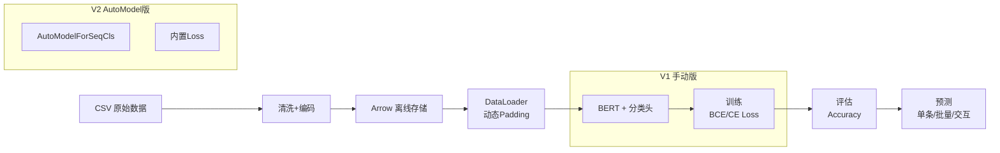

# AI智评 -- 电商评论情感分析

> 基于 BERT 预训练模型的中文电商评论正/负情感二分类项目，从手动搭建到 HuggingFace AutoModel 的完整实践。

---

## Meta 层认知

本项目属于**微调系统**范畴，核心流程是：**流程驱动**（数据清洗 -> 编码 -> 训练 -> 评估 -> 预测），关键质量取决于**预训练质量**（BERT-base-chinese）+ **数据质量**（清洗、标签一致性）。

---

## 目标定义

| 维度 | 内容 |
|------|------|
| 业务目标 | 判断一条电商评论是正面还是负面，输出置信度 |
| 技术目标 | 掌握 BERT 微调全流程，理解手动实现 vs HuggingFace 封装的差异 |

输入输出示例：
- `"质量很好，物流也快，非常满意！"` -> 正面 0.97
- `"收到货发现破损，客服不处理"` -> 负面 0.93

---

## 架构图

---

## 4 层统一认知模型映射

| 层级 | 本项目对应 |
|------|-----------|
| 预训练层 | bert-base-chinese（12层 Transformer，768维，110M参数） |
| 微调层 | 冻结大部分层，末尾接分类头，lr=1e-5 小学习率训练 |
| 数据层 | CSV -> 清洗 -> tokenizer encode -> Arrow 存储 -> DataLoader |
| 工程层 | 动态 padding、离线预处理、分层抽样、模型检查点保存 |

---

## 三种讲法概要

### 30 秒版
一句话讲清项目是什么、做了什么、价值在哪里。详见 [[04_面试表达]]。

核心：BERT 中文电商评论情感二分类，做了手动版和 AutoModel 两版，手动版帮我理解 BERT 内部原理，AutoModel 版更接近工程实际。

### 2 分钟版
讲清背景 -> 架构 -> V1 核心实现 -> V2 改了什么 -> 对比总结。详见 [[04_面试表达]]。

### 5 分钟版
讲清背景 -> 架构 -> 6 个核心模块设计 -> 两版对比 -> 工程亮点 -> 收获总结。详见 [[04_面试表达]]。

---

## 笔记索引

| 文件 | 说明 |
|------|------|
| [[01_系统架构与数据流]] | 整体架构、数据流、V1/V2 差异 |
| [[02_核心模块设计]] | 6 个模块的设计思路与面试追问 |
| [[03_问题与优化]] | 常见问题、优化路径、扩展方向 |
| [[04_面试表达]] | 30秒/2分钟/5分钟/STAR 四种讲法 |
| [[05_面试追问]] | 10~15 个高频追问与标准答案 |
| [[00_项目总览]]（本文件） | 项目全局导览 |

---

*作者：gl | 日期：2026-06-13*
