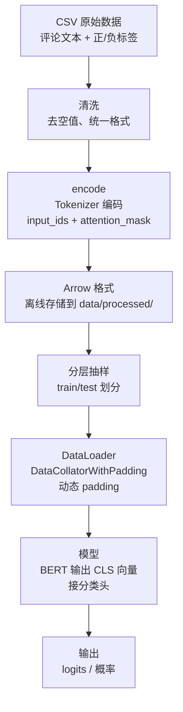

# 系统架构与数据流

> 本文档梳理 AI智评 项目的整体架构、数据流转路径，以及 V1/V2 两版的结构差异。

---

## 整体架构

项目分为 5 个阶段，顺序执行：

```
数据预处理 -> Dataset/DataLoader -> Model -> Train -> Evaluate -> Predict
```

对应代码文件（V1）：

| 阶段 | 文件 | 作用 |
|------|------|------|
| 预处理 | `src/preprocess.py` | 清洗 + encode + 分层切分 |
| 数据加载 | `src/dataset.py` | Dataset + DataLoader + 动态 Padding |
| 模型 | `src/model.py` | BERT + 线性分类头（仅 V1） |
| 训练 | `src/train.py` | 训练循环 + 检查点保存 |
| 评估 | `src/evaluate.py` | 测试集准确率 |
| 预测 | `src/predict.py` | 单条/批量/交互三种预测模式 |

V2 去掉了 `model.py`，其余文件逻辑基本一致。

---

## 数据流详解



**关键设计决策：**

| 决策 | 原因 | 替代方案 |
|------|------|---------|
| 离线预处理存 Arrow | 避免每次训练重复 tokenize，节省时间 | 每次在线 tokenize（慢） |
| 动态 padding | 按 batch 内最大长度 pad，省 40-60% 计算量 | 静态 pad 到 512（浪费显存） |
| 分层抽样 | 保证训练/测试集标签比例一致 | 随机划分（可能类别不均衡） |
| cast_column 固定映射 | 保证 label 的 id2label 一致 | 手动映射（容易出错） |

---

## V1 vs V2 架构差异

### V1（手动版）架构

```
CSV -> 清洗 -> encode -> Arrow -> DataLoader
                                        |
                                        v
                            ReviewAnalyzeModel(nn.Module)
                            ├── BERT (AutoModel)
                            └── nn.Linear(768, 1)
                                        |
                                        v
                            BCEWithLogitsLoss + Adam(lr=1e-5)
                                        |
                                        v
                            torch.save(state_dict)
```

### V2（AutoModel 版）架构

```
CSV -> 清洗 -> encode -> Arrow -> DataLoader
                                        |
                                        v
                            AutoModelForSequenceClassification
                            ├── BERT
                            └── 内置分类头 (num_labels=2)
                                        |
                                        v
                            内置 CrossEntropyLoss + Adam(lr=1e-5)
                                        |
                                        v
                            save_pretrained()
```

**核心区别总结：**

| 维度 | V1 | V2 |
|------|----|----|
| 模型定义 | 自己写 `nn.Module` | `AutoModelForSequenceClassification` 全包 |
| 分类头 | `nn.Linear(768, 1)` 手动接 | 内置，自动适配 num_labels |
| 损失函数 | 手动 `BCEWithLogitsLoss` | 内置 `CrossEntropyLoss` |
| 输出形状 | `(batch_size,)` 标量 | `(batch_size, 2)` 两列 logits |
| 保存方式 | `torch.save(state_dict)` | `save_pretrained()` |

两版效果基本一致，但 V1 让你搞清楚 BERT 内部工作方式，V2 更接近工程实际。

---

## 关联笔记

- [[00_项目总览]] -- 项目全局导览
- [[02_核心模块设计]] -- 每个模块的详细设计
- [[05_面试追问]] -- "V1 和 V2 的区别？" 追问标准答案

---

*作者：gl | 日期：2026-06-13*
