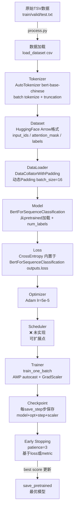
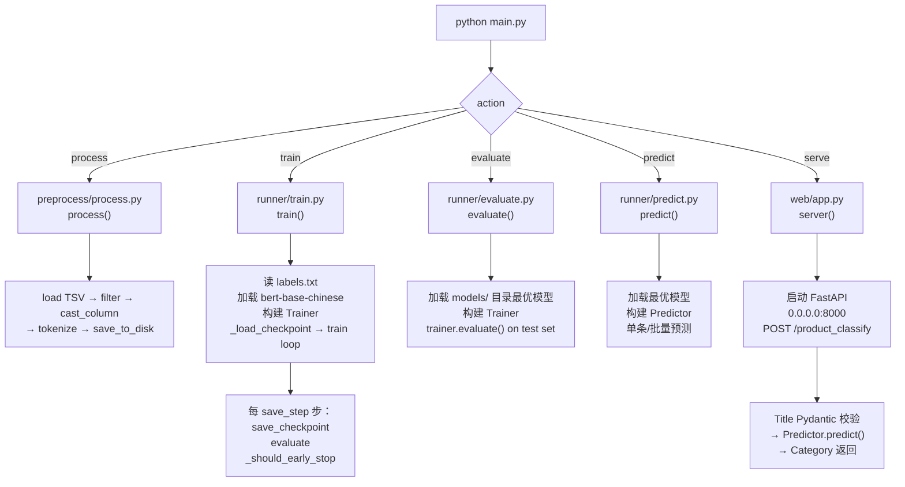
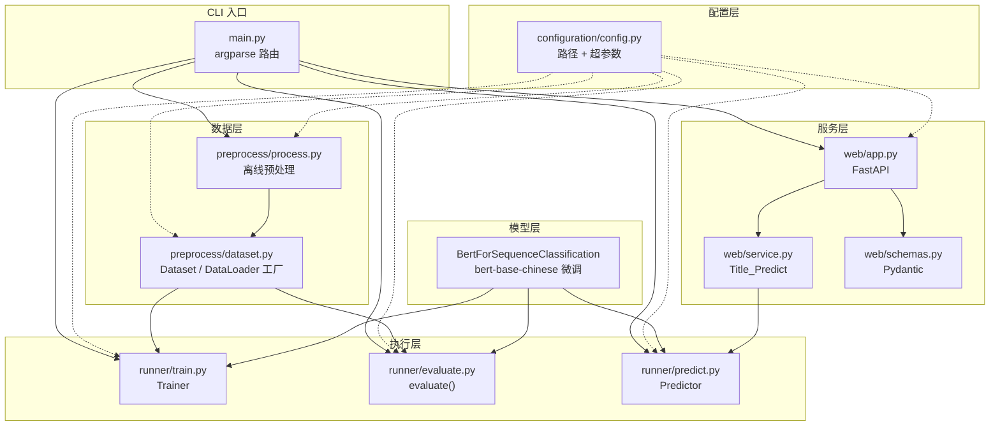
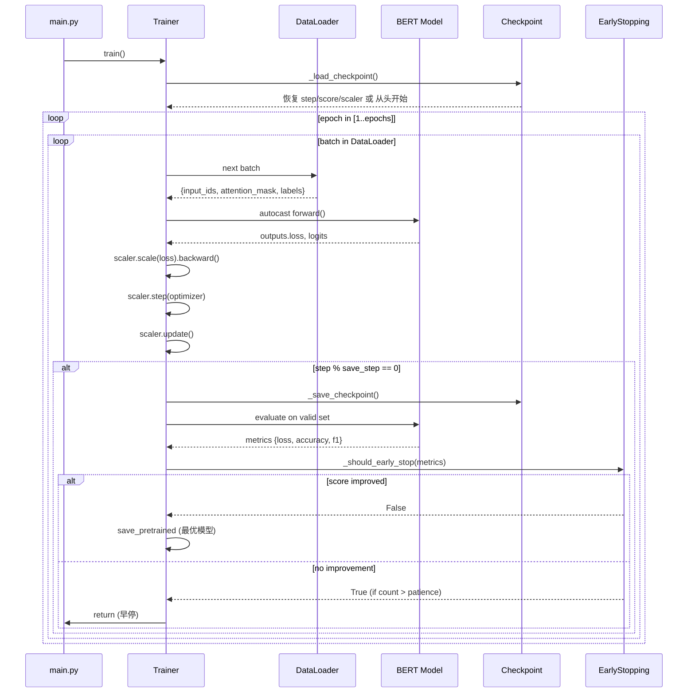

# 商品标题分类器 — 大模型工程项目学习笔记

> **项目日期**：2026/5/29  
> **作者**：gl  
> **分析视角**：大模型开发工程师  

---

#NLP #BERT #文本分类 #微调 #PyTorch #HuggingFace #FastAPI #混合精度 #EarlyStopping #Checkpoint

---

## 1. 项目概览

### 1.1 项目作用

基于 **BERT 预训练模型微调**的商品标题多分类系统。给定一条电商商品标题文本，自动预测其所属商品类目。

### 1.2 解决什么问题

| 问题 | 方案 |
|------|------|
| 电商平台商品类目标注成本高 | 用 BERT 做自动分类 |
| 中文文本语义理解难 | 使用 bert-base-chinese 预训练 |
| 模型训练不稳定、容易崩溃 | 混合精度 + 早停 + Checkpoint |
| 需要提供 HTTP 接口 | FastAPI + uvicorn 部署 |

### 1.3 输入 / 输出

```
输入：商品标题文本（str 或 list）
      e.g. "瓦伦丁小麦西柚啤酒500ml*12听整箱装"

输出：商品类目标签（str 或 list）
      e.g. "酒水饮料"
```

### 1.4 技术栈

```
语言：Python 3.12
预训练模型：bert-base-chinese（本地加载）
框架：
  - PyTorch（训练核心）
  - HuggingFace transformers（模型 + Tokenizer）
  - HuggingFace datasets（数据处理）
  - scikit-learn（评估指标）
  - FastAPI + uvicorn（推理服务）
  - TensorBoard（训练可视化）
混合精度：torch.amp（AMP）
```

---

## 2. 项目整体架构

### 2.1 目录树

```
src/
├── main.py                    # 统一入口，CLI 路由
├── configuration/
│   ├── __init__.py
│   └── config.py              # 全局路径 + 超参数配置
├── preprocess/
│   ├── __init__.py
│   ├── process.py             # 数据预处理（一次性）
│   └── dataset.py             # Dataset / DataLoader 工厂
├── runner/
│   ├── __init__.py
│   ├── train.py               # Trainer 类 + train() 入口
│   ├── evaluate.py            # 测试集评估入口
│   └── predict.py             # Predictor 类 + predict() 入口
└── web/
    ├── __init__.py
    ├── app.py                 # FastAPI 路由 + 服务启动
    ├── service.py             # 业务逻辑层（Title_Predict）
    └── schemas.py             # Pydantic 请求/响应模型

data/（项目根）
├── raw/                       # 原始 TSV 文件
│   ├── train.txt
│   ├── test.txt
│   └── valid.txt
└── processed/                 # Arrow 格式（datasets 保存）

models/（项目根）
├── labels.txt                 # 标签映射文件
├── checkpoint/
│   └── checkpoint.pt          # 训练断点
└── config.json / pytorch_model.bin  # 最优模型

pretrained/（项目根）
└── bert-base-chinese/         # 本地预训练权重

logs/                          # TensorBoard 日志
```

### 2.2 各目录职责

| 目录 | 职责 |
|------|------|
| `configuration/` | 唯一配置源，所有路径/超参数从这里读 |
| `preprocess/` | 数据清洗、Tokenize、存储（离线一次） |
| `runner/` | 训练、评估、推理的执行逻辑 |
| `web/` | HTTP 服务，解耦推理与网络层 |

### 2.3 数据流向

```mermaid
flowchart LR
    A["raw/train.txt\n(TSV格式)"] -->|load_dataset| B["DatasetDict\n(HuggingFace)"]
    B -->|filter + cast_column| C["标签编码\n(ClassLabel)"]
    C -->|AutoTokenizer + map| D["Arrow格式\n(input_ids, attention_mask, labels)"]
    D -->|save_to_disk| E["processed/"]
    E -->|load_from_disk + set_format| F["torch.Tensor Dataset"]
    F -->|DataCollatorWithPadding| G["动态Padding Batch"]
    G -->|BertForSequenceClassification| H["logits"]
    H -->|argmax + id2label| I["预测类目"]
```



---

## 3. 核心模块分析

### 3.1 [[配置模块 config.py]]

**设计思想**：`pathlib.Path` 从文件位置反推项目根目录，所有路径都是相对根目录的绝对路径。避免了硬编码和环境依赖。

```python
ROOT_DIR = Path(__file__).parent.parent.parent
# config.py 位于 src/configuration/ 所以上溯 3 级到项目根
```

**工程意义**：
- 任意机器 clone 后无需改路径
- 所有模块 `from configuration import config` 共享同一套路径
- 如需扩展超参数，只在此处增加字段即可

---

### 3.2 [[数据预处理 process.py]]

**文件作用**：离线一次性预处理，原始 TSV → Arrow 格式的 tokenized dataset。

**核心函数调用链**：
```
load_dataset()
  └─ filter()             # 过滤 None
     └─ cast_column()     # 文字标签 → ClassLabel（固定顺序）
        └─ map(tokenize)  # 批量分词
           └─ save_to_disk()
```

**设计亮点 — 为什么用 `cast_column` 而不是 `class_encode_column`？**

```python
# 错误做法：标签顺序不确定，训练/推理时 id 可能错位
dataset_dict.class_encode_column("label")

# 正确做法：先排序，再固定映射
all_labels = sorted(set(dataset_dict["train"]["label"]))
dataset_dict.cast_column("label", ClassLabel(names=all_labels))
```

**关键：标签一致性**。`labels.txt` 保存排序后的标签顺序，`id2label` 在训练和推理时都从此文件读取，保证模型 logits 下标与类目一一对应。

**为什么用 `datasets.map`？**
- 自动批处理（`batched=True`）
- 自动缓存（重复运行秒速返回）
- Arrow 内存映射，不一次性加载进内存
- 支持多进程加速

---

### 3.3 [[Dataset & DataLoader — dataset.py]]

**核心设计**：将 Dataset 和 DataLoader 的构建分离。

```python
def get_dataset(dtype="train"):
    return load_from_disk(config.PROCESSED_DATA_DIR / dtype)

def get_dataloader(tokenizer, dtype="train"):
    dataset = load_from_disk(...)
    dataset.set_format("torch")          # HuggingFace → Tensor
    return DataLoader(dataset,
                      collate_fn=DataCollatorWithPadding(...))
```

**`DataCollatorWithPadding` 的意义**：
- 不在预处理阶段 padding（避免浪费存储和计算）
- 每个 batch 动态 padding 到该 batch 最长序列
- 比静态 padding 到 512 省约 40-60% 计算量

> 💡 **面试考点**：为什么 padding 放在 collate_fn 而不是 tokenize 阶段？

---

### 3.4 [[Trainer — train.py]]

**最核心的类**，封装了完整的训练生命周期。

#### 核心类：`Training_Config`（dataclass）

```python
@dataclass
class Training_Config:
    epochs: int = 10
    learning_rate: float = 5e-5
    batch_size: int = 16
    save_step: int = 20          # 每多少步评估一次
    early_stop_metric: str = 'loss'
    patience: int = 3
    amp_enabled: bool = True
```

**为什么用 `@dataclass`？** 比普通 class 少写 `__init__`，比 dict 有类型提示，比 argparse 更适合传递给对象。

#### Trainer 类核心方法

| 方法                     | 作用            |
| ---------------------- | ------------- |
| `train()`              | 主训练循环，含断点续训逻辑 |
| `_train_one_batch()`   | 单批次前向+反向+AMP  |
| `evaluate()`           | 验证集推理，无梯度     |
| `_should_early_stop()` | 早停判断 + 最优模型保存 |
| `_save_checkpoint()`   | 保存完整训练状态      |
| `_load_checkpoint()`   | 恢复训练状态        |

---

### 3.5 [[Predictor — predict.py]]

**设计思想**：将推理逻辑封装成独立类，与训练解耦，供 CLI 和 Web 服务复用。

**接口设计**：同时支持单条和批量预测，内部统一转 list 处理，结果按输入类型返回：

```python
def predict(self, text: str | list):
    is_str = isinstance(text, str)
    if is_str: text = [text]
    # ... 统一处理 ...
    if is_str: return result[0]
    else: return result
```

---

### 3.6 [[Web 服务]]

**分层设计**：

```
schemas.py   →  数据校验层（Pydantic）
app.py       →  路由层（FastAPI）
service.py   →  业务层（Title_Predict）
predict.py   →  模型推理层（Predictor）
```

**模型在 app 启动时加载（全局单例）**，避免每次请求重新加载的巨大开销。

---

## 4. 训练流程分析



### 4.1 逐步说明

#### 数据加载
`load_dataset("csv", data_files=..., delimiter="\t")` 将三个 TSV 文件读入 `DatasetDict`，利用 HuggingFace 的 Arrow 格式实现内存映射，不会一次性爆内存。

#### Tokenizer
使用 `AutoTokenizer.from_pretrained` 加载本地 `bert-base-chinese` 分词器。`truncation=True` 不设 `max_length` 时自动使用模型最大长度（512）。**刻意不 padding**，留给 DataCollator 动态处理。

#### Dataset
预处理后以 Arrow 格式保存到磁盘，训练时 `load_from_disk` + `set_format("torch")` 直接返回 PyTorch Tensor，零拷贝。

#### DataLoader
`DataCollatorWithPadding` 在 collate 阶段对 batch 内做动态 padding，每 batch 的 `attention_mask` 自动标记 padding 位置，BERT 内部 attention 不会关注 padding token。

#### Model
`BertForSequenceClassification` = BERT Encoder + Linear(hidden_size, num_labels)，`num_labels` 从 `labels.txt` 动态读取，`id2label`/`label2id` 写入模型 config，使 `save_pretrained` 后可以直接推理。

#### Loss
模型内置 CrossEntropyLoss，当传入 `labels` 时 `outputs.loss` 自动计算，无需手动定义。

#### Optimizer
`torch.optim.Adam(lr=5e-5)`。BERT 微调推荐 `AdamW`（含权重衰减），这里用 `Adam` 是简化写法，**面试可指出优化点**。

#### Scheduler
**本项目未实现**。工业实践中通常配合 linear warmup + cosine decay，可用 `transformers.get_linear_schedule_with_warmup`。

#### Trainer
见 [[Trainer — train.py]] 章节。

#### Checkpoint
每 `save_step` 步保存完整状态（model / optimizer / step / early_stop_count / best_score / scaler），下次启动自动恢复，**实现断点续训**。

---

## 5. 面试角度

### 5.1 为什么这样设计？

| 设计决策 | 原因 |
|----------|------|
| 离线预处理 + Arrow 格式存储 | 训练时避免重复 tokenize，节省 GPU 等待时间 |
| 动态 Padding（DataCollator）| 减少无效计算，尤其在短文本多的场景 |
| `@dataclass` 超参数 | 类型安全 + IDE 提示 + 默认值，比 dict 更工程化 |
| Checkpoint 包含 scaler | AMP 的 scaler 有内部状态，断点续训必须恢复 |
| `id2label` 写入模型 config | `save_pretrained` 后推理无需外部标签文件 |
| 早停基于 score 统一化（-loss/metric）| 无论监控 loss 还是 accuracy 都用同一套逻辑 |

### 5.2 可以如何优化？

```
1. Optimizer：Adam → AdamW（添加 weight_decay=0.01）
2. Scheduler：添加 linear warmup + cosine decay
3. DataLoader：num_workers > 0，开多进程数据加载
4. Early Stopping：目前只支持单指标，可扩展为组合指标
5. 模型保存：Checkpoint 只保存最新，可改为 Top-K 保存
6. Trainer：可引入 Gradient Clipping（clip_grad_norm_）
7. 日志：tqdm.write 替换为 logging 模块，支持文件输出
8. 配置：Training_Config 支持从 YAML/JSON 加载
9. 分布式：单卡 → DDP（torch.distributed）
```

### 5.3 面试官可能问的问题

**Q1：为什么 BERT 微调学习率要设 5e-5 这么小？**  
A：BERT 预训练权重已经很好，过大 lr 会破坏预训练特征（灾难性遗忘）。微调本质是在已有语义空间中做小幅调整。

**Q2：DataCollatorWithPadding 和在 tokenizer 里 padding=True 有什么区别？**  
A：tokenizer padding 是静态的（pad 到最长/fixed length）；DataCollator 是 batch 级别动态 padding，每个 batch 只 pad 到该 batch 最长序列，大幅减少无效计算。

**Q3：AMP 混合精度训练原理是什么？GradScaler 解决什么问题？**  
A：`autocast` 将部分运算（如矩阵乘法）降为 float16 加速；但 float16 梯度容易下溢（underflow），`GradScaler` 会放大 loss 使梯度数值更大，更新参数前再缩回来。

**Q4：Checkpoint 为什么要保存 optimizer 状态？**  
A：Adam 的 momentum（m/v）是随训练积累的状态，不保存会导致续训初期的参数更新行为与正常训练不同，影响训练稳定性。

**Q5：`BertForSequenceClassification` 内部结构是什么？**  
A：BERT Encoder（12层Transformer）→ [CLS] token 的 hidden state → Dropout → Linear(768, num_labels) → CrossEntropyLoss。

**Q6：早停的 patience 应该怎么设置？**  
A：与 `save_step` 联动。若 `save_step=20`，`patience=3`，实际上是连续 60 步没有提升才停止。需要根据数据集大小和收敛速度调整。

---

## 6. 重点源码

### 6.1 标签固定映射（核心！）

```python
# preprocess/process.py

all_labels = sorted(set(dataset_dict["train"]["label"]))
# 输入：训练集所有标签 e.g. {"酒水", "个护", "食品", ...}
# 排序后：["个护", "食品", "酒水", ...]

dataset_dict = dataset_dict.cast_column("label", ClassLabel(names=all_labels))
# 数据变化：{"酒水"} → {2}（固定下标）

# 同时写入文件
with open(config.MODELS_DIR / "labels.txt", "w") as f:
    f.write("\n".join(all_labels))
# 输出：labels.txt，保证训练与推理时 id2label 完全一致
```

**关键**：排序保证每次运行标签 id 相同，否则多次训练的模型不可比较。

---

### 6.2 AMP 混合精度训练

```python
# runner/train.py _train_one_batch()

# 初始化（__init__）
self.scaler = torch.amp.GradScaler("cuda", enabled=self.training_config.amp_enabled)

# 训练一批
with torch.autocast(device_type=self.device.type, dtype=torch.float16,
                    enabled=self.training_config.amp_enabled):
    outputs = self.model(**inputs)   # fp16 前向传播

loss = outputs.loss
self.optimizer.zero_grad()
self.scaler.scale(loss).backward()   # 放大梯度，防止 fp16 下溢
self.scaler.step(self.optimizer)     # 缩回梯度，更新参数
self.scaler.update()                 # 动态调整缩放系数
```

**数据变化**：
- `autocast` 内：权重 fp32，计算 fp16（显存减半，速度提升~1.5-2x）
- `scaler.scale(loss)`：loss × scale_factor（e.g. 65536）
- `scaler.step`：检测是否有 inf/nan，有则跳过此步并降低 scale_factor

---

### 6.3 Early Stopping 统一化

```python
# runner/train.py _should_early_stop()

# 统一化：loss 越小越好，所以取负；accuracy/f1 越大越好
score = -metric if self.training_config.early_stop_metric == 'loss' else metric

if score > self.best_score:
    # 有改善：保存最优模型，重置计数器
    self.best_score = score
    self.early_stop_count = 0
    self.model.save_pretrained(self.training_config.output_dir)
    return False
else:
    self.early_stop_count += 1
    if self.early_stop_count > self.training_config.patience:
        return True  # 触发早停
```

**输入**：当前 epoch 的 metrics dict  
**输出**：True（停止训练）/ False（继续）  
**设计亮点**：通过符号转换统一了"越大越好"的比较逻辑

---

### 6.4 Checkpoint 完整状态保存

```python
# 保存
checkpoint = {
    "model": self.model.state_dict(),       # 模型权重
    "opt": self.optimizer.state_dict(),     # Adam m/v
    "step": self.step,                      # 全局步数（用于跳过已训练步）
    "count": self.early_stop_count,         # 早停计数
    "score": self.best_score,               # 历史最优分数
    "scaler": self.scaler.state_dict()      # AMP 缩放系数
}
torch.save(checkpoint, file_name)

# 续训时跳过已训练步
for batch in dataloader:
    current_step += 1
    if current_step <= self.step:
        continue  # 跳过！
```

**断点续训原理**：重新遍历 dataloader（因 shuffle seed 固定为 42），但跳过已经训练过的步数，从中断处继续。

---

## 7. 项目运行流程



### 7.1 标准执行顺序

```bash
# Step 1: 数据预处理（仅需运行一次）
python main.py process

# Step 2: 训练模型
python main.py train

# Step 3: 测试集评估
python main.py evaluate

# Step 4: 单次命令行预测
python main.py predict

# Step 5: 启动 HTTP 服务
python main.py serve
# POST http://localhost:8000/product_classify
# Body: {"name": "农夫山泉500ml"}
```

---

## 8. 架构图与流程图

### 8.1 项目整体架构图



### 8.2 训练流程图



---

## 9. 从零实现要点

> **如果让你从零实现这个项目，关键决策如下：**

### 9.1 Tokenizer 设计
- 直接复用 `AutoTokenizer.from_pretrained` 即可，不需要自己写
- 关键参数：`truncation=True`，`padding` 留给 DataCollator
- 必须和预训练模型配套，不能混用

### 9.2 Dataset 处理流程
- 用 `datasets.map(batched=True)` 而非手写循环
- `remove_columns` 移除不需要的字段
- 输出只保留模型所需字段：`input_ids`、`attention_mask`、`labels`

### 9.3 DataLoader 实现
- `collate_fn=DataCollatorWithPadding`（动态 padding）
- `shuffle=True` 训练集，`shuffle=False` 验证/测试集
- 设 `generator.manual_seed(42)` 保证可复现

### 9.4 Model 加载方式
- `from_pretrained(本地路径)` 而不是 Hub 地址，避免联网依赖
- 传入 `num_labels`、`id2label`、`label2id` 保存到 config
- 不要用 `torch.load`，用 HuggingFace 的 `save_pretrained` / `from_pretrained`

### 9.5 Trainer 设计
- `Training_Config` 用 `@dataclass` 管理超参数
- 训练循环：`model.train()` / `model.eval()` 正确切换
- 梯度更新三步曲：`zero_grad` → `backward` → `step`

### 9.6 Optimizer 配置
- BERT 微调用 `AdamW`（比 `Adam` 多了权重衰减）
- `lr=5e-5` 是 BERT 微调经典起点

### 9.7 Scheduler 配置（本项目未实现，建议添加）
```python
from transformers import get_linear_schedule_with_warmup
scheduler = get_linear_schedule_with_warmup(
    optimizer,
    num_warmup_steps=total_steps * 0.1,   # 10% warmup
    num_training_steps=total_steps
)
```

### 9.8 Mixed Precision
- `torch.amp.GradScaler` + `torch.autocast`
- 一定要把 `scaler.state_dict()` 加入 checkpoint

### 9.9 Early Stopping
- 统一用"越大越好"的 score 比较（loss 取负）
- 触发早停时直接 `return`，不是 `break`（注意循环层级）

### 9.10 Checkpoint 机制
- 保存：model + optimizer + step + early_stop_count + best_score + scaler
- 续训：`shuffle` seed 固定，遍历 dataloader 时跳过已训步数

---

## 相关链接

- [[配置模块 config.py]]
- [[数据预处理 process.py]]
- [[Dataset & DataLoader — dataset.py]]
- [[Trainer — train.py]]
- [[Predictor — predict.py]]
- [[Web 服务 — app.py / service.py / schemas.py]]

---

*Tags: #BERT微调 #文本分类 #NLP项目 #PyTorch #HuggingFace #FastAPI #AMP #EarlyStopping #Checkpoint #面试准备*
