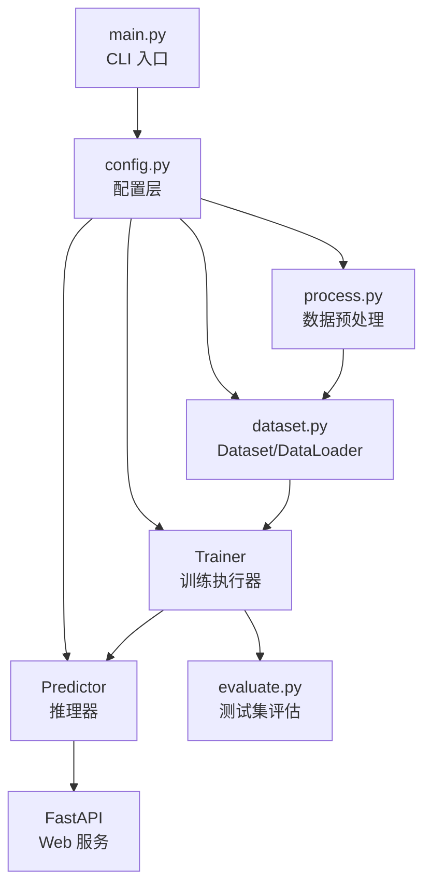

---
tags:
  - NLP
  - BERT
  - 文本分类
  - 微调
  - 项目总览
created: 2026-06-13
---

# 智能商品发布 — 项目总览

> **一句话定义**：基于 BERT 预训练模型微调的商品标题多分类系统，给定电商商品标题，自动预测所属类目（如"酒水饮料"、"个护"等）。

---

## Meta 层定位

本项目属于 **BERT 微调文本分类**，核心驱动力是：

| 维度 | 本项目的选择 |
|------|------------|
| 系统类型 | 微调系统（不是从零训练） |
| 驱动方式 | 流程驱动（pipeline: 数据预处理 → 训练 → 评估 → 推理） |
| 质量来源 | 数据质量 + 预训练质量（两者共同决定上限） |

---

## 业务目标 vs 技术目标

| 业务目标 | 技术目标 |
|----------|----------|
| 降低电商类目人工标注成本 | 用 BERT 做自动分类，准确率 > 95% |
| 支持批量/实时两种预测模式 | 训练稳定性：AMP + 早停 + 断点续训 |
| 提供 HTTP 接口供其他系统调用 | 推理服务化：FastAPI + 模型全局单例 |

---

## 4 层统一认知模型映射

```
┌─────────────────────────────────────────────────┐
│  业务层    "电商商品标题 → 类目"                   │
├─────────────────────────────────────────────────┤
│  数据层    TSV → Arrow → DataLoader              │
├─────────────────────────────────────────────────┤
│  模型层    BERT Encoder → [CLS] → Linear → CE   │
├─────────────────────────────────────────────────┤
│  工程层    AMP / 早停 / Checkpoint / FastAPI     │
└─────────────────────────────────────────────────┘
```

---

## 架构图



---

## 30 秒 / 2 分钟 / 5 分钟讲法概要

### 30 秒版

这是一个基于 BERT 预训练模型微调的商品标题分类项目。电商商品标题输入，自动预测所属类目。核心工程亮点：动态 Padding 省 40-60% 计算，AMP 混合精度显存减半，Checkpoint 完整状态保存实现断点续训，早停机制防过拟合。最终部署为 FastAPI HTTP 服务。

### 2 分钟版

> 背景：电商平台有大量商品需要自动分类，人工标注成本高。我用 BERT 做了微调。
> 
> 数据流：原始 TSV → load_dataset → cast_column 固定标签映射 → tokenize → Arrow 格式存储 → DataLoader 动态 Padding → BERT 分类。
> 
> 训练：Adam lr=5e-5，AMP 混合精度加速，每 20 步评估一次，Early Stopping patience=3，Checkpoint 保存 model+optimizer+step+scaler。
> 
> 部署：FastAPI + Pydantic 校验，模型启动时加载一次，支持单条和批量预测。

### 5 分钟版

详见 [[04_面试表达]] 中的完整版。

---

## 文件导航

| 文件 | 内容 |
|------|------|
| [[00_项目总览]] | 你在这里 |
| [[01_系统架构与数据流]] | 四层架构 + Mermaid 数据流图 |
| [[02_核心模块设计]] | 6 个模块的详细设计（作用/为什么/替代方案/面试追问） |
| [[03_问题与优化]] | 常见问题排查 + 优化路径 + 扩展方向 |
| [[04_面试表达]] | 30s/2min/5min/STAR 讲法模板 |
| [[05_面试追问]] | 12~15 个面试追问 + 标准答案 |

## 已有模块详解笔记

| 文件 | 对应模块 |
|------|---------|
| [[配置模块 config.py]] | 配置管理 |
| [[数据预处理 process.py]] | 数据预处理 |
| [[Dataset & DataLoader — dataset.py]] | Dataset/DataLoader 工厂 |
| [[Trainer — train.py]] | 训练器核心 |
| [[Predictor — predict.py]] | 推理器 |
| [[Web 服务]] | FastAPI 服务层 |
| [[模型评估evaluate]] | 测试集评估 |
