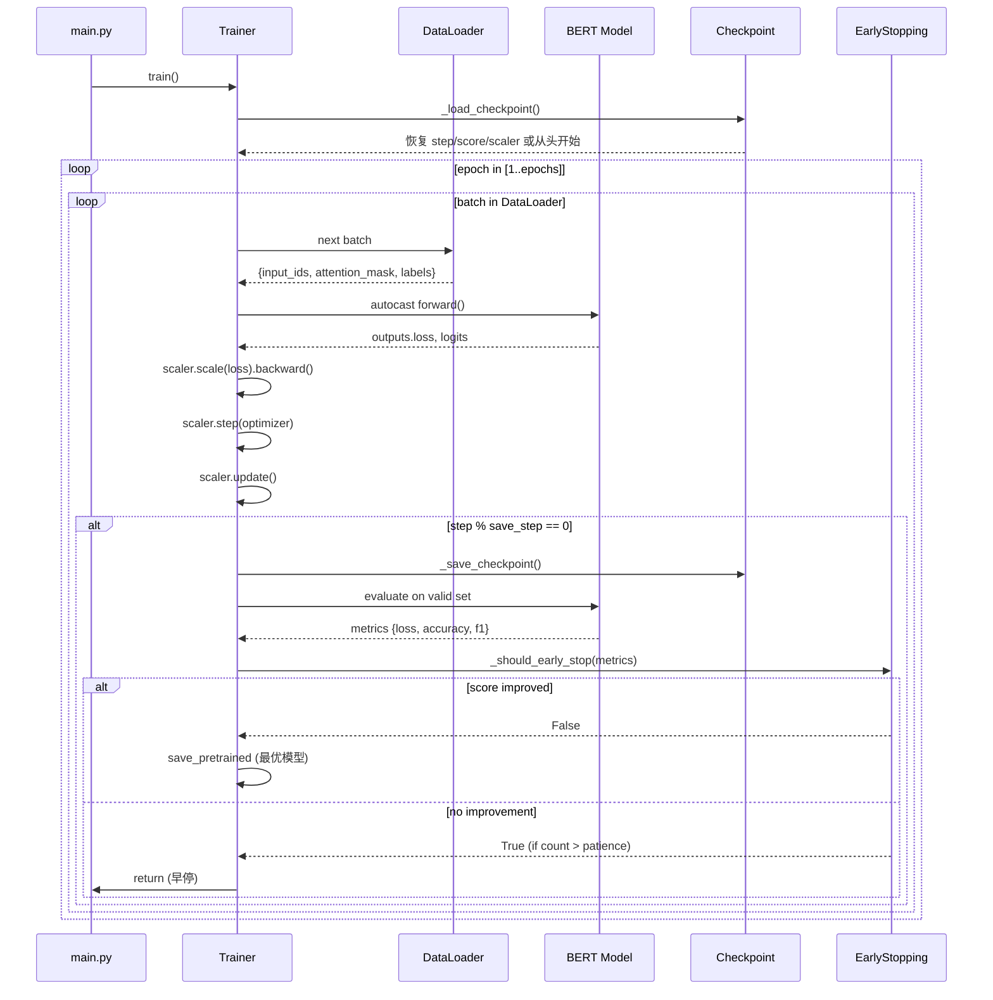

---
tags:
  - NLP
  - BERT
  - 系统架构
  - 数据流
  - 面试准备
created: 2026-06-13
---

# 智能商品发布 — 系统架构与数据流

---

## 四层架构

```
┌───────────────────────────────────────────────────────┐
│  CLI 入口层    main.py (argparse)                     │
├───────────────────────────────────────────────────────┤
│  配置层       config.py (路径 + 超参数)                │
├───────────────────────────────────────────────────────┤
│  数据层       process.py (预处理) + dataset.py (工厂)  │
├───────────────────────────────────────────────────────┤
│  模型层       BertForSequenceClassification           │
├───────────────────────────────────────────────────────┤
│  执行层       Trainer / Predictor / evaluate          │
├───────────────────────────────────────────────────────┤
│  服务层       FastAPI + Pydantic                      │
└───────────────────────────────────────────────────────┘
```

### 各层职责

| 层 | 文件 | 职责 | 依赖 |
|---|------|------|------|
| CLI 入口 | `main.py` | 统一路由，根据参数分发到不同模块 | argparse |
| 配置层 | `config.py` | 唯一配置源，所有路径从 ROOT_DIR 反推 | pathlib |
| 数据层 | `process.py` + `dataset.py` | 离线预处理 + Dataset/DataLoader 构建 | HuggingFace datasets |
| 模型层 | `BertForSequenceClassification` | 预训练 BERT + 分类头 | transformers |
| 执行层 | `Trainer` / `Predictor` | 训练循环 / 推理逻辑 | PyTorch |
| 服务层 | `app.py` / `service.py` / `schemas.py` | HTTP 接口 + 数据校验 | FastAPI |

---

## 数据流

### 完整数据流路径

```
原始 TSV (train/valid/test.txt)
  → load_dataset("csv", delimiter="\t")        # HuggingFace DatasetDict
  → filter()                                    # 过滤 None 行
  → cast_column("label", ClassLabel(names=...)) # 文字标签 → ClassLabel (固定顺序)
  → map(tokenize, batched=True)                 # 批量 tokenize + truncation (不 padding)
  → save_to_disk("processed/")                  # Arrow 格式存储
  → load_from_disk() + set_format("torch")      # 训练时加载，直接转 Tensor
  → DataLoader(collate_fn=DataCollatorWithPadding) # 动态 Padding batch
  → BertForSequenceClassification              # 前向传播
  → CrossEntropyLoss + Adam                    # 损失 + 优化
```

### Mermaid 数据流图

```mermaid
flowchart LR
    A["raw/train.txt\n(TSV格式)"] -->|load_dataset| B["DatasetDict\n(HuggingFace)"]
    B -->|filter| B2["过滤 None"]
    B2 -->|cast_column| C["ClassLabel\n标签编码"]
    C -->|map(tokenize)| D["Arrow 格式\ninput_ids/attention_mask/labels"]
    D -->|save_to_disk| E["processed/"]
    E -->|load_from_disk\n+ set_format| F["torch.Tensor Dataset"]
    F -->|DataCollatorWithPadding| G["动态 Padding Batch"]
    G -->|BertForSequenceClassification| H["logits"]
    H -->|argmax + id2label| I["预测类目"]
```

### 关键设计决策

| 决策 | 为什么 | 替代方案的问题 |
|------|--------|-------------|
| 离线预处理 + Arrow 存储 | 训练时避免重复 tokenize，节省 GPU 等待时间 | 每次训练都 tokenize 浪费时间 |
| `cast_column` 而非 `class_encode_column` | 标签顺序固定（sorted），训练/推理 id 一致 | `class_encode_column` 顺序不确定 |
| tokenize 不 padding | 留给 DataCollator 动态处理 | 静态 padding 浪费 40-60% 计算 |
| Arrow 格式 | 内存映射，不一次性加载进内存 | Python list 占内存大 |

---

## 标签一致性保障（核心工程设计）

这是整个项目最关键的工程决策之一：

```
训练时：
  sorted(set(labels)) → ClassLabel(names=[...]) → cast_column
  labels.txt 保存排序后顺序

推理时：
  读取 labels.txt → id2label = {0: "个护", 1: "食品", ...}
  模型 config.json 中也保存 id2label/label2id
  save_pretrained 后推理无需外部文件
```

**关键点**：排序保证每次运行标签 id 相同，否则多次训练的模型不可比较。

---

## 训练流程图


