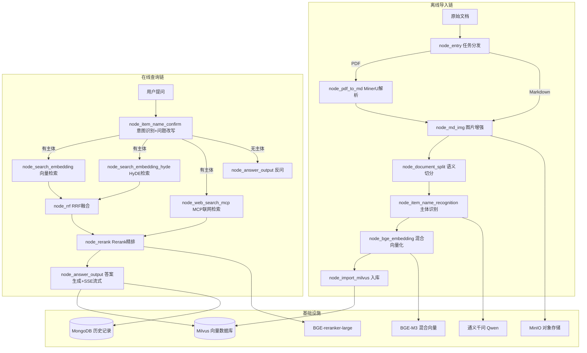

# 00. 掌柜智库项目总览

## 一句话定义

> 掌柜智库是一套基于 **RAG 架构 + LangGraph 工作流编排** 的企业级私有知识库智能问答系统，工程化代码 5500+ 行，实现从文档接入、知识库构建、多路检索到 SSE 流式答案生成的全链路生产级能力。

## 业务目标

| 目标 | 说明 |
|------|------|
| 私有知识管理 | 企业内部文档结构化入库，私有化部署，数据安全可控 |
| 高精准问答 | 多路检索 + RRF 融合 + Rerank 精排，显著降低模型幻觉 |
| 多格式支持 | PDF/Markdown 自动解析，图片多模态理解 |
| 流式交互 | SSE 实时推送，用户体验接近 ChatGPT |

## 系统架构图

## Meta 层判断

| 维度 | 判断 |
|------|------|
| **系统类型** | RAG 系统（LangGraph 工作流编排，非原生 Agent） |
| **核心控制** | 检索驱动 + 流程驱动（图结构控制确定性流程） |
| **成功依赖** | 检索质量（多路召回覆盖率 + 排序精度）+ 数据质量（解析、切分、主体识别） |

## 4 层统一认知模型映射

| 层级 | 掌柜智库实现 | 关键设计点 |
|------|-------------|-----------|
| **数据层** | MinerU PDF→MD、视觉模型图片理解、标题粗切+递归细切+短合并、LLM 主体识别、BGE-M3 混合向量化 | 双层索引（kb_item_names + kb_chunks）；chunk 600 字符基准，400 以下合并，1000 上限 |
| **检索/决策层** | 三路并行召回（向量/HyDE/MCP联网）、RRF 同源融合、Rerank 精排+动态断崖截断 | 先圈定主体范围再精准匹配；HyDE 用假设答案增强弱语义查询 |
| **生成层** | 意图识别+问题重写、上下文组装（带来源/置信度）、SSE 流式输出、图片 URL 正则提取 | 流式用 Queue 阻塞机制，非定时轮询；图片从 reranked_docs 和 web 结果中提取 |
| **优化层** | 分层 RAG 评估（embedding→hyde→rrf→rerank 四层 precision/recall/must_hit_rate） | 评估体系可定位"哪一层拖了后腿" |

## 三种讲法概要

### 30 秒版
> 我做了一个企业级 RAG 知识库系统。用户上传 PDF 手册，系统自动解析、切分、向量化入库。查询时三路召回（向量+HyDE+联网），RRF 融合后 Rerank 精排，最后 LLM 生成带图片的流式回答。核心是用 LangGraph 编排确定性流程，保证企业场景可控可追溯。

### 5 分钟版
> 背景：企业内部产品手册多、知识分散，传统搜索找不到精准答案。
> 架构：离线导入链 7 个节点（分发→解析→图片增强→切分→主体识别→向量化→入库），在线查询链 7 个节点（意图识别→三路召回→RRF 融合→Rerank→答案生成）。
> 核心亮点：① BGE-M3 同时生成稠密+稀疏向量支持混合检索；② HyDE 假设答案增强弱语义查询；③ Rerank 动态断崖截断而非固定 TopK；④ 双层索引设计（文档级+切片级）。
> 技术栈：LangGraph + FastAPI + Milvus + BGE-M3 + 通义千问 + MongoDB + MinIO + SSE。

### 15 分钟版
> 详见 [[04_面试表达|面试表达]] 的 STAR 法则版。

## 为什么是"工程级系统"而非 Demo

| 维度 | Demo/玩具 | 掌柜智库 |
|------|----------|---------|
| 流程编排 | 单链式 if-else | LangGraph 图结构，条件路由+并发节点+状态管理 |
| 检索策略 | 单路向量检索 | 三路召回+RRF 融合+Rerank 精排+动态截断 |
| 文档处理 | 直接读文本 | MinerU PDF 解析+图片多模态理解+语义切分+短合并 |
| 主体识别 | 无 | LLM 识别+Milvus 置信度分级+兜底策略 |
| 评估体系 | 无 | 四层分层评估（precision/recall/must_hit_rate） |
| 流式输出 | 无 | SSE+Queue 阻塞机制+事件类型（progress/delta/final/error） |
| 持久化 | 无 | MongoDB 历史记录+MinIO 对象存储+Milvus 向量库 |

## 相关链接

- [[01_系统架构与数据流|系统架构与数据流]]
- [[02_核心模块设计|核心模块设计]]
- [[03_问题与优化|问题与优化]]
- [[04_面试表达|面试表达]]
- [[05_面试追问|面试追问]]
- [[06_企业面试真题|企业面试真题]]
