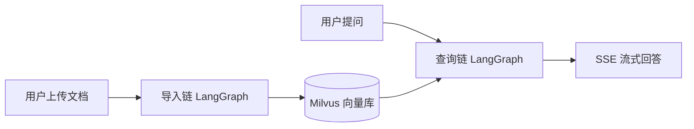
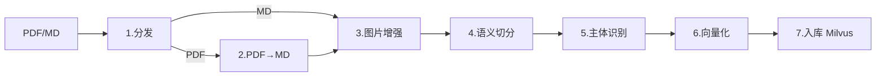
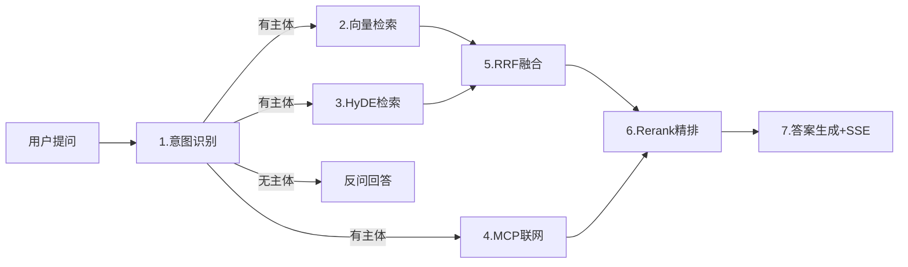

# 01. 系统架构与数据流

## 一句话架构

> 浏览器 → FastAPI → **导入链**（离线，文档→向量）+ **查询链**（在线，问题→答案）→ Milvus / MongoDB / MinIO

## 全局流程（极简）



---

## 导入链（7 节点，离线）



### 各节点数据变换

| # | 节点 | 输入 → 输出 | 做了什么 |
|---|------|------------|---------|
| 1 | node_entry | `local_file_path` → `is_pdf/md_read_enabled` | 判断文件类型，决定走 PDF 还是 MD 路径 |
| 2 | node_pdf_to_md | `pdf_path` → `md_path` | MinerU 上传→解析→下载→解压→重命名为 .md |
| 3 | node_md_img | `md_path` → `md_content_new` | 扫描图片→视觉模型识别→上传 MinIO→替换 MD 中图片引用为网络地址 |
| 4 | node_document_split | `md_content` → `chunks` 列表 | 标题粗切→递归细切（600字符）→短合并（<400合并）→补全 title/parent_title/part |
| 5 | node_item_name_recognition | `chunks` → `item_name` + `chunks[+item_name]` | LLM 识别主体→回填每个 chunk→生成主体向量→Milvus 入库 |
| 6 | node_bge_embedding | `chunks` → `embeddings_content` | 批量生成 dense(1024维)+sparse 向量，6 条一批 |
| 7 | node_import_milvus | `embeddings_content` → 入库 | 创建集合→先删后插→写入 Milvus |

---

## 查询链（7 节点，在线）



### 各节点数据变换

| # | 节点 | 输入 → 输出 | 做了什么 |
|---|------|------------|---------|
| 1 | node_item_name_confirm | `original_query` → `item_names` + `rewritten_query` | LLM 结合历史对话识别主体+改写问题→Milvus 置信度验证（≥0.7确认/0.6-0.7可选/<0.6拒绝） |
| 2 | node_search_embedding | `item_names` + `rewritten_query` → `embedding_chunks` | 问题向量化→Milvus 混合检索（dense+sparse，权重0.6:0.4）→Top5 |
| 3 | node_search_embedding_hyde | `item_names` + `rewritten_query` → `hyde_embedding_chunks` | LLM 生成假设答案→拼接"问题+答案"→复用向量检索→Top5 |
| 4 | node_web_search_mcp | `rewritten_query` → `web_search_docs` | MCP 协议调用百炼联网搜索→返回5条结果 |
| 5 | node_rrf | `embedding_chunks` + `hyde_embedding_chunks` → `rrf_chunks` | RRF 融合：score = Σ(1/(60+rank))，权重各1.0→Top5 |
| 6 | node_rerank | `rrf_chunks` + `web_search_docs` → `reranked_docs` | 统一格式→超长压缩（>512token）→BGE-reranker打分→排序→动态断崖截断（min=2,max=6） |
| 7 | node_answer_output | `reranked_docs` → `answer` + `image_urls` | 组装 Prompt→LLM 生成→SSE 流式推送→正则提取图片URL→保存历史记录 |

---

## 基础设施一览

| 组件 | 用途 | 关键配置 |
|------|------|---------|
| **Milvus** | 向量数据库，双层索引 | kb_item_names（主体级）+ kb_chunks（切片级） |
| **MongoDB** | 历史对话存储 | session_id 隔离，复合索引（session_id + ts） |
| **MinIO** | 图片对象存储 | 桶权限设为 public，拼接网络访问地址 |
| **通义千问** | 大语言模型 | Qwen-Flash（文本）+ Qwen3-VL-Flash（视觉） |
| **BGE-M3** | 向量模型 | 1024维，dense+sparse，本地加载，8192 token |
| **BGE-reranker** | 重排序模型 | 512 token 上下文，打分+动态截断 |
| **百炼 MCP** | 联网搜索 | Streamable HTTP 协议，补充本地知识库 |

---

## State 定义

### ImportGraphState（导入链）

```python
class ImportGraphState(TypedDict):
    task_id: str              # 任务唯一标识
    local_file_path: str      # 原始文件路径
    md_path: str              # 解析后的 MD 路径
    is_md_read_enabled: bool  # MD 类型开关
    pdf_path: str             # PDF 文件路径
    is_pdf_read_enabled: bool # PDF 类型开关
    file_title: str           # 文件名（不含后缀）
    local_dir: str            # 中间文件输出目录
    md_content: str           # MD 文件内容
    chunks: list              # 切片列表 [{content, title, file_title, parent_title, part}]
    item_name: str            # 主体名称
    embeddings_content: list  # 带向量的切片 [{..., dense_vector, sparse_vector}]
```

### QueryGraphState（查询链）

```python
class QueryGraphState(TypedDict):
    session_id: str           # 会话标识
    original_query: str       # 用户原始问题
    embedding_chunks: list    # 向量检索结果
    hyde_embedding_chunks: list # HyDE 检索结果
    web_search_docs: list     # 联网搜索结果
    rrf_chunks: list          # RRF 融合结果
    reranked_docs: list       # Rerank 精排结果
    prompt: str               # 组装好的 Prompt
    answer: str               # 最终答案
    item_names: list          # 主体名称列表
    rewritten_query: str      # 改写后的问题
    history: list             # 历史对话
    is_stream: bool           # 流式标记
    image_urls: list          # 图片链接
```

---

## 技术栈

| 类别 | 技术 | 选型理由 |
|------|------|---------|
| 后端框架 | FastAPI + Uvicorn | 高性能异步，原生支持 SSE |
| AI 框架 | LangGraph + LangChain | 图结构工作流编排，状态管理清晰 |
| 大语言模型 | 通义千问 Qwen-Flash | 国产模型，中文能力强，API 稳定 |
| 向量模型 | BGE-M3 (1024 维) | 混合稠密+稀疏向量 |
| 重排序模型 | BGE-reranker-large | 512 token，精细化排序 |
| 向量数据库 | Milvus | 支持混合检索 |
| 文档数据库 | MongoDB | 历史对话记录 |
| 对象存储 | MinIO | 图片存储 |
| 文档解析 | MinerU | PDF 结构化解析 |
| 前端 | HTML + JS + EventSource | SSE 流式支持 |

---

## 相关链接

- [[00_项目总览|项目总览]]
- [[02_核心模块设计|核心模块设计]]
- [[03_问题与优化|问题与优化]]
