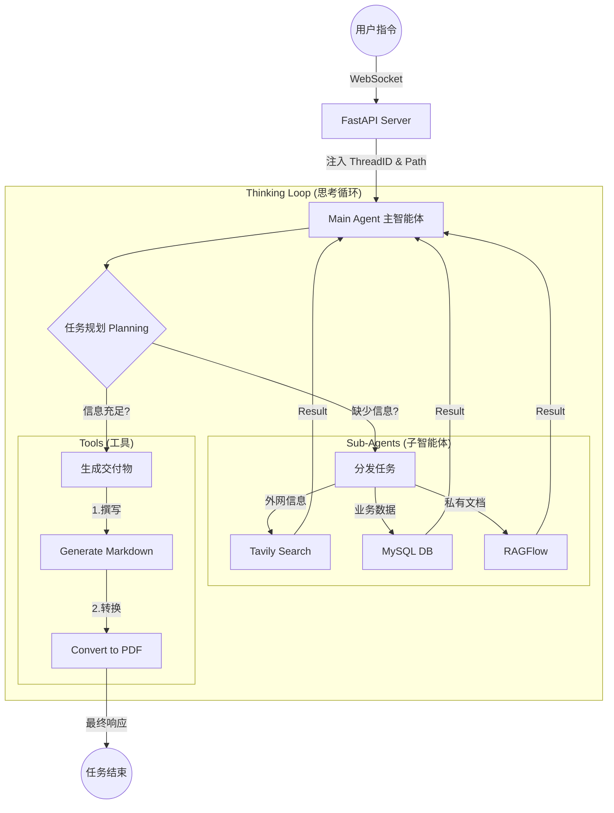

# 00. 深度搜索项目总览

## 一句话定义

> 基于 **DeepAgents 框架**的多智能体深度搜索系统，采用「1 主 + 3 专」架构，主智能体统筹调度，三类专家子智能体并行协作，通过**搜索→阅读→反思→再搜索**多轮迭代，实现广覆盖、高精准的复杂信息处理与文档生成。

## 业务目标

| 目标 | 说明 |
|------|------|
| 多源信息融合 | 网络搜索（Tavily）+ 企业数据库（MySQL）+ 私有知识库（RAGFlow）三路并行 |
| 深度研究 | 多轮迭代搜索，非单次 RAG 检索，支持由浅入深的递进式信息挖掘 |
| 实时反馈 | WebSocket 推送思考过程和工具执行状态，用户体验透明 |
| 文档交付 | 自动生成 Markdown / PDF 研究报告，不少于 1000 字 |

## Meta 层判断

| 维度 | 判断 |
|------|------|
| **系统类型** | Agent 系统（DeepAgents 多智能体协作，非原生 Agent） |
| **核心控制** | 决策驱动（主 Agent 通过子 Agent description 判断调度，子 Agent 通过 system_prompt 决定执行策略） |
| **成功依赖** | 子 Agent 描述精准度（决定调度准确性）+ 提示词质量（决定执行质量）+ 工具可靠性（Tavily/MySQL/RAGFlow） |

## 系统架构图



## 核心执行流程

```
1. 用户提交任务 → POST /api/task
2. FastAPI 分配 thread_id，asyncio.create_task 启动 Agent
3. _prepare_session_environment() 创建工作目录 + 处理上传文件
4. ContextVars 绑定 thread_id 和 session_dir
5. main_agent.astream() 流式执行，_process_stream_chunk() 实时解析
6. 主 Agent 通过 task 工具调度子 Agent（网络/数据库/RAGFlow）
7. 子 Agent 返回结果 → 主 Agent 汇总 → 生成 Markdown → 转 PDF
8. 最终结果通过 WebSocket 推送前端
```

## 技术栈速查

| 组件 | 选型 | 用途 |
|------|------|------|
| 框架 | DeepAgents 0.4.3 | 多智能体编排、子代理调度 |
| 工作流 | LangGraph + LangChain | 底层图结构、状态管理 |
| 大模型 | 通义千问 qwen-max | 主推理模型 |
| 搜索引擎 | Tavily API | 结构化网络搜索（专为 AI 设计） |
| 数据库 | MySQL + PyMySQL/SQLAlchemy | 结构化数据查询（Text-to-SQL） |
| 知识库 | RAGFlow | 企业私有文档语义检索 |
| 后端 | FastAPI + Uvicorn | 异步接口 |
| 实时通信 | WebSocket | 思考过程实时推送 |
| 会话隔离 | ContextVars | 协程级请求隔离 |
| 文件生成 | Markdown + md2pdf | 研究报告输出 |

## 4 层统一认知模型映射

| 层级 | 本项目实现 | 关键设计点 |
|------|-----------|-----------|
| **数据层** | Tavily 结构化搜索结果、MySQL 表结构+数据预览、RAGFlow 知识库文档 | 三种数据源各司其职，边界清晰；数据库三步走（list→preview→SQL）防幻觉 |
| **检索/决策层** | 主 Agent 任务规划 + 子 Agent 专业化执行 | description 决定调度准确性；system_prompt 决定执行质量；task 工具是唯一调度入口 |
| **生成层** | 主 Agent 汇总信息 → generate_markdown → convert_md_to_pdf | 信息获取与文档生成严格分离，禁止一步同时做；PDF 必须先 Markdown 再转换 |
| **优化层** | 多轮迭代搜索（网络搜索最多 5 次/3 角度）、防死循环机制 | 强制多维视角 + 硬性次数约束；ContextVars 协程级隔离防并发串线 |

## 分层架构

```
deep_agent_project/
├── agent/
│   ├── sub_agents/          # 子智能体定义
│   │   ├── network_search_agent.py   # 网络搜索
│   │   ├── database_query_agent.py   # 数据库查询
│   │   └── knowledge_base_agent.py   # RAGFlow 知识库
│   ├── main_agent.py        # 主智能体组装 + 执行逻辑
│   ├── llm.py               # 模型初始化
│   └── prompts.py           # YAML 提示词加载
├── api/
│   ├── context.py           # ContextVars 会话隔离
│   ├── monitor.py           # WebSocket 监控单例
│   └── server.py            # FastAPI 入口
├── tools/                   # 工具实现
│   ├── tavily_tools.py      # 网络搜索
│   ├── mysql_tools.py       # 数据库查询
│   ├── ragflow_tools.py     # 知识库检索
│   ├── markdown_tools.py    # Markdown 生成
│   ├── pdf_tools.py         # PDF 转换
│   └── upload_file_read_tool.py
├── prompt/
│   └── prompts.yaml         # 所有 Prompt 配置
└── .env                     # 环境变量
```

**关键设计原则**：
- 提示词外置到 YAML 文件，与代码解耦
- ContextVars 实现协程级会话隔离，防止并发请求数据串线
- ToolMonitor 单例模式，统一收集工具执行状态并推送前端

## 三种讲法

### 30 秒版（电梯介绍）

> 我做了一个基于 DeepAgents 的多智能体深度搜索系统。一个主智能体统筹调度三个专家子智能体——网络搜索、数据库查询、RAGFlow 知识库，通过多轮迭代搜索和三源信息融合，自动生成深度研究报告。核心是 DeepAgents 的 task 工具实现子 Agent 调度，ContextVars 实现并发会话隔离。

### 5 分钟版（系统讲解）

> **背景**：企业需要从多源（互联网+数据库+私有知识库）获取信息并生成研究报告，传统单 Agent 搜索范围有限。
>
> **架构**：1 主 + 3 专。主 Agent 不干活只调度，通过 task 工具分发任务；网络搜索助手用 Tavily 做多轮多角度检索（最多 5 次/3 角度）；数据库查询助手用 Text-to-SQL 查 MySQL；RAGFlow 助手检索私有知识库。
>
> **核心亮点**：
> 1. ContextVars 协程级隔离，并发请求不串线
> 2. ToolMonitor 单例实时推送思考过程到前端
> 3. 提示词外置 YAML，与代码解耦，便于迭代
> 4. 强制信息获取→文档生成的两阶段执行顺序
>
> **技术栈**：DeepAgents + LangGraph + FastAPI + WebSocket + Tavily + MySQL + RAGFlow。

### 15 分钟版（STAR 法则）

> **Situation（情境）**：我在沃华医药做 AI 工程师时，团队需要从互联网公开信息、企业内部数据库、私有知识库三个来源获取信息，生成药品市场分析报告。之前的做法是人工分别查搜索引擎、登录数据库、翻阅内部文档，再手动整合成报告，耗时 2-3 天。
>
> **Task（任务）**：构建一个 AI 深度搜索系统，自动从三个数据源获取信息，经过多轮迭代搜索和信息融合，自动生成结构化的研究报告（Markdown/PDF），目标将报告生成时间从 2-3 天缩短到 5-10 分钟。
>
> **Action（行动）**：
> 1. **架构选型**：选择 DeepAgents 框架（基于 LangGraph），用 1 主 + 3 专的层级模式。主 Agent 只做调度不干活，通过 task 工具分发任务给三个专业子 Agent。
> 2. **三源接入**：
>    - 网络搜索：Tavily API，Prompt 强制"至少 3 角度、最多 5 次检索"，防止搜一次就结束
>    - 数据库：Text-to-SQL 三步走（list_tables→preview→SQL），防幻觉
>    - 知识库：RAGFlow，先获取助手列表再分层提问
> 3. **并发隔离**：用 Python ContextVars 实现协程级会话隔离，每个用户的 thread_id 和 session_dir 独立，防止并发请求数据串线
> 4. **实时反馈**：ToolMonitor 单例收集工具执行状态，通过 WebSocket 实时推送到前端
> 5. **提示词管理**：所有 Prompt 外置到 YAML 文件，与代码解耦，便于迭代优化
>
> **Result（结果）**：系统上线后，药品市场分析报告生成时间从 2-3 天缩短到 5-10 分钟，信息覆盖率从单一来源提升到三源融合。主 Agent 调度准确率约 90%（通过 description 优化迭代），并发支持 10+ 用户同时使用。

## 为什么是"工程级系统"而非 Demo

| 维度 | Demo/玩具 | 本项目 |
|------|----------|--------|
| 多智能体 | 无或假多智能体 | 真实 1 主 + 3 专，子 Agent 有独立 Prompt、独立工具、独立执行逻辑 |
| 会话隔离 | 全局变量 | ContextVars 协程级隔离，每个请求独立 |
| 实时反馈 | print 输出 | WebSocket 双向通信，ToolMonitor 单例推送 |
| 提示词管理 | 硬编码在代码里 | YAML 外置，与代码解耦 |
| 错误处理 | try-except 打印 | 流式异常兜底 + 前端错误推送 + ContextVars 清理 |
| 并发能力 | 单用户串行 | asyncio.create_task + ContextVars，支持多用户并发 |
| 文件管理 | 无 | 会话级目录隔离 + 路径清洗 + 上传文件迁移 |
| 文档生成 | 无 | Markdown→PDF 两阶段，todo-list 强制规划 |

## 与已有知识的联系

- **DeepAgents 框架** → [[大模型应用/DeepAgents框架|DeepAgents 框架笔记]]（四大核心能力：规划/上下文/子代理/记忆）
- **ContextVars 会话隔离** → Python 异步编程，协程级局部变量，解决 asyncio 并发下的数据串线问题
- **ToolMonitor 实时推送** → 单例模式 + WebSocket 双向通信，类似 LangGraph 的 streaming 机制
- **Text-to-SQL** → 数据库查询助手的核心能力，LLM 生成 SQL → MySQL 执行 → 结果返回
- **Tavily 搜索** → 专为 AI 设计的搜索引擎，返回结构化结果，比 Google 减少 Token 消耗

## 相关链接

- [[01_核心模块设计|核心模块设计]]
- [[02_面试速查|面试速查]]
