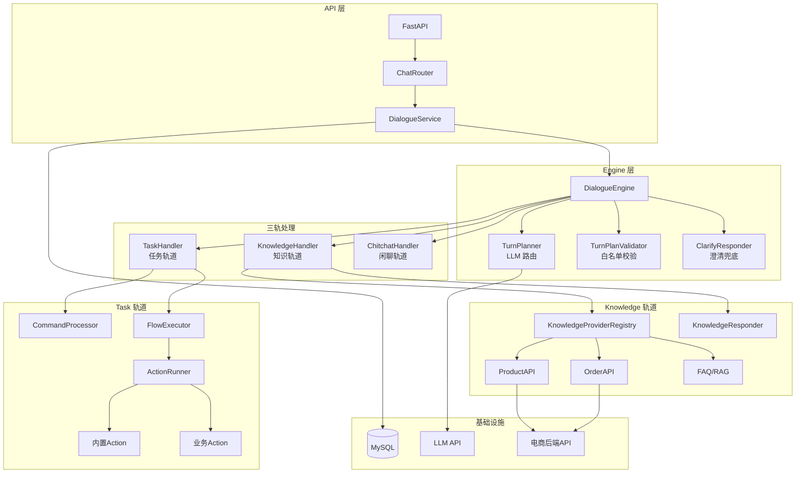

# 电商智能客服系统 - 项目总览

## 一句话定义

> 基于 LLM 路由 + YAML 流程编排的电商智能客服系统，通过"三轨分离 + 白名单校验 + 澄清兜底"机制驯服 LLM 不确定性，支持任务流程、知识问答、闲聊三种对话模式。

## 业务目标 / 技术目标

| 目标类型 | 具体内容 |
|---------|---------|
| **业务目标** | 替代人工客服处理重复性咨询，支持查订单、查物流、退款申请、商品咨询等场景 |
| **技术目标** | 用工程化方式驯服 LLM 不确定性，保证业务结果稳定可控 |

## 系统架构图



## 4层统一认知模型映射

| 层级 | 当前实现 | 关键设计点 |
|------|---------|-----------|
| **数据层** | 对话状态 JSON 持久化 + YAML 流程定义 + Jinja2 提示词 | 整份 JSON 存储、两步提交（pending_turn）、流程与代码分离 |
| **决策层** | TurnPlanner（LLM 路由）+ 白名单校验 + 澄清兜底 | 三轨互斥、9 种澄清原因、任务栈管理（LIFO） |
| **生成层** | ActionResponse（多模式）+ KnowledgeResponder（RAG）| static/rephrase/generate 三种回复模式 |
| **优化层** | 防幻觉校验 + 任务打断恢复 + 会话超时管理 | 工程化驯服 LLM 不确定性、状态机管理 |

## 核心设计思想

### 1. 三轨分离

```
用户消息 → LLM 路由 → 三选一
    ├─ Task: 业务任务（查订单、退款）→ FlowExecutor
    ├─ Knowledge: 知识问答（商品信息）→ RAG 检索 + LLM 生成
    └─ Chitchat: 闲聊兜底 → LLM 直接回复
```

### 2. 驯服 LLM 不确定性

```
LLM 输出 → 白名单校验 → 澄清兜底
    ├─ 校验通过 → 执行
    └─ 校验失败 → 友好提示，引导用户澄清
```

### 3. 流程与代码分离

- **YAML** 描述流程结构（步骤、链接、槽位）
- **代码** 只负责解释执行
- 新增业务流程只需添加 YAML 文件，无需改代码

## 30秒 / 5分钟 / 15分钟 讲法概要

### 30秒版（电梯介绍）

> 这是一个电商智能客服系统，核心设计是"LLM 路由 + YAML 流程编排 + 白名单校验"。用户说一句话，LLM 判断走哪条轨道（任务/知识/闲聊），任务轨道用 YAML 描述业务流程，知识轨道用 RAG 检索回答。关键创新是用工程化方式驯服 LLM 的不确定性——通过白名单校验防止幻觉，通过澄清兜底处理歧义。

### 5分钟版（系统讲解）

1. **背景**：电商客服每天处理大量重复咨询，传统关键词机器人答非所问
2. **架构**：三轨分离 + LLM 路由 + 流程编排
3. **核心模块**：
   - TurnPlanner：LLM 意图识别
   - FlowExecutor：YAML 流程解释器
   - 白名单校验：防幻觉
4. **亮点**：流程与代码分离，新增业务只需加 YAML
5. **效果**：支持查订单、查物流、退款申请、商品咨询等场景

### 15分钟版（深入细节）

1. **业务背景与问题**（2分钟）
   - 重复性咨询占比高
   - 传统机器人理解能力差
   - 需要支持多轮对话和状态管理

2. **系统架构**（3分钟）
   - 分层架构：API → Service → Engine → Domain
   - 三轨分离：Task / Knowledge / Chitchat
   - 基础设施：LLM + MySQL + 电商后端

3. **核心技术实现**（5分钟）
   - LLM 路由：TurnPlanner 输出 TurnPlan
   - 流程编排：YAML 定义 + FlowExecutor 执行
   - 防幻觉：白名单校验 + 澄清兜底
   - 状态管理：DialogueState 聚合根 + 任务栈

4. **关键设计决策**（3分钟）
   - 为什么用 YAML 描述流程？（可维护性、可扩展性）
   - 为什么需要白名单校验？（驯服 LLM 不确定性）
   - 为什么用 pending_turn？（两步提交保证数据完整性）

5. **成果与收获**（2分钟）
   - 支持 7 种业务场景
   - 响应时间 1-5 秒
   - 工程化保障稳定性

## 为什么是"工程级系统"

| 维度 | Demo/玩具 | 本项目 |
|------|----------|--------|
| 状态管理 | 无状态 | 多轮对话 + 任务栈 + 会话管理 |
| 错误处理 | 无 | 白名单校验 + 澄清兜底 |
| 可扩展性 | 硬编码 | YAML 流程 + 注册表模式 |
| 持久化 | 内存 | MySQL + JSON 序列化 |
| 外部集成 | 无 | LLM API + 电商后端 API |

## 相关链接

- [[01_系统架构与数据流]]
- [[02_核心模块设计]]
- [[03_问题与优化]]
- [[04_面试表达]]
- [[05_面试追问]]
