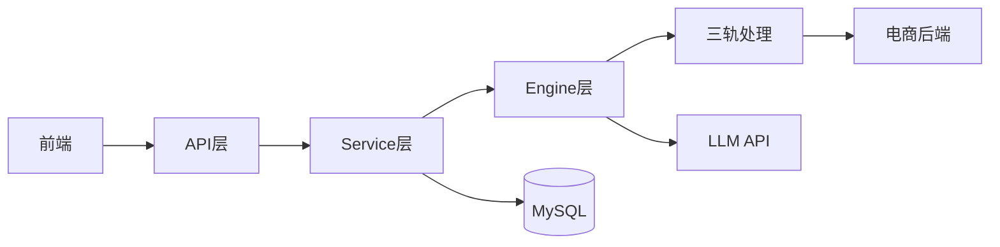
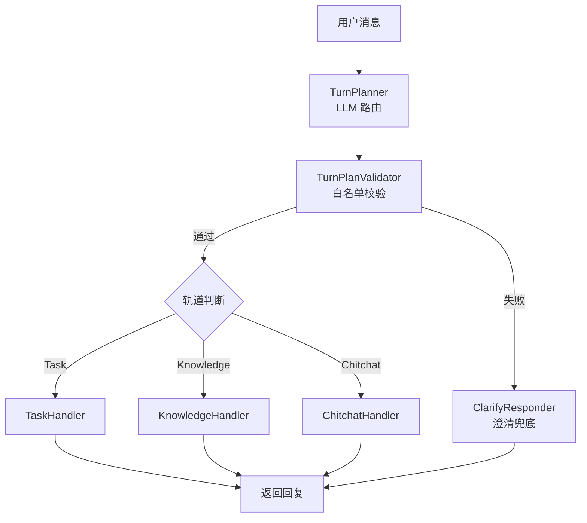
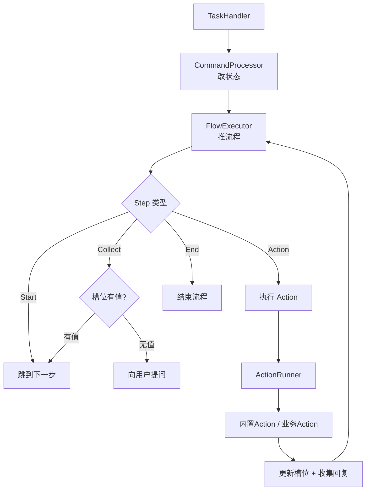
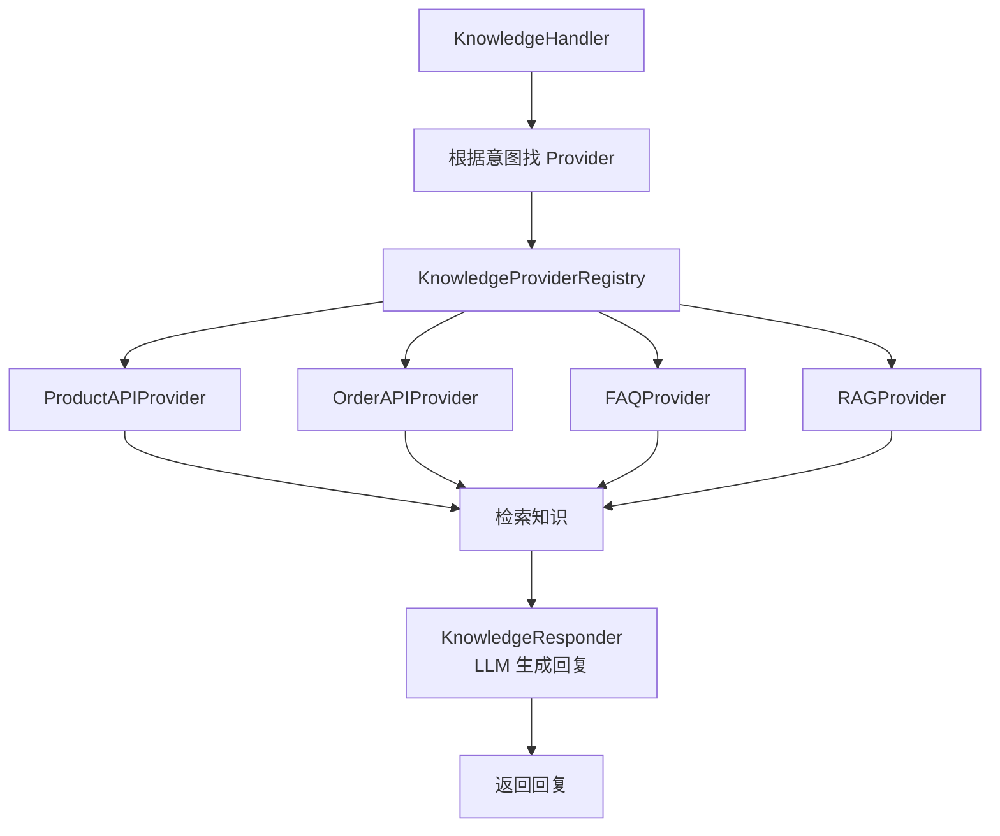
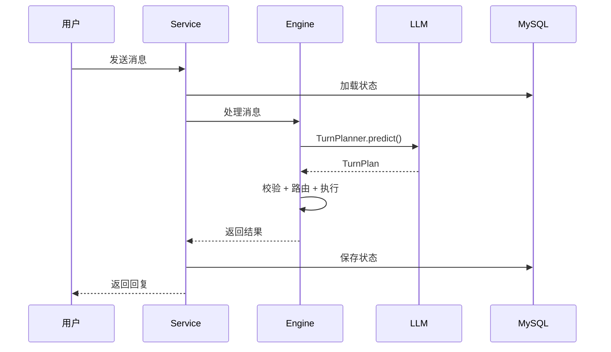
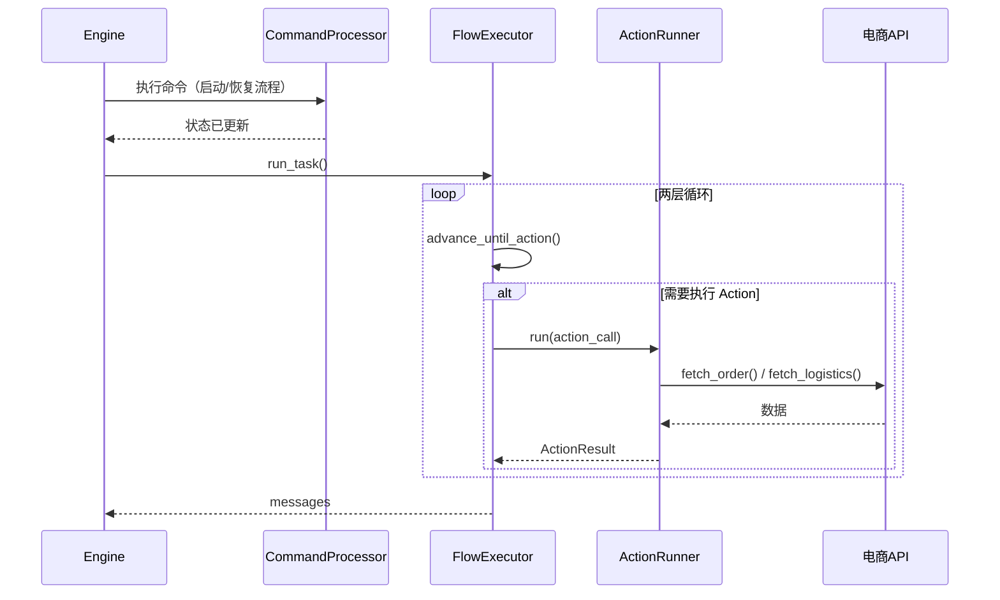
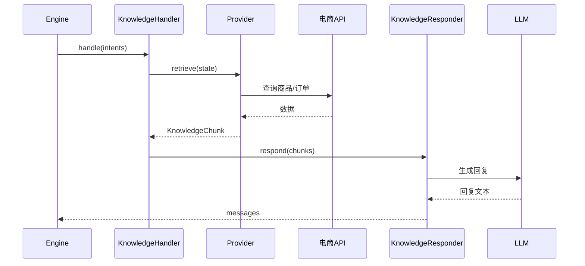
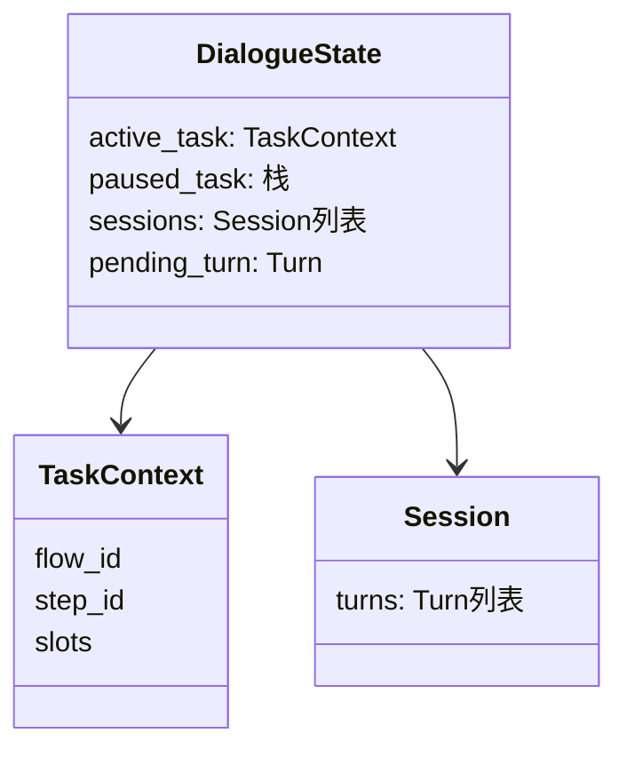
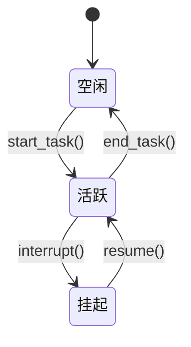

# 电商智能客服系统 - 系统架构与数据流

## 整体架构

**分层职责：**

| 层 | 职责 | 关键设计 |
|----|------|---------|
| API 层 | 接收请求、返回响应 | Pydantic 校验 |
| Service 层 | 编排事务（load→process→save） | I/O 隔离 |
| Engine 层 | 核心调度、三轨路由 | LLM 路由 + 白名单校验 |
| 三轨处理 | Task / Knowledge / Chitchat | 各司其职 |

---

## Engine 层核心流程

---

## Task 轨道流程

---

## Knowledge 轨道流程

---

## 请求处理时序

---

## Task 轨道时序

---

## Knowledge 轨道时序

---

## 状态管理

### DialogueState 结构

### 任务栈机制

---

## 模块职责表

| 层级 | 模块 | 职责 |
|------|------|------|
| **API** | FastAPI + Router | 接收请求、返回响应 |
| **Service** | DialogueService | 编排事务 |
| **Engine** | DialogueEngine | 核心调度、三轨路由 |
| **Plan** | TurnPlanner + Validator | 意图识别、白名单校验 |
| **Task** | TaskHandler + FlowExecutor | 流程执行 |
| **Knowledge** | KnowledgeHandler + Provider | 知识问答 |
| **Domain** | DialogueState | 状态管理 |
| **Infrastructure** | LLM + HTTP + DB | 基础设施 |

---

## 相关链接

- [[00_项目总览]]
- [[02_核心模块设计]]
