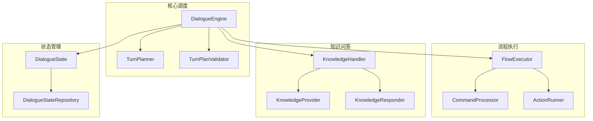
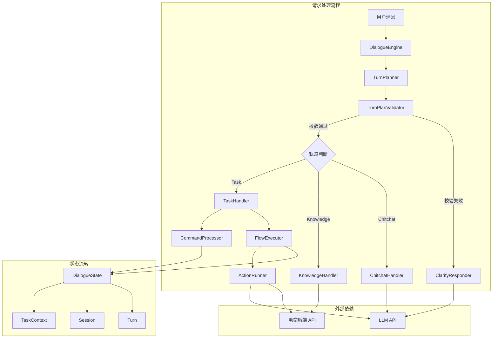

# 电商智能客服系统 - 核心模块设计

## 模块概览



---

## 1. DialogueEngine - 核心调度器

### 1.1 作用

DialogueEngine 是整个客服系统的"大脑"，负责：
1. 管理会话生命周期（超时检测、新会话创建）
2. 用 LLM 识别用户意图，决定走哪条处理轨道
3. 路由到对应的处理器（Task/Knowledge/Chitchat/Clarify）

### 1.2 为什么这么设计

**三轨分离的设计原因：**

| 轨道 | 特点 | 处理方式 |
|------|------|---------|
| Task | 步骤明确、可枚举 | YAML 流程编排，确定性执行 |
| Knowledge | 需要检索外部信息 | RAG 检索 + LLM 生成 |
| Chitchat | 开放域、无明确目标 | LLM 直接回复 |

**为什么不让 LLM 直接处理所有请求？**

| 方案 | 优点 | 缺点 |
|------|------|------|
| LLM 直接处理 | 简单灵活 | 不可控、幻觉、无法执行业务动作 |
| 纯规则引擎 | 确定性强 | 无法理解自然语言 |
| LLM 路由 + 规则执行 | 兼顾理解和执行 | 架构复杂度增加 |

选择第三种：LLM 负责"理解"，规则/流程负责"执行"。

### 1.3 替代方案对比

| 方案 | 优点 | 缺点 | 为什么选/不选 |
|------|------|------|--------------|
| 纯 LLM Agent | 灵活、可处理复杂场景 | 延迟高、成本高、不可控 | 不适合高频简单场景 |
| 纯规则引擎 | 快速、确定性强 | 无法理解自然语言 | 用户体验差 |
| LLM 路由 + 流程执行 | 兼顾理解和执行 | 架构复杂 | ✅ 选择此方案 |

### 1.4 面试追问

**Q：为什么用 LLM 做路由而不是意图分类模型？**

→ 思路：考虑准确率、维护成本、扩展性

→ 回答：LLM 的理解能力更强，可以处理模糊表达和多意图混合场景。虽然意图分类模型更快更便宜，但需要标注数据训练，且难以处理新意图。LLM 只需要更新 prompt 就能支持新场景，维护成本更低。

**Q：三轨可以同时执行吗？**

→ 思路：考虑业务需求和实现复杂度

→ 回答：设计上是互斥的，任何一句话只走一条轨道。这是因为同一时刻用户只有一个主要意图。如果同时填充多条轨道，执行引擎一次只能处理一个，反而增加复杂度。

### 1.5 核心代码（20行）

```python
async def process_message(self, state, user_message):
    # 1. 准备会话（超时检测）
    self._prepare_session(state)
    
    # 2. 开启新轮次
    self._begin_turn(state, user_message)
    
    # 3. 按消息类型处理
    if user_message.type is MessageType.TEXT:
        messages = await self._handle_text_message(state, ...)
    else:
        # 对象消息：自动填槽
        state.set_focused_object(...)
        messages = await self._handle_object_message(...)
    
    # 4. 提交轮次
    state.pending_turn.bot_messages.extend(messages)
    state.commit_pending_turn()
    
    return ProcessResult(...)
```

---

## 2. TurnPlanner - LLM 路由决策

### 2.1 作用

TurnPlanner 是"LLM 路由器"，负责：
1. 将对话上下文喂给 LLM
2. 让 LLM 输出结构化的 TurnPlan（行动计划）
3. TurnPlan 决定走哪条轨道

### 2.2 为什么这么设计

**为什么需要结构化输出？**

| 方案 | 优点 | 缺点 |
|------|------|------|
| 自由文本输出 | 灵活 | 难以解析、格式不稳定 |
| JSON 结构化输出 | 易解析、可校验 | 需要 prompt 工程 |
| Function Calling | 最结构化 | 依赖模型能力、灵活性低 |

选择 JSON 结构化输出：平衡了灵活性和可解析性。

### 2.3 替代方案对比

| 方案 | 优点 | 缺点 | 为什么选/不选 |
|------|------|------|--------------|
| 意图分类模型 | 快速、便宜 | 需要标注数据、无法处理多意图 | 不适合开放域 |
| Function Calling | 最结构化 | 依赖模型能力 | 灵活性不足 |
| JSON 结构化输出 | 平衡 | 需要校验 | ✅ 选择此方案 |

### 2.4 面试追问

**Q：TurnPlan 的格式是怎么设计的？**

→ 思路：考虑可扩展性、可校验性

→ 回答：顶层三个字段 task/knowledge/chitchat，互斥填充。task 包含 commands 列表，knowledge 包含 intents 列表，chitchat 为空对象。这种设计让后续校验和路由都很简单。

**Q：如果 LLM 输出格式错误怎么办？**

→ 思路：考虑兜底机制

→ 回答：TurnPlanValidator 会校验输出，格式错误会触发澄清兜底，友好地引导用户重新表达。

### 2.5 核心代码（15行）

```python
async def predict(self, state, *, flows, intents):
    # 1. 构建提示词（包含对话历史、状态、可用流程等）
    inputs_prompt = self._build_inputs_prompt(state, flows, intents)
    
    # 2. 调用 LLM
    prompt_template = PromptTemplate.from_template(...)
    chain = prompt_template | llm | JsonOutputParser()
    llm_response_dict = await chain.ainvoke(inputs_prompt)
    
    # 3. 转换为 TurnPlan
    return TurnPlan.from_dict(llm_response_dict)
```

---

## 3. FlowExecutor - YAML 流程解释器

### 3.1 作用

FlowExecutor 是"工人"，负责：
1. 沿着 YAML 流程图一步步推进
2. 遇到 Action 步骤时，交给 ActionRunner 执行
3. 遇到等待用户输入时，停下来返回

### 3.2 为什么这么设计

**两层循环的设计原因：**

| 层 | 职责 | 停下条件 |
|----|------|---------|
| 外层 run_task | 执行 Action | 拿到 action_listen |
| 内层 advance_until_action | 推进 Step | 遇到 ActionStep |

**为什么要拆成两层？**

Step 是轻量级的推进（改 step_id、判断 slot），极快。
Action 是真正的外部工作（调接口、生成回复），需要 await。
混在一个循环里会导致每一步都要判断"现在是推进还是执行"，拆成两层后职责清晰。

### 3.3 替代方案对比

| 方案 | 优点 | 缺点 | 为什么选/不选 |
|------|------|------|--------------|
| 单层循环 | 简单 | 职责混乱 | 不适合 |
| 两层循环 | 职责清晰 | 稍复杂 | ✅ 选择此方案 |
| 状态机框架 | 规范 | 过重、学习成本高 | 项目规模不需要 |

### 3.4 面试追问

**Q：action_listen 是什么？为什么用它作为退出条件？**

→ 思路：考虑设计一致性

→ 回答：action_listen 是一个特殊的 Action，表示"该等用户输入了"。把它放到 Action 列表中，让退出条件统一：外层只管执行 ActionCall，action_listen 的执行方式是"停"而不是"做"。

**Q：如果流程定义有环怎么办？**

→ 思路：考虑异常处理

→ 回答：当前实现没有防环机制，依赖 YAML 流程定义的正确性。生产环境可以加一个最大步数限制，防止无限循环。

### 3.5 核心代码（20行）

```python
async def run_task(self, state, flows, action_runner):
    """外层循环：执行 Action"""
    final_messages = []
    while True:
        # 内层：找到下一个要执行的 Action
        action_call = self._advance_until_action(state, flows)
        
        if action_call.action_name == "action_listen":
            break  # 该等用户了
        else:
            # 执行 Action
            action_result = await action_runner.run(state, action_call)
            state.set_slots(action_result.slot_updates)
            final_messages.extend(action_result.messages)
    
    return final_messages

def _advance_until_action(self, state, flows):
    """内层循环：推进 Step"""
    while True:
        current_task = state.current_task()
        if current_task is None:
            return ActionCall(action_name="action_listen")
        
        flow = flows.get_flow_by_id(current_task.flow_id)
        step = flow.get_step_by_id(current_task.step_id)
        action_call = self._run_step(state, step, flows)
        
        if action_call is not None:
            return action_call
```

---

## 4. TurnPlanValidator - 白名单校验

### 4.1 作用

TurnPlanValidator 是"守门员"，负责：
1. 校验 LLM 输出的 TurnPlan 是否合法
2. 防止 LLM 幻觉出未注册的 flow / intent
3. 校验失败时返回失败原因

### 4.2 为什么这么设计

**为什么需要白名单校验？**

LLM 可能输出：
- 不存在的流程 ID
- 未注册的知识意图
- 同时填充多条轨道
- 命令类型不合法

这些都会导致执行失败或产生错误结果。白名单校验可以提前拦截。

### 4.3 替代方案对比

| 方案 | 优点 | 缺点 | 为什么选/不选 |
|------|------|------|--------------|
| 不校验 | 简单 | 幻觉导致执行失败 | 不可接受 |
| 运行时校验 | 延迟发现问题 | 错误处理复杂 | 体验差 |
| 预校验 + 澄清兜底 | 提前拦截、友好提示 | 增加复杂度 | ✅ 选择此方案 |

### 4.4 面试追问

**Q：校验失败后怎么处理？**

→ 思路：考虑用户体验

→ 回答：返回失败原因（ClarifyReason），ClarifyResponder 根据原因生成友好的澄清回复，引导用户重新表达。

**Q：有 9 种失败原因，能举例说明吗？**

→ 思路：结合业务场景

→ 回答：
- MISSING_TRACK：用户说"啊？"，LLM 无法识别意图
- MULTIPLE_TRACKS：用户说"查订单然后退款"，同时表达两个意图
- UNKNOWN_TASK_FLOW：LLM 幻觉出不存在的流程

### 4.5 核心代码（15行）

```python
def validate(self, state, turn_plan, flow_list, intents):
    # 1. 获取激活的轨道
    active_tracks = self._active_tracks(turn_plan)
    
    if not active_tracks:
        return TurnPlanValidationResult(valid=False, reason=ClarifyReason.MISSING_TRACK)
    
    # 2. 按轨道类型校验
    active_track = active_tracks[0]
    if active_track == "task":
        return self._validate_task_track(turn_plan, flow_list)
    if active_track == "knowledge":
        return self._validate_knowledge_track(state, turn_plan, intents)
    
    return TurnPlanValidationResult(valid=True)
```

---

## 5. DialogueState - 聚合根

### 5.1 作用

DialogueState 是"中央仓库"，管理：
1. 任务状态（active_task、paused_task、active_system_task）
2. 聚焦对象（focused_object）
3. 会话历史（sessions）
4. 轮次暂存（pending_turn）

### 5.2 为什么这么设计

**为什么用聚合根模式？**

所有状态集中管理，避免状态散落各处导致不一致。

**为什么需要 pending_turn？**

两步提交机制：
1. begin_turn → pending_turn = Turn(user_msg, [])
2. 引擎处理 → pending_turn.bot_messages.append(reply)
3. commit_pending_turn → session.turns.append(pending_turn)

好处：
- 处理失败时丢弃 pending_turn，turns 始终干净
- 决定不入库时不调用 commit
- turns 里的每条 Turn 都是完整的

### 5.3 替代方案对比

| 方案 | 优点 | 缺点 | 为什么选/不选 |
|------|------|------|--------------|
| 无状态 | 简单 | 无法支持多轮对话 | 不满足需求 |
| 分散存储 | 灵活 | 状态不一致 | 容易出 bug |
| 聚合根 | 一致性好、易于序列化 | 查询不够灵活 | ✅ 选择此方案 |

### 5.4 面试追问

**Q：为什么用 JSON 整份存储而不是拆表？**

→ 思路：考虑实现成本和调试便利性

→ 回答：学习阶段为了调试方便，可以直接查看数据库记录。生产环境可能需要拆表以支持按字段查询和并发更新。

**Q：任务栈（paused_task）是怎么工作的？**

→ 思路：结合业务场景

→ 回答：用户在任务 A 中途切到任务 B 时，A 被压入栈（interrupt_active_task），B 成为活跃任务。用户说"继续刚才的 A"时，从栈中弹出恢复（resume_task）。支持 LIFO 恢复。

### 5.5 核心代码（20行）

```python
def interrupt_active_task(self):
    """中断当前任务（压栈）"""
    self.paused_task.append(self.active_task)
    self.active_task = None

def resume_task(self, flow_id=None):
    """恢复挂起的任务"""
    if not self.paused_task:
        return False
    
    if flow_id is None:
        # LIFO: 恢复最近挂起的任务
        self.active_task = self.paused_task.pop()
        return True
    
    # 精确恢复：按 flow_id 查找
    for task in self.paused_task:
        if task.flow_id == flow_id:
            self.active_task = task
            self.paused_task.remove(task)
            return True
    return False

def current_task(self):
    """获取当前任务（系统任务优先）"""
    return self.active_system_task or self.active_task
```

---

## 6. CommandProcessor - 命令处理器

### 6.1 作用

CommandProcessor 负责：
1. 接收 TurnPlanner 输出的 Command 列表
2. 根据 Command 类型执行对应的状态变更
3. 管理任务的启动、中断、恢复、取消

### 6.2 为什么这么设计

**为什么用命令模式？**

将"要做什么"封装成 Command 对象：
- TurnPlanner 生成 Command 列表
- CommandProcessor 执行 Command，修改 DialogueState
- 这种分离让意图识别和状态修改解耦

### 6.3 面试追问

**Q：CommandProcessor 和 FlowExecutor 的职责边界是什么？**

→ 思路：考虑单一职责

→ 回答：CommandProcessor 负责"改状态"（修改 TaskContext、slots），FlowExecutor 负责"推流程"（沿 YAML 流程执行 Action）。前者是声明式的（描述要做什么），后者是命令式的（实际执行）。

### 6.4 核心代码（15行）

```python
def run(self, state, commands, flow_list):
    for command in commands:
        self._apply(state, command=command, flow_list=flow_list)

def _apply(self, state, command, flow_list):
    if isinstance(command, StartFlowCommand):
        self._handle_start_flow(state, command, flow_list)
    elif isinstance(command, SetSlotsCommand):
        self._handle_set_slots(state, command)
    elif isinstance(command, ResumeFlowCommand):
        self._handle_resume_flow(state, command, flow_list)
    elif isinstance(command, CancelFlowCommand):
        self._handle_cancel_flow(state, flow_list)
```

---

## 7. KnowledgeHandler - 知识问答

### 7.1 作用

KnowledgeHandler 负责：
1. 根据意图获取对应的知识源
2. 从知识源检索相关信息
3. 调用 LLM 生成自然语言回复

### 7.2 为什么这么设计

**为什么用注册表模式？**

KnowledgeProviderRegistry 管理所有知识源：
- 新增知识源只需实现 Provider 并注册
- KnowledgeHandler 只需按 ID 查找
- 解耦了知识检索和知识源实现

### 7.3 面试追问

**Q：Knowledge 轨道和 Task 轨道的区别是什么？**

→ 思路：考虑业务场景

→ 回答：Task 轨道处理"办事"场景（需要多步操作），如退款申请；Knowledge 轨道处理"咨询"场景（只需回答问题），如商品信息。前者需要流程编排，后者只需检索+生成。

### 7.4 核心代码（15行）

```python
async def handle(self, state, knowledge_intents):
    # 1. 根据意图获取知识源 ID
    provider_ids = self._get_provider_ids_by_intents(knowledge_intents)
    
    # 2. 检索知识
    chunks = []
    for provider_id in provider_ids:
        provider = self.provider_registry.get(provider_id)
        current_chunks = await provider.retrieve(state)
        chunks.extend(current_chunks)
    
    # 3. 生成回复
    return await self.knowledge_responder.respond(
        user_message=state.pending_turn.user_message,
        recent_turns=state.current_session().turns[-5:],
        chunks=chunks
    )
```

---

## 模块间协作关系



## 相关链接

- [[00_项目总览]]
- [[01_系统架构与数据流]]
- [[03_问题与优化]]
