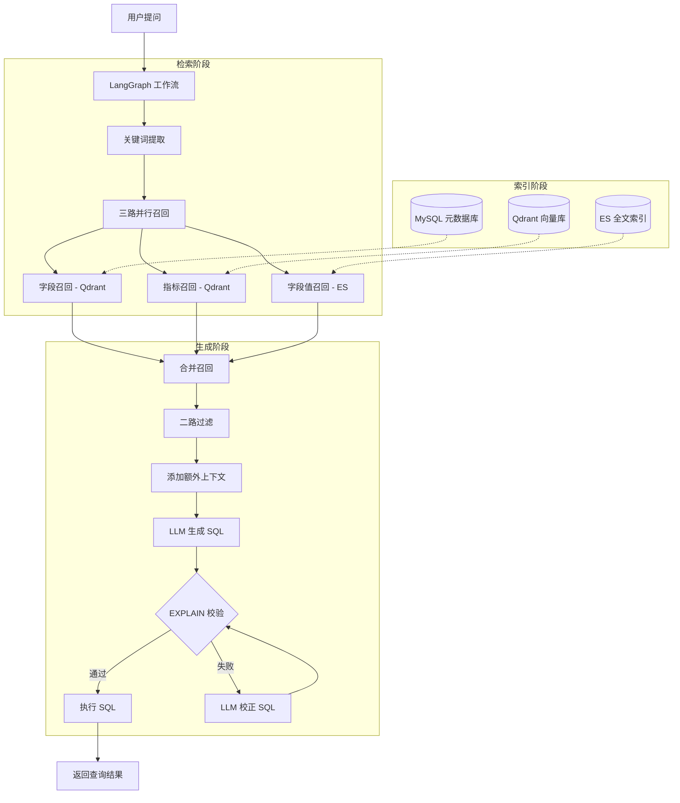

# 掌柜问数 — 项目总览

> [!abstract] 一句话定义
> 基于 **DB RAG（Text2SQL）** 技术的智能数据查询系统，用户用自然语言提问，系统自动将问题转换为 SQL 并从数据仓库查询结果。核心技术栈：**LangGraph 工作流 + Qdrant 向量库 + Elasticsearch 全文索引 + BGE 嵌入模型 + DeepSeek LLM**。

---

## 业务目标 / 技术目标

| 维度 | 目标 |
|------|------|
| **业务目标** | 让后台工作人员无需掌握 SQL，通过自然语言直接查询数据仓库 |
| **技术目标** | 实现端到端的 NL2SQL 流程：元数据索引 → 多路召回 → SQL 生成 → 校验校正 → 执行查询 |

---

## 系统架构图

---

## 4 层统一认知模型映射

| 层级 | 名称 | 掌柜问数的实现 | 关键设计点 |
|------|------|---------------|-----------|
| **第1层** | 数据层 | MySQL 存储元数据（表/字段/指标），Qdrant 存储向量索引，ES 存储字段值全文索引 | 星型模型数仓 + 三层索引架构 |
| **第2层** | 检索/决策层 | jieba 分词 + LLM 语义扩展 → 三路并行召回 → 合并去重 → LLM 二路过滤 | 混合召回（向量语义 + 全文模糊） |
| **第3层** | 生成层 | LangGraph 12 节点工作流，LLM 生成 SQL + EXPLAIN 校验 + 错误校正闭环 | 条件分支流转（validate→correct/execute） |
| **第4层** | 优化层 | EXPLAIN 校验 SQL 语法，LLM 校正失败 SQL，流式输出提升用户体验 | 自动校正机制 + SSE 流式推送 |

---

## 30 秒 / 5 分钟 / 15 分钟 讲法概要

### 30 秒版

我做了一个基于 DB RAG 的 Text2SQL 系统——掌柜问数。用户用自然语言提问，系统通过 Qdrant 向量召回 + ES 全文召回，找到相关的表结构和字段信息，交给大模型生成 SQL，自动查询数据仓库返回结果。核心是 LangGraph 编排的 12 节点工作流，带自动校验和校正机制。

### 5 分钟版

1. **背景**：后台人员需要从数据仓库取数，但不会写 SQL
2. **架构**：元数据知识库（MySQL + Qdrant + ES）+ LangGraph 工作流 + FastAPI
3. **核心流程**：关键词提取 → 三路召回（字段/指标/字段值）→ 合并过滤 → 生成 SQL → EXPLAIN 校验 → 执行
4. **亮点**：LLM 语义扩展关键词、三路混合召回、自动 SQL 校验校正

### 15 分钟版

展开每个模块的设计决策、替代方案对比、核心代码实现（详见 [[02_核心模块设计]]）。

---

## 为什么是"工程级系统"

| 特征 | 体现 |
|------|------|
| **完整数据链路** | 元数据采集 → 索引构建 → 多路召回 → SQL 生成 → 校验校正 → 执行查询 |
| **多系统协作** | MySQL + Qdrant + Elasticsearch + HuggingFace TEI + LLM，5 个异构系统 |
| **异常处理闭环** | SQL 校验失败自动触发校正节点，LLM 根据错误信息重新生成 SQL |
| **流式用户体验** | SSE 实时推送每个节点的执行进度，前端实时展示 |
| **生产级工程** | 分层架构（API/Service/Repository）、依赖注入、连接池管理、日志追踪 |

---

## 关联笔记

- [[01_系统架构与数据流]]
- [[02_核心模块设计]]
- [[03_问题与优化]]
- [[04_面试表达]]
- [[05_面试追问]]
- [[问数知识点]]
