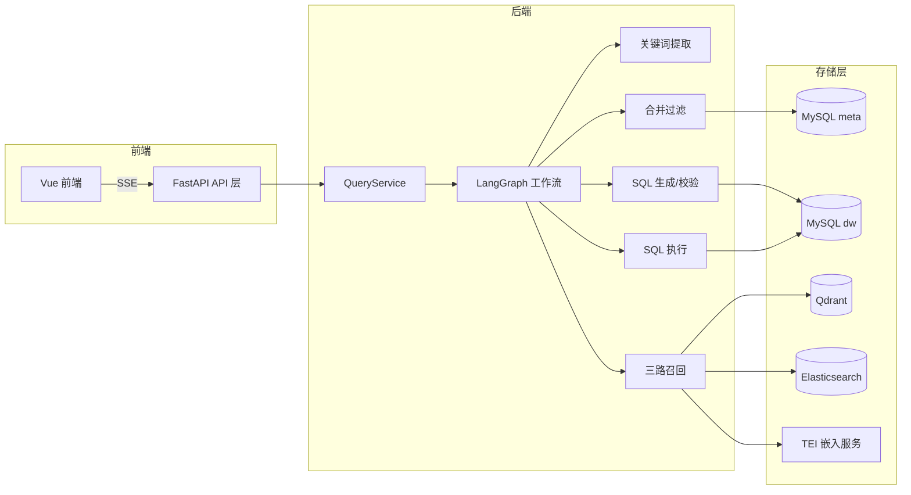
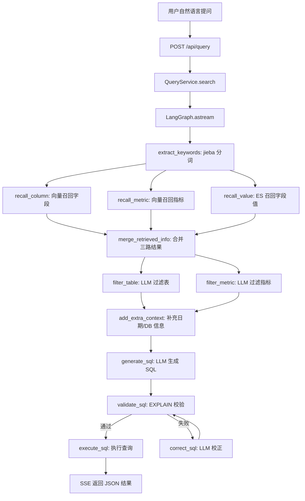
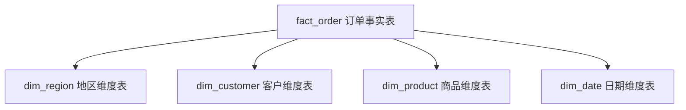
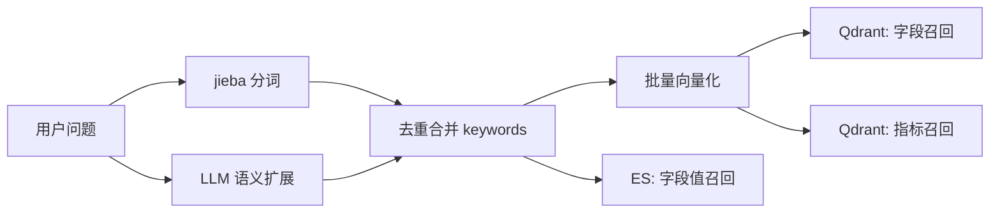
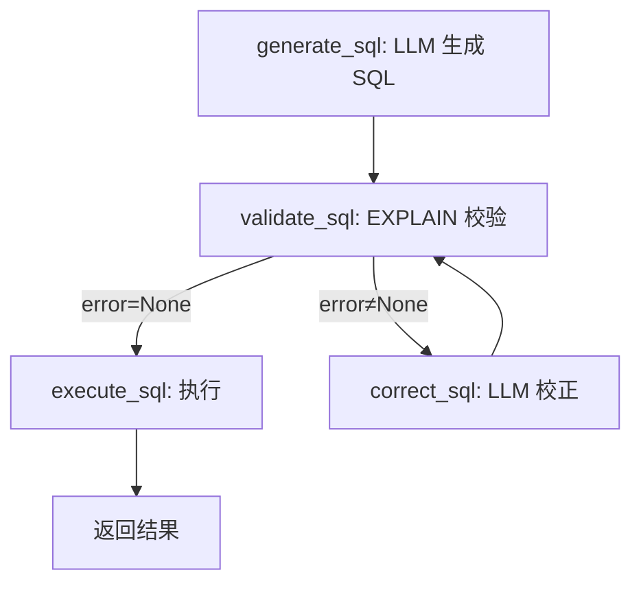

# 掌柜问数 — 系统架构与数据流

> [!abstract] 本文档覆盖系统的总体架构、模块划分、以及数据如何在系统中流转。

---

## 总体架构

---

## 模块划分与职责

| 模块 | 路径 | 职责 | 依赖 |
|------|------|------|------|
| **API 层** | `app/api/` | 接口定义、参数校验、SSE 流式响应 | QueryService |
| **服务层** | `app/services/` | 业务编排、构建元数据知识库 | Repository + Client |
| **智能体层** | `app/agent/` | LangGraph 工作流定义、12 个节点 | Repository + LLM + Embedding |
| **持久层** | `app/repositories/` | MySQL/Qdrant/ES 的 CRUD 操作 | 各存储客户端 |
| **模型层** | `app/models/` | ORM 实体 + 业务实体 | — |
| **客户端管理** | `app/clients/` | 封装各存储系统的连接初始化/释放 | 配置 |
| **配置** | `app/conf/` + `conf/` | YAML 配置加载（OmegaConf） | — |
| **提示词** | `prompts/` | 所有 LLM 提示词集中管理 | — |
| **脚本** | `app/scripts/` | 知识库构建入口脚本 | Service |

---

## 输入 → 处理 → 输出 完整链路

---

## 数据层详解

### 数据仓库（dw 库）— 星型模型

- **事实表**（`fact_`）：存储度量值（订单金额、数量），用于聚合操作
- **维度表**（`dim_`）：存储上下文属性（地区、客户、商品、时间），用于分组和过滤

### 元数据库（meta 库）

| 表 | 存储内容 | 用途 |
|----|---------|------|
| `table_info` | 表名、角色、描述 | 描述数据仓库的表结构 |
| `column_info` | 字段名、类型、角色、别名、示例值 | 描述每个字段的业务含义 |
| `metric_info` | 指标名、描述、关联字段、别名 | 描述业务指标（如 GMV、AOV） |
| `column_metric` | 列 ID ↔ 指标 ID 关联 | 指标依赖哪些字段 |

### 索引存储

| 存储系统 | 索引内容 | 索引方式 | 用途 |
|---------|---------|---------|------|
| **Qdrant** | 字段信息（name/description/alias） | 向量化 → 余弦相似度 | 语义召回 |
| **Qdrant** | 指标信息（name/description/alias） | 向量化 → 余弦相似度 | 语义召回 |
| **Elasticsearch** | 字段取值（维度字段的所有值） | IK 分词 → 倒排索引 | 全文模糊匹配 |

---

## 检索/决策层详解

### 多路召回机制

**为什么要多路召回？**
- 向量召回擅长语义匹配（"销售额" 匹配 `order_amount`）
- 全文召回擅长精确匹配（"华北" 匹配 `region_name = '华北'`）
- 三路互补，覆盖更多场景

### 二路过滤

召回结果可能包含噪音，使用 LLM 进一步筛选：
- **过滤表和字段**：LLM 根据问题判断哪些表和字段真正需要
- **过滤指标**：LLM 根据问题判断需要哪些指标

---

## 生成层详解

### SQL 生成与校正闭环

**为什么需要校正？**
- LLM 生成的 SQL 可能有语法错误、表名/字段名错误
- EXPLAIN 能发现表不存在、JOIN 语法错误等问题
- 校正节点将错误信息反馈给 LLM，让它重新生成

---

## 关联笔记

- [[00_项目总览]]
- [[02_核心模块设计]]
- [[问数知识点]]
