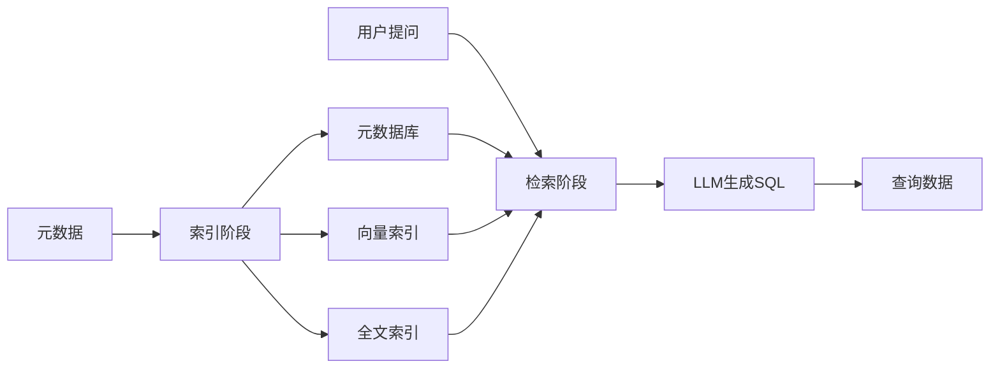
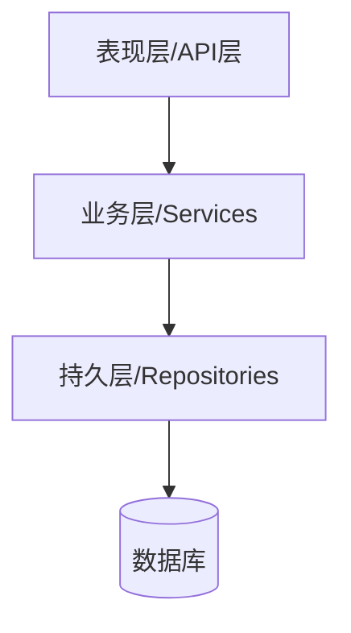
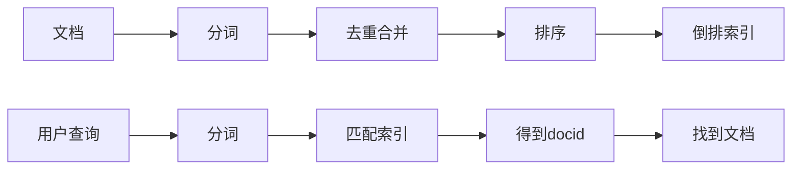
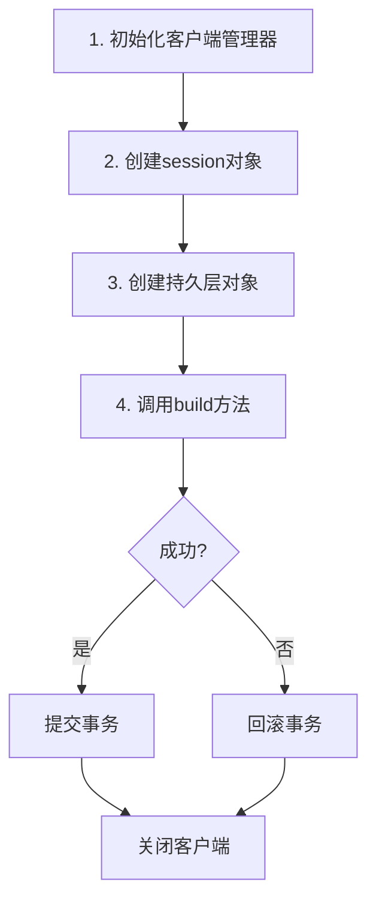
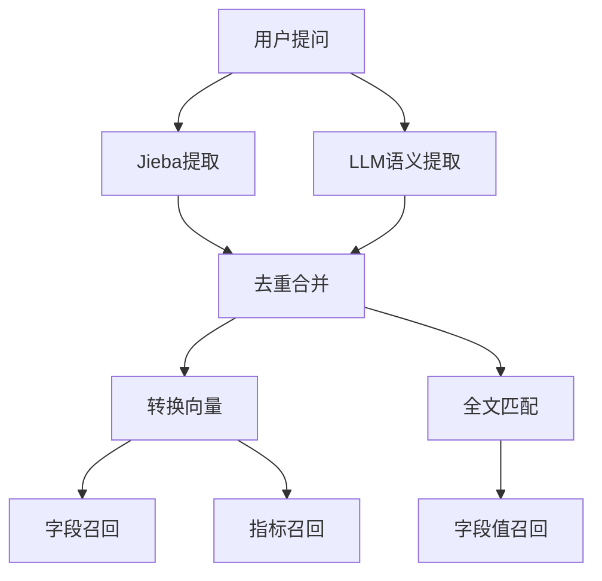
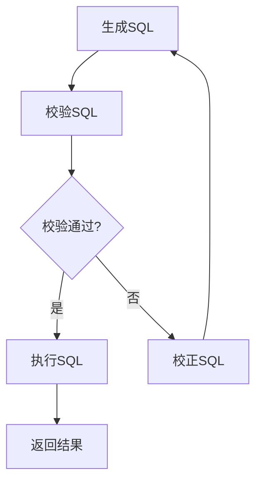

# 掌柜问数

> [!info] 项目概述
> **实现NL2SQL的RAG项目**：将用户提问查询需求，自动转换成语法正确、可直接执行的SQL查询语句，从数据库中查询得到想要的数据显示。

#NL2SQL #RAG #数据仓库 #大模型

---

## 核心概念对比

### 掌柜问数与掌柜智库

| 项目 | 类型 | 说明 |
|------|------|------|
| 掌柜智库 | doc RAG | 文档检索增强生成 |
| 掌柜问数 | db RAG | 数据库检索增强生成 |

### 数据仓库与业务仓库

> [!note] 概念区分
> - **业务仓库（业务数据库）**：对接前台用户，当用户操作时，实时对数据库进行CRUD操作
> - **数据仓库（数仓）**：用于数据分析，保存的是业务数据库中的历史数据，每隔一定的时间将业务数据库中的新的数据读取出来后，处理后再插入到数仓中，一般不做更新和删除

### 向量索引与全文索引

| 索引类型 | 匹配方式 | 应用场景 |
|----------|----------|----------|
| **向量索引** | 语义匹配（相似） | 字段信息和指标信息 |
| **全文索引** | 字面匹配（部分模糊） | 字段值（特定字段的所有值） |

---

## 元数据

> [!tip] 定义
> **元数据**：描述/关于数据的数据

**数据仓库的元数据**：
- **原始数据**：表中的多行数据
- **元数据**：表名，表的字段名，字段类型，字段描述，字段别名等

---

## DB RAG的二个阶段



### 1. 索引阶段

将数仓的元数据保存到元数据库，并对字段信息和指标信息进行**向量索引**，对字段值进行**全文索引**

### 2. 检索阶段

根据用户的提问从索引库中匹配相关的元数据，交给LLM生成SQL，执行SQL从数仓中查询得到需要的数据

---

## Git管理项目

### 创建本地仓库

```bash
git init
git add .
git commit -m "日志"
```

### 创建远程仓库

在Gitee上创建远程仓库（空）

### 将本地仓库推送到远程仓库

```bash
git remote add origin url
git push origin master
```

### 更新与同步

```bash
# 本地代码更新后推送
git add .
git commit -m "日志"
git push origin master

# 远程代码更新后拉取
git pull origin master
```

---

## YAML与JSON对比

| 特性 | YAML | JSON |
|------|------|------|
| 语法 | 简洁，易读 | 相对复杂，不太易读 |
| 注释 | 支持 | 不支持 |
| 单行编写 | 不支持 | 支持 |
| 使用场景 | 配置文件 | 前后台传输数据 |

> [!important] OmegaConf库的优点
> 1. 可以将yaml的对象数据转换为指定类型的对象 => 读取属性时可以有提示
> 2. 对属性名和属性值的类型有限定，防止错误

---

## 后端项目的三层架构



### 1. 表现层/接口层（API）

- 使用FastAPI来定义多个接口路由
- 得到前台用户提交的请求参数数据
- 调用业务层处理业务逻辑
- 向前台返回结果数据

### 2. 业务层（Services）

- 调用持久层的多个方法对数据库数据进行多个CRUD操作
- 进行各种业务逻辑的处理

### 3. 持久层（Repositories）

- 定义了对数据库数据进行CRUD操作的多个方法
- 使用ORM框架来简化数据库的操作，不用写SQL语句，而是基于对象进行操作

> [!info] ORM
> **ORM**：Object Relation Mapping（对象关系映射）

---

## SQLAlchemy框架

> [!abstract] 理解
> - 面向关系型数据库的ORM框架
> - 可以不用写SQL，可以基于对象进行数据库操作（内部生成SQL执行）
> - 内部维护连接池，提高运行效率

### 相关配置

| 配置项 | 说明 |
|--------|------|
| `pool_size` | 连接池大小，初始化的常驻连接数 |
| `max_overflow` | 最大临时连接数 |
| `autoflush` | 是否自动将未提交的数据保存到暂存区（查询可以获取） |
| `autobegin` | 是否自动开启事务 |

---

## Qdrant

> [!note] 向量数据库
> 开源的向量数据库，用于高维向量数据存储和相似度查询。

> [!warning] 注意
> 本身并不能生成向量

---

## HuggingFace

实现生成向量的推理服务，配合嵌入模型进行向量的批量生成。

---

## ContextVar：协程安全的上下文变量

> [!example] 示例说明
> 每个协程都有自己的上下文对象context，互不干扰，可以向其中独立设置和获取不同变量名的数据。

```python
# 协程1和协程2的context对象: {"aa": ""}
context_var = ContextVar("aa", default="")

# 协程1设置值
context_var.set("1111")  # 协程1的context对象: {"aa": "1111"}

# 协程2设置值
context_var.set("2222")  # 协程2的context对象: {"aa": "2222"}

# 获取值
context_var.get()  # 协程1: "1111", 协程2: "2222"

# 重置
context_var.reset()  # 协程1的context对象: {}
```

> [!important] 核心概念
> ContextVar对象本身并不存储数据，数据存储在协程的context对象中 => **ContextVar是context对象的代理对象**

---

## 日志模块的功能

- [ ] 定制日志输出格式，控制输出级别
- [ ] 自动将日志内容保存到日志文件
- [ ] 指定日志文件的最大大小，一旦超过自动创建一个新的文件
- [ ] 指定文件的有效期，过了自动删除
- [ ] 记录当前日志输出是哪个请求的，记录请求ID

---

## REST API与非REST API

### REST API

> [!abstract] 特点
> 一个接口路径可以对应多个不同请求，通过不同的请求方式对应不同后台操作

| 方法 | 用途 |
|------|------|
| `GET` | 获取数据 |
| `DELETE` | 删除数据 |
| `POST/PUT` | 添加/更新 |

```
http://localhost:3000/user/1
```

### 非REST API

> [!warning] 对比
> 一个接口路径只对应一个请求，后台只能有一个处理

```
http://localhost:3000/getUserById?id=1
```

---

## Elasticsearch（ES）

### 理解

> [!info] 特点
> - 开源的全文搜索引擎
> - 多切片（分布式）、多副本、多节点（多服务器集群）、超大数据量索引存储（可PB级）



### ES中的索引、文档和字段

| 概念 | 对应关系 |
|------|----------|
| 索引 | 表 / 列表 |
| 文档 | 行数据 / 对象 |
| 字段 | 表的列 / 对象属性 |

### ES的DSL查询

#### 单条件查询

| 关键字 | 说明 |
|--------|------|
| `query` | 查询 |
| `match` | 模糊匹配 => 分词后匹配索引 |
| `term` | 精确匹配 => 不分词匹配索引 |
| `range` | 匹配数值区间 |

#### 多条件组合查询

| 关键字 | 说明 |
|--------|------|
| `bool` | 使用组合查询 |
| `must` | 都满足 |
| `should` | 只要满足一个 |
| `must_not` | 都不满足 |
| `filter` | 都满足，但不记录得分 |

---

## 构建知识库

### 同步脚本的执行流程



### 业务函数的执行流程

#### 1. 处理表信息和字段信息

- [ ] **1.1** 将表信息和字段信息插入到meta库（`table_info`, `column_info`）
- [ ] **1.2** 将字段信息保存到qdrant向量库中
- [ ] **1.3** 将字段值保存到es全文索引库中

#### 2. 处理指标信息

- [ ] **2.1** 将指标信息保存到meta库（`metric_info`和`column_metric`）
- [ ] **2.2** 将指标信息保存到qdrant向量索引库中

---

## LangGraph相关重要概念

### 核心概念

| 概念 | 说明 |
|------|------|
| 状态图 | StateGraph的实例 |
| 节点 | 实现特定功能的函数 |
| 状态 | 包含多个可变数据的对象，在图的各个节点上传递 |
| 边 | A->B两个节点的连线，A执行后执行B，且将最新的状态数据传递给B |

### 节点函数的参数

| 参数 | 说明 |
|------|------|
| `state` | 状态对象（自定义类型） |
| `runtime` | Runtime运行时对象 |
| `config` | ConfigRunnable保存配置的对象 |

> [!detail] runtime参数详解
> - `stream_writer`：向调用者输出自定义数据的函数
> - `store`：实现跨会话长期记忆的对象，默认保存在内存中
> - `context`：包含固定数据或依赖的外部模块的对象（自定义类型）

### stream_mode

| 模式 | 说明 |
|------|------|
| `updates` | 外部得到的是节点返回的更新 |
| `values` | 外部得到的是节点返回后合并后的state值 |
| `custom` | 外部得到的是stream_writer指定的自定义数据 |

---

## 提取关键字节点的功能

> [!tip] 策略
> - 利用Jieba库对用户提问进行字面的关键字提取 => 可能会丢失语义
> - 将用户提问合并到关键字列表中 => 防止语义丢失

---

## 三路召回节点的作用



### 1. 召回字段

1. 使用大模型对提问进行语义化提取关键字并与jieba提取的关键字进行去重合并（`keywords`）
2. 将所有关键字转换为向量
3. 根据关键字向量去qdrant库中进行相似度匹配得到相关的字段信息列表，并进行去重合并（`recall_columns`）

### 2. 召回指标

1. 使用大模型对提问进行语义化提取关键字并与jieba提取的关键字进行去重合并（`keywords`）
2. 将所有关键字转换为向量
3. 根据关键字向量去qdrant库中进行相似度匹配得到相关的指标信息列表，并进行去重合并（`recall_metrics`）

### 3. 召回字段值

1. 使用大模型对提问进行语义化提取关键字并与jieba提取的关键字进行去重合并（`keywords`）
2. 根据关键字去es库中进行字段值的全文模糊匹配得到字段值信息列表，并进行去重合并（`recall_values`）

---

## 合并三种召回

### 1. 收集最完整的字段信息列表

去重合并 `dict[column_id, ColumnInfoQdrant]`

- [ ] **1.1** 收集召回的字段信息列表
- [ ] **1.2** 收集召回的指标信息列表关联的字段信息列表
- [ ] **1.3** 收集召回的字段值信息列表对应的字段信息列表 => 将字段值保存到字段的值的样例列表中
- [ ] **1.4** 收集相关表的主键和外键字段信息列表

### 2. 生成带字段信息列表的表信息列表

- [ ] **2.1** 对收集的字段信息列表进行按表ID进行分组：`dict[table_id, list[ColumnInfoQdrant]]`
- [ ] **2.2** 生成带字段信息列表的表信息列表 => `table_infos: list[TableInfoState]`
  - 根据表ID查询meta得到表信息
  - 根据当前字段信息列表生成`ColumnInfoState`类型的字段状态信息列表

---

## 二路过滤

### 过滤表和字段

根据用户提问和表信息列表，利用大模型生成需要的表名和字段名列表，过滤掉不需要的表信息和字段信息 => `table_infos`

### 过滤指标

根据用户提问和指标信息列表，利用大模型生成需要的指标名列表，过滤掉不需要的指标信息 => `metric_infos`

---

## 添加额外信息

> [!important] 上下文补充
> - **当前日期信息**：日期/星期/季度 => 提问中可能包含相对当前的一个时间
> - **当前数据库信息**：名称和版本 => 不同数据库、不同版本生成的SQL不同

---

## SQL相关节点



### 1. 生成SQL

根据前面准备的相关数据（`query`, `table_infos`, `metric_infos`, `db_info`, `date_info`），让大模型生成SQL，并返回SQL

### 2. 校验SQL

利用MySQL数据库的`EXPLAIN`来检查SQL语法的正确性，不会执行SQL查询：

> [!success] 校验通过
> 返回不带错误信息，跳转到**执行SQL节点**

> [!fail] 校验失败
> 返回错误信息，跳转到**校正SQL节点**

### 3. 校正SQL

根据前面准备的相关数据 + SQL和错误信息，让大模型生成一个新的SQL，返回新的SQL

### 4. 执行SQL

取出SQL执行，查询数仓中的数据，写给外部调用者，返回给客户端显示

---

## FastAPI相关知识

### 接口参数类型

| 参数类型 | 说明 | 示例 |
|----------|------|------|
| **Path参数** | 路径中可变的部分，有对应的占位名称 | `/users/{id}` |
| **Body参数** | JSON格式，对应的参数必须是`BaseModel`类型 | 请求体 |
| **Query参数** | 请求路径中`?`后面的参数 | `?page=1&size=10` |

### 流式输出

> [!abstract] SSE实现
> - 基于SSE（Server-Sent Events）协议实现
> - 路由函数返回流动响应对象`StreamResponse`，一定要指定类型为：`text/event-stream`
> - 流式输出函数：包含`yield`的`async`函数 => 异步生成器
> - 返回的数据格式：`"data: json数据 \n\n"`

### 生命周期与中间件

#### 生命周期


> [!tip] 启动与停止
> - `yield`**之前**的代码在启动时执行 => 做一次性的初始化工作（如初始化客户端Manager）
> - `yield`**之后**的代码在停止前执行 => 做一次性的收尾工作（如关闭客户端Manager）

#### 中间件

> [!note] 请求处理
> - `call_next()`**执行前**的代码在处理请求前执行 => 向ContextVar对象中保存一个当前请求的ID
> - `call_next()`**执行后**的代码在处理请求后执行

### 依赖注入

> [!abstract] 定义
> 路由函数依赖的特定对象我们不在路由函数中直接创建，而是通过声明依赖参数的形式，让框架自动创建并注入进来

> [!important] 作用
> 将创建依赖对象的代码写死，而是由依赖函数在外部创建再通过参数传入

### 路由和路由器

- **路由**：一个路由就对应一个接口，包含请求路径、请求方式和处理请求函数（路由函数）
- **路由器**：管理多个路由的对象，方便对多个路由进行分组管理
